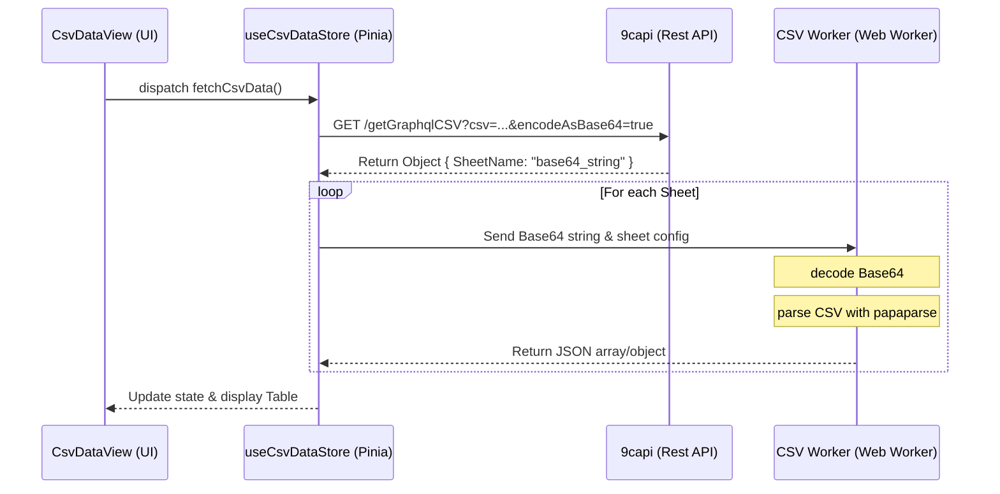

# CSV Data Automation Sequence Diagram

This diagram describes the flow of fetching, parsing, and storing CSV data from 9capi.

```mermaid
sequenceDiagram
    participant UI as CsvDataView (UI)
    participant Store as useCsvDataStore (Pinia)
    participant API as 9capi (Rest API)
    participant Worker as CSV Worker (Web Worker)

    UI->>Store: dispatch fetchCsvData()
    Store->>API: GET /getGraphqlCSV?csv=...&encodeAsBase64=true
    API-->>Store: Return Object { SheetName: "base64_string" }

    loop For each Sheet
        Store->>Worker: Send Base64 string & sheet config
        Note over Worker: decode Base64
        Note over Worker: parse CSV with papaparse
        Worker-->>Store: Return JSON array/object
    end

    Store-->>UI: Update state & display Table
```
