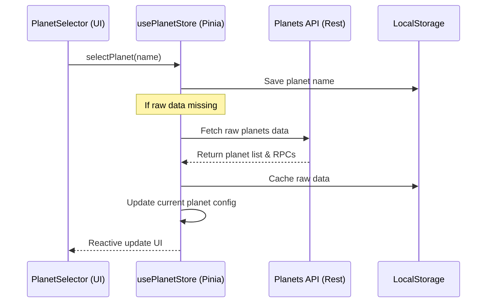

# Planet Management Sequence Diagram

This diagram describes the flow of selecting planets and managing RPC endpoints.

```mermaid
sequenceDiagram
    participant UI as PlanetSelector (UI)
    participant Store as usePlanetStore (Pinia)
    participant API as Planets API (Rest)
    participant Local as LocalStorage

    UI->>Store: selectPlanet(name)
    Store->>Local: Save planet name

    Note over Store: If raw data missing
    Store->>API: Fetch raw planets data
    API-->>Store: Return planet list & RPCs
    Store->>Local: Cache raw data

    Store->>Store: Update current planet config
    Store-->>UI: Reactive update UI
```
