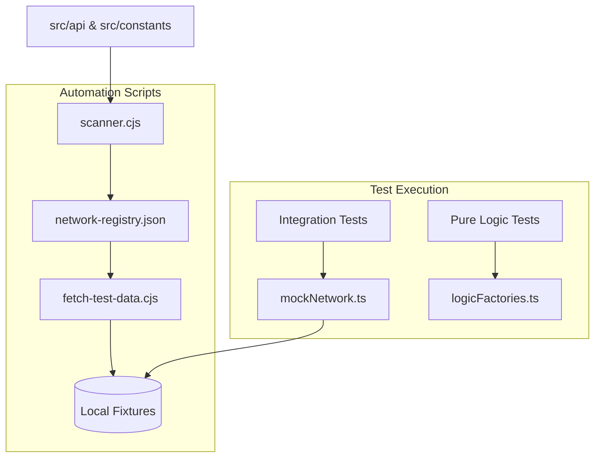

# Chiến lược Kiểm thử Hai Tầng (Two-Tier Testing Strategy)

Tài liệu này mô tả kiến trúc và quy trình triển khai hệ thống kiểm thử cho dự án Nine CMD, chia làm hai loại chính: **Network-Dependent Tests** và **Pure Logic Tests**.

## 1. Phân loại Kiểm thử

### Category 1: Network-Dependent Tests (Kiểm thử phụ thuộc mạng)
Mục tiêu: Đảm bảo ứng dụng xử lý đúng dữ liệu từ các API thực tế (GraphQL, REST) mà không cần thực hiện cuộc gọi mạng thật trong quá trình chạy test CI.

**Thành phần:**
- **Scanner (`scripts/scanner.cjs`)**: Tự động quét mã nguồn (constants, api helpers) để tạo ra `network-registry.json`.
- **Fetcher (`scripts/fetch-test-data.cjs`)**: Sử dụng registry để tải dữ liệu thật từ blockchain/API và lưu thành các file fixtures cục bộ.
- **Mock Layer (`src/__tests__/helpers/mockNetwork.ts`)**: Tự động chặn các yêu cầu mạng và trả về dữ liệu từ fixtures dựa trên registry.

### Category 2: Pure Logic Tests (Kiểm thử logic thuần túy)
Mục tiêu: Kiểm tra các hàm xử lý nghiệp vụ, tính toán chỉ số (CP, AP), và logic quyết định (`decision.ts`) một cách cô lập hoàn toàn.

**Thành phần:**
- **Factories (`src/__tests__/helpers/logicFactories.ts`)**: Cung cấp các hàm tạo dữ liệu mẫu (Mock Data) chuẩn xác theo Typescript interfaces mà không chứa các thuộc tính thừa từ API.
- **Isolated Tests**: Các file test trong `src/__tests__/logic/` không được import bất kỳ mock network nào, chỉ tập trung vào Input -> Output của hàm.

---

## 2. Quy trình Thực hiện (Implementation Roadmap)

### Giai đoạn 1: Thiết lập Hạ tầng Tự động hóa
1. **Tạo `scripts/scanner.cjs`**:
   - Quét `GQL_QUERIES` và `REST_API_CONFIG` trong `src/constants/index.ts`.
   - Tạo file `src/__tests__/network-registry.json` chứa mapping giữa tên query và nội dung.
2. **Nâng cấp `scripts/fetch-test-data.cjs`**:
   - Đọc registry và cấu hình hành tinh.
   - Tải dữ liệu cho các môi trường (Heimdall, Odin).
   - Tự động cắt tỉa dữ liệu (Pruning) để giảm kích thước fixture.

### Giai đoạn 2: Triển khai Mocking & Factories
1. **Hoàn thiện `mockNetwork.ts`**:
   - Sử dụng `vi.mock('@vueuse/core')` để ghi đè `useFetch`.
   - Logic so khớp thông minh: Nếu URL chứa query X trong registry, trả về fixture tương ứng.
2. **Xây dựng `logicFactories.ts`**:
   - Hàm `createMockAvatar()`, `createMockInventory()`, v.v.

### Giai đoạn 3: Viết Test Mẫu
1. **Integration Test**: Kiểm tra `useCharacterStore` có load đúng dữ liệu từ mock network hay không.
2. **Logic Test**: Kiểm tra hàm `calculateCP` hoặc `evaluateAutomation` với các case biên.

---

## 3. Lệnh vận hành

- `npm run test:scan`: Cập nhật danh mục network calls.
- `npm run test:fetch`: Tải dữ liệu thật mới nhất làm fixture.
- `npm run test:unit`: Chạy toàn bộ test suite.
- `npm run test:logic`: Chỉ chạy các bài test logic thuần túy.

---

## 4. Sơ đồ Hoạt động (Mermaid)

