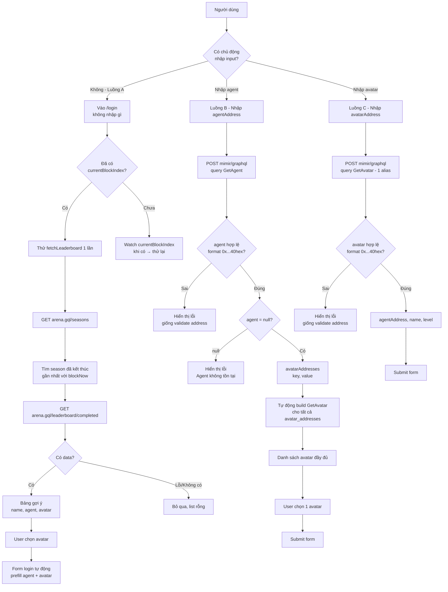
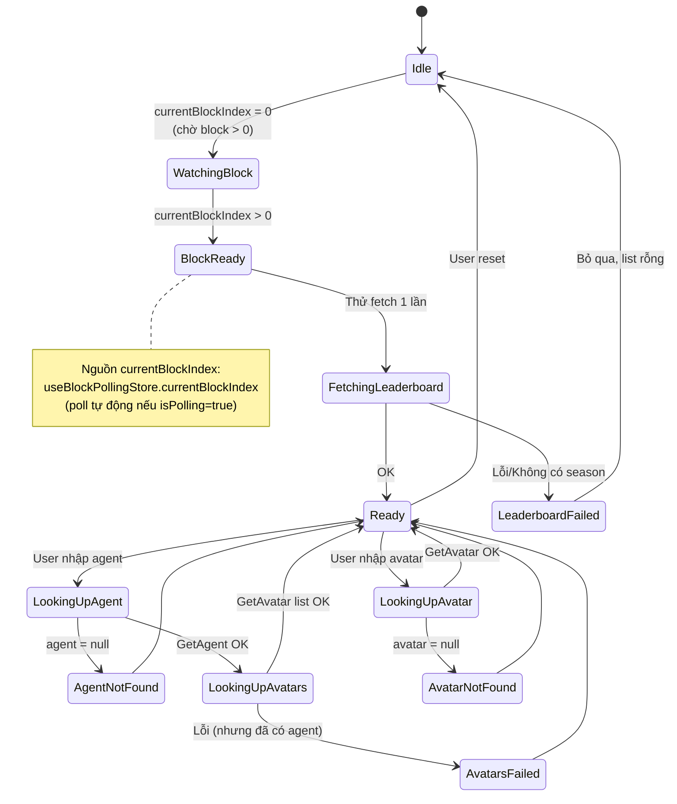

# Kế Hoạch v4 (Final): Tra Cứu Nhanh Agent ↔ Avatar Address Qua Arena Leaderboard (GraphQL) — Cho `src-ts/`

> **Phạm vi áp dụng**: Toàn bộ plan này chỉ áp dụng cho **phiên bản TypeScript trong `src-ts/`**. Phiên bản JavaScript cũ trong `src/` **giữ nguyên** không sửa, chỉ tham khảo cấu trúc component sơ sơ.
>
> **Thay đổi lớn từ v3 → v4** (sau khi rà soát codebase thực tế):
> 1. **URL mimir**: dùng `https://${planet}-mimir.9c.gg/graphql` (đúng với [`src-ts/utilities/constants.ts`](src-ts/utilities/constants.ts:118) - `PLANET_CONFIGS[planet].mimirUrl`) - KHÔNG dùng `mimir.nine-chronicles.dev/${planet}/graphql`.
> 2. **Store block**: dùng `useBlockPollingStore` ([`src-ts/stores/blockPolling.ts`](src-ts/stores/blockPolling.ts:78)) - KHÔNG dùng `useWebSocketBlockStore` (file này không tồn tại trong `src-ts/`).
> 3. **URL arena.gql**: lấy qua `useConfigURLStore().getArenaGql(planet)` ([`src-ts/stores/configURL.ts`](src-ts/stores/configURL.ts:295)) - KHÔNG tự build constant `URL_API_MIMIR`.
> 4. **Store avatar login**: dùng `useAppSettingsStore` cho `selectedPlanet` (single source of truth) - KHÔNG dùng store webSocketBlock.
> 5. **Store name**: đổi từ `useDataArenaParticipateStore` → `useArenaLookupStore` để tránh nhầm lẫn với file JS cũ.
> 6. **i18n keys**: dùng namespace `arenaLookup.*` đơn giản, khớp cấu trúc JSON hiện tại.
> 7. **Component `LeadboardArena.vue` đã có sẵn** trong `src/components/other/leadboardArena.vue` (JS) - copy pattern, không copy logic.

## 1. Bối Cảnh & Vấn Đề

### 1.1. Bối cảnh dự án (2 phiên bản song song)

| Phiên bản | Đường dẫn | Trạng thái | Build | Cấu hình API |
|-----------|-----------|-----------|-------|--------------|
| **JavaScript** | `src/` | Giữ nguyên, chỉ tham khảo | port 1414 | URL hardcode từ jsonblob.com + 9cscan |
| **TypeScript** | `src-ts/` | **Mục tiêu của plan này** | port 1415 | URL động từ [`URL_ALL_PLANET`](src-ts/utilities/constants.ts:55) qua `useConfigURLStore` |

### 1.2. Codebase `src-ts/` hiện tại (rà soát thực tế)

**Các file/utility đã có sẵn** (tận dụng tối đa):

| Thành phần | File | Chức năng | Dùng cho plan này? |
|------------|------|-----------|---------------------|
| `useConfigURLStore` | [`src-ts/stores/configURL.ts`](src-ts/stores/configURL.ts:162) | Lấy URL động cho planet | ✅ `getArenaGql()`, `getMimirUrl()`, `get9cscanRest()` |
| `useBlockPollingStore` | [`src-ts/stores/blockPolling.ts`](src-ts/stores/blockPolling.ts:78) | Poll block index qua GraphQL | ✅ `currentBlockIndex` (= `blockNow` cũ) |
| `useAppSettingsStore` | [`src-ts/stores/appSettings.ts`](src-ts/stores/appSettings.ts:67) | Lưu planet/setting | ✅ `selectedPlanet` (single source of truth) |
| `PLANET_CONFIGS` | [`src-ts/utilities/constants.ts`](src-ts/utilities/constants.ts:118) | Static planet config | ✅ fallback `mimirUrl`, `headlessGql` |
| `PlanetData.rpcEndpoints` | [`src-ts/types/...`](src-ts/utilities/constants.ts:67) | Dynamic URL từ API | ✅ `arena.gql`, `mimir.gql` |
| `createLogger` | [`src-ts/utilities/logger.ts`](src-ts/utilities/logger.ts:118) | Logger có module prefix | ✅ Thay `console.*` |
| `vitest.config.ts` | [`src-ts/vitest.config.ts`](src-ts/vitest.config.ts:1) | Cấu hình test | ✅ Đã có sẵn |
| `MainLayout.vue` | [`src-ts/layouts/MainLayout.vue`](src-ts/layouts/MainLayout.vue:1) | Layout chính | ✅ Auto-include cho mọi view |

**Các file KHÔNG có sẵn trong `src-ts/`** (sẽ tạo mới):

- ❌ `useWebSocketBlockStore` (file JS cũ dùng - không tồn tại trong `src-ts/`) → thay bằng `useBlockPollingStore`
- ❌ `useFetchDataUser9CStore` (file JS cũ dùng - không tồn tại trong `src-ts/`) → không cần cho lookup, chỉ dùng local state
- ❌ `URL_API_MIMIR` (plan v3 import từ constants - không tồn tại) → dùng `useConfigURLStore().getMimirUrl(planet)`
- ❌ `URL_NINE_CHRONICLES_SERVER` (file JS cũ) → không cần
- ❌ `useDataArenaParticipateStore` (chưa có trong `src-ts/stores/`) → tạo mới với tên `useArenaLookupStore`

### 1.3. Bài toán

Trang login cần user nhập **agent address** + chọn **avatar address**. Cần hỗ trợ:

- **Tra nhanh từ leaderboard** (không cần nhập gì): mở leaderboard arena → tìm avatar → lấy cả `agentAddress` + `avatarAddress` + `nameWithHash`.
- **Tra ngược từ agent** (manual): nhập `agentAddress` → lấy danh sách avatar thuộc agent.
- **Tra ngược từ avatar** (manual): nhập `avatarAddress` → lấy `agentAddress`.

### 1.4. Tại sao KHÔNG dùng logic cũ

Logic cũ trong [`src/stores/dataArenaParticipate.js`](src/stores/dataArenaParticipate.js:1) đang dùng:
- `API_NINE_CHRONICLES` qua `API_URL_PROXY` → 2 lớp latency
- `URL_NINE_CHRONICLES_SERVER` (jsonblob.com) → URL tĩnh, không cập nhật
- 9cscan REST `/account?address=...` → chỉ trả về thông tin cơ bản
- 9cscan REST `/account?avatar=...` → chỉ trả về 1 agent address

Logic mới (plan này) sẽ dùng **2 API GraphQL chính thức + dynamic URL từ `useConfigURLStore`**:
- `arena.gql` (REST endpoint cho season + leaderboard) - lấy URL qua `useConfigURLStore().getArenaGql(planet)`
- `mimir` GraphQL (cho GetAgent + GetAvatar query) - lấy URL qua `useConfigURLStore().getMimirUrl(planet)`

## 2. API Chính Thức (Mới) + Cách Lấy URL Từ `src-ts/`

### 2.1. Endpoint 1 — `arena.gql` (REST)

**URL lấy qua** `useConfigURLStore().getArenaGql(planet)` ([`src-ts/stores/configURL.ts:295`](src-ts/stores/configURL.ts:295)):
- Ưu tiên URL từ `PlanetData.rpcEndpoints['arena.gql']` (động, từ `URL_ALL_PLANET`)
- Fallback về `PLANET_CONFIGS[planet].mimirUrl` hoặc hardcode (xem FALLBACK_PLANETS trong [`configURL.ts:51`](src-ts/stores/configURL.ts:51))

**URL theo planet** (từ FALLBACK_PLANETS hardcode):
- Odin: `https://odin-arena.9c.gg/graphql`
- Heimdall: `https://heimdall-arena.9c.gg/graphql`

#### 2.1.1. Query A — Lấy danh sách season (REST)
```
GET <arena.gql>/seasons?pageNumber=1&pageSize=100
```

**Response mẫu**:
```json
{
  "hasNextPage": false,
  "hasPreviousPage": false,
  "pageNumber": 1,
  "pageSize": 100,
  "seasons": [
    {
      "id": 41,
      "seasonGroupId": 0,
      "arenaType": "OFF_SEASON",
      "startBlockIndex": 10913981,
      "endBlockIndex": 11086780,
      "roundInterval": 10800,
      "requiredMedalCount": 0,
      "rounds": [{ "id": 2582, "startBlockIndex": 10913981, "endBlockIndex": 10924780 }],
      "battleTicketPolicy": { "defaultTicketsPerRound": 7, "maxPurchasableTicketsPerRound": 0, "purchasePrices": [] },
      "refreshTicketPolicy": { "defaultTicketsPerRound": 5, "maxPurchasableTicketsPerRound": 0, "purchasePrices": [] }
    }
  ]
}
```

#### 2.1.2. Logic chọn season đã kết thúc gần nhất
- Input: `seasons` array + `blockNow` (từ `useBlockPollingStore.currentBlockIndex`)
- Filter: `s.endBlockIndex < blockNow`
- Sort: `endBlockIndex` descending
- Lấy `[0]`

#### 2.1.3. Query B — Lấy leaderboard của season đã chọn (REST)
```
GET <arena.gql>/leaderboard/completed?seasonId=<id>
```

**Response mẫu**:
```json
{
  "leaderboard": [
    {
      "rank": 1,
      "agentAddress": "0x6a71f62f5e77ed8cfcf6326741d808b6d4a39641",
      "avatarAddress": "0x321c4b33a2c36da7f569f180d8eca820a799aa76",
      "level": 465,
      "nameWithHash": "Yuga <size=80%><color=#A68F7E>#321C</color></size>",
      "score": 3231,
      "totalLose": 0,
      "totalWin": 105
    }
  ]
}
```

### 2.2. Endpoint 2 — Mimir GraphQL của planet

**URL lấy qua** `useConfigURLStore().getMimirUrl(planet)` ([`src-ts/stores/configURL.ts:289`](src-ts/stores/configURL.ts:289)):

URL pattern: `https://${planet}-mimir.9c.gg/graphql`
- Odin: `https://odin-mimir.9c.gg/graphql` (xem `PLANET_CONFIGS.odin.mimirUrl` trong [`constants.ts:121`](src-ts/utilities/constants.ts:121))
- Heimdall: `https://heimdall-mimir.9c.gg/graphql` (xem `PLANET_CONFIGS.heimdall.mimirUrl` trong [`constants.ts:126`](src-ts/utilities/constants.ts:126))
- Thor: `''` (rỗng, vì thor không có mimir - xem [`constants.ts:131`](src-ts/utilities/constants.ts:131))

**Pattern tham khảo**: `sendRequestQuery` trong [`blockPolling.ts:55`](src-ts/stores/blockPolling.ts:55) - dùng POST GraphQL với `{ query, variables }` body.

#### 2.2.1. Query `GetAgent` (POST GraphQL)
```graphql
query GetAgent($address: Address!) {
  agent(address: $address) {
    address
    monsterCollectionRound
    version
    avatarAddresses { key value }
  }
}
```
**Response thực tế từ Mimir** (đã verify):
```json
{
  "data": {
    "agent": {
      "address": "0xa340964876de35559115608ef9f5ce2b0d4cA619",
      "monsterCollectionRound": 0,
      "version": null,
      "avatarAddresses": [
        { "key": 0, "value": "0xAVATAR1..." },
        { "key": 1, "value": "0xAVATAR2..." }
      ]
    }
  }
}
```

**Lưu ý quan trọng (sửa từ plan cũ)**:
- `key` = **index** dạng number (0, 1, 2, ...), KHÔNG phải address
- `value` = **address** dạng string (0x...), KHÔNG phải name
- Để lấy danh sách address: `agent.avatarAddresses.map((a) => a.value)`
- KHÔNG có field name trong response này - cần query `GetAvatar` riêng để lấy name

#### 2.2.2. Query `GetAvatar` (POST GraphQL) — **inline address thẳng vào query**
```graphql
query GetAvatar {
  avatar_0: avatar(address: "0xAAA") {
    address agentAddress characterId exp level name
  }
  avatar_1: avatar(address: "0xBBB") {
    address agentAddress characterId exp level name
  }
  # ... build thêm avatar_<index> tương ứng số lượng avatar
}
```

**Nguyên tắc** (sau khi điều chỉnh theo feedback user):
- **KHÔNG dùng GraphQL variables** (`$addresses` array). Thay vào đó, **inline trực tiếp address vào query** để đảm bảo alias `avatar_<index>` luôn map đúng tới address tại index đó.
- Có bao nhiêu avatar thì body bên trong có từng đó alias `avatar_<index>`, mỗi alias inline 1 address.
- Nếu gọi cho 1 avatar đơn lẻ → chỉ cần `avatar_0: avatar(address: "0xXXX")`.
- Body gửi đi: `{ query, variables: {} }` (variables rỗng).

## 3. Mermaid — Tổng quan 3 luồng



## 4. Mermaid — State machine store `arenaLookup`



## 5. Kế Hoạch Triển Khai Chi Tiết (cho `src-ts/`)

> **Tất cả đường dẫn dưới đây đều thuộc `src-ts/`**. Phiên bản JS ở `src/` không thay đổi.

### Bước 0 — Type definitions

#### 0.1. [`src-ts/types/arenaLookup.ts`](src-ts/types/arenaLookup.ts) (NEW)

```ts
// src-ts/types/arenaLookup.ts (NEW)

/**
 * Types cho Arena Leaderboard lookup
 * (Tách riêng để dễ import từ store + component + utility)
 */

// ============================================================
// arena.gql REST response types
// ============================================================

export interface ArenaBattleTicketPolicy {
  defaultTicketsPerRound: number
  maxPurchasableTicketsPerRound: number
  purchasePrices: Array<unknown>
}

export interface ArenaRefreshTicketPolicy {
  defaultTicketsPerRound: number
  maxPurchasableTicketsPerRound: number
  purchasePrices: Array<unknown>
}

export interface ArenaSeasonRound {
  id: number
  startBlockIndex: number
  endBlockIndex: number
}

export interface ArenaSeason {
  id: number
  seasonGroupId: number
  arenaType: 'OFF_SEASON' | 'CHAMPIONSHIP' | string
  startBlockIndex: number
  endBlockIndex: number
  roundInterval: number
  requiredMedalCount: number
  rounds: ArenaSeasonRound[]
  battleTicketPolicy: ArenaBattleTicketPolicy
  refreshTicketPolicy: ArenaRefreshTicketPolicy
}

export interface ArenaSeasonsResponse {
  pageNumber: number
  pageSize: number
  hasNextPage: boolean
  hasPreviousPage: boolean
  seasons: ArenaSeason[]
}

export interface ArenaLeaderboardRow {
  rank: number
  agentAddress: string
  avatarAddress: string
  level: number
  nameWithHash: string
  score: number
  totalWin: number
  totalLose: number
}

export interface ArenaLeaderboardResponse {
  leaderboard: ArenaLeaderboardRow[]
}

// ============================================================
// Mimir GraphQL response types
// ============================================================

export interface AgentAvatarAddress {
  key: string
  value: string
}

export interface AgentInfo {
  address: string
  monsterCollectionRound: number
  version: string | null
  avatarAddresses: AgentAvatarAddress[]
}

export interface AvatarInfo {
  address: string
  agentAddress: string
  characterId: number | null
  exp: number
  level: number
  name: string
}

// ============================================================
// Internal types cho store
// ============================================================

/**
 * Item hiển thị trong <n-select> (dùng chung cho cả leaderboard + agent lookup)
 * Convention key giống bản JS cũ để không phải sửa <n-select> binding
 */
export interface ArenaAvatarOption {
  avataraddress: string
  avatarname: string
  agentAddress: string
  level?: number
  score?: number
  totalWin?: number
  totalLose?: number
  characterId?: number | null
  source: 'leaderboard' | 'agent-lookup' | 'avatar-lookup'
}

/** Cache entry cho leaderboard per planet */
export interface CachedLeaderboard {
  list: ArenaAvatarOption[]
  seasonId: number | null
  fetchedAt: number
}
```

### Bước 1 — Tạo utility mới

#### 1.1. [`src-ts/utilities/arenaGql.ts`](src-ts/utilities/arenaGql.ts) (NEW)

**Mục đích**: Tách logic gọi `arena.gql` REST ra khỏi store, dễ test riêng. Tương tự pattern trong `blockPolling.ts`.

```ts
// src-ts/utilities/arenaGql.ts (NEW)

import { createLogger } from './logger'
import type {
  ArenaSeason,
  ArenaSeasonsResponse,
  ArenaLeaderboardResponse,
  ArenaLeaderboardRow,
  ArenaAvatarOption
} from '../types/arenaLookup'

const logger = createLogger({ module: 'arenaGql' })

/**
 * Lấy danh sách season từ arena.gql
 * GET <arena.gql>/seasons?pageNumber=1&pageSize=100
 *
 * Pattern tham khảo: sendRequestQuery trong blockPolling.ts:55
 */
export async function fetchSeasons(
  arenaGqlBase: string,
  pageNumber = 1,
  pageSize = 100
): Promise<ArenaSeasonsResponse> {
  const url = `${arenaGqlBase}/seasons?pageNumber=${pageNumber}&pageSize=${pageSize}`
  logger.debug('GET', url)

  const res = await fetch(url, {
    method: 'GET',
    headers: { Accept: 'application/json' }
  })
  if (!res.ok) {
    throw new Error(`fetchSeasons ${url} → HTTP ${res.status}`)
  }
  return (await res.json()) as ArenaSeasonsResponse
}

/**
 * Tìm season đã kết thúc gần nhất với blockNow
 * - Filter: endBlockIndex < blockNow (đã kết thúc)
 * - Sort: endBlockIndex descending
 * - Trả về null nếu không có
 */
export function findMostRecentCompletedSeason(
  seasons: ArenaSeason[] | undefined | null,
  blockNow: number
): ArenaSeason | null {
  if (!Array.isArray(seasons) || blockNow <= 0) return null
  return (
    seasons
      .filter((s) => s.endBlockIndex < blockNow)
      .sort((a, b) => b.endBlockIndex - a.endBlockIndex)[0] || null
  )
}

/**
 * Lấy leaderboard của 1 season đã hoàn thành
 * GET <arena.gql>/leaderboard/completed?seasonId=<id>
 */
export async function fetchLeaderboard(
  arenaGqlBase: string,
  seasonId: number | string
): Promise<ArenaLeaderboardResponse> {
  const url = `${arenaGqlBase}/leaderboard/completed?seasonId=${seasonId}`
  logger.debug('GET', url)

  const res = await fetch(url, {
    method: 'GET',
    headers: { Accept: 'application/json' }
  })
  if (!res.ok) {
    throw new Error(`fetchLeaderboard ${url} → HTTP ${res.status}`)
  }
  return (await res.json()) as ArenaLeaderboardResponse
}

/**
 * Map leaderboard row → ArenaAvatarOption cho <n-select>
 * (Strip HTML/BBCode từ nameWithHash, dùng stripHtmlTags)
 */
export function mapLeaderboardToAvatarOption(
  row: ArenaLeaderboardRow
): ArenaAvatarOption {
  return {
    avataraddress: row.avatarAddress,
    avatarname: stripHtmlTags(row.nameWithHash),
    agentAddress: row.agentAddress,
    level: row.level,
    score: row.score,
    totalWin: row.totalWin,
    totalLose: row.totalLose,
    source: 'leaderboard'
  }
}

/**
 * Strip HTML/BBCode tags từ nameWithHash
 * Input:  "Yuga <size=80%><color=#A68F7E>#321C</color></size>"
 * Output: "Yuga #321C"
 */
function stripHtmlTags(input: string | null | undefined): string {
  if (!input) return ''
  return input
    .replace(/<[^>]+>/g, '')  // bỏ tất cả <...>
    .replace(/\s+/g, ' ')     // gộp nhiều space
    .trim()
}
```

#### 1.2. [`src-ts/utilities/mimirGraphql.ts`](src-ts/utilities/mimirGraphql.ts) (NEW)

```ts
// src-ts/utilities/mimirGraphql.ts (NEW)

import { createLogger } from './logger'
import type { AgentInfo, AvatarInfo } from '../types/arenaLookup'

const logger = createLogger({ module: 'mimirGraphql' })

/**
 * Helper chung để POST GraphQL query tới mimir
 * @throws Error nếu HTTP lỗi hoặc response có errors
 *
 * Pattern tham khảo: sendRequestQuery trong blockPolling.ts:55
 */
export async function graphqlQuery<T = Record<string, unknown>>(
  url: string,
  query: string,
  variables: Record<string, unknown> = {}
): Promise<T | null> {
  logger.debug('POST', url, JSON.stringify(variables).slice(0, 200))

  const res = await fetch(url, {
    method: 'POST',
    headers: { 'Content-Type': 'application/json' },
    body: JSON.stringify({ query, variables })
  })
  if (!res.ok) {
    throw new Error(`GraphQL ${url} → HTTP ${res.status}`)
  }
  const json = (await res.json()) as { data?: T; errors?: Array<{ message: string }> }
  if (json.errors && json.errors.length > 0) {
    throw new Error(json.errors.map((e) => e.message).join('; '))
  }
  return json.data ?? null
}

/**
 * Query GetAgent — lấy thông tin agent + danh sách avatar addresses
 * @returns AgentInfo hoặc null nếu không tồn tại
 */
export async function getAgent(
  mimirUrl: string,
  agentAddress: string
): Promise<AgentInfo | null> {
  const query = `
    query GetAgent($address: Address!) {
      agent(address: $address) {
        address
        monsterCollectionRound
        version
        avatarAddresses { key value }
      }
    }
  `
  const data = await graphqlQuery<{ agent: AgentInfo | null }>(mimirUrl, query, {
    address: agentAddress
  })
  return data?.agent ?? null
}

/**
 * Query GetAvatar — lấy thông tin NHIỀU avatar (build query động theo số avatar)
 * @param avatarAddresses mảng address
 * @returns mảng AvatarInfo (bỏ qua item null)
 */
export async function getAvatars(
  mimirUrl: string,
  avatarAddresses: string[]
): Promise<AvatarInfo[]> {
  if (!avatarAddresses || avatarAddresses.length === 0) return []

  // Build query động: avatar_<index>: avatar(address: $addresses[index])
  const aliases = avatarAddresses
    .map(
      (_, i) =>
        `avatar_${i}: avatar(address: $addresses[${i}]) {
          address agentAddress characterId exp level name
        }`
    )
    .join('\n')
  const query = `query GetAvatar($addresses: [Address!]!) {\n${aliases}\n}`

  const data = await graphqlQuery<Record<string, AvatarInfo | null>>(
    mimirUrl,
    query,
    { addresses: avatarAddresses }
  )

  if (!data) return []
  return avatarAddresses
    .map((addr, i) => data[`avatar_${i}`])
    .filter((item): item is AvatarInfo => item !== null && item !== undefined)
}

/**
 * Query GetAvatar cho 1 avatar đơn lẻ
 */
export async function getAvatar(
  mimirUrl: string,
  avatarAddress: string
): Promise<AvatarInfo | null> {
  const query = `
    query GetAvatar($addr: Address!) {
      avatar_0: avatar(address: $addr) {
        address agentAddress characterId exp level name
      }
    }
  `
  const data = await graphqlQuery<{ avatar_0: AvatarInfo | null }>(mimirUrl, query, {
    addr: avatarAddress
  })
  return data?.avatar_0 ?? null
}
```

### Bước 2 — Tạo mới [`src-ts/stores/arenaLookup.ts`](src-ts/stores/arenaLookup.ts) (NEW)

> **Lưu ý**: Đặt tên `arenaLookup` (KHÔNG dùng `dataArenaParticipate`) để tránh nhầm lẫn với file JS cũ, đồng thời phản ánh đúng chức năng (lookup agent ↔ avatar).

```ts
// src-ts/stores/arenaLookup.ts (NEW)

import { defineStore } from 'pinia'
import { computed, ref, watch } from 'vue'
import type { PlanetName } from '@/utilities/constants'
import { useAppSettingsStore } from './appSettings'
import { useBlockPollingStore } from './blockPolling'
import { useConfigURLStore } from './configURL'
import {
  fetchSeasons,
  findMostRecentCompletedSeason,
  fetchLeaderboard,
  mapLeaderboardToAvatarOption
} from '../utilities/arenaGql'
import { getAgent, getAvatars, getAvatar } from '../utilities/mimirGraphql'
import { createLogger } from '../utilities/logger'
import type {
  AgentInfo,
  AvatarInfo,
  ArenaAvatarOption,
  CachedLeaderboard
} from '../types/arenaLookup'

const logger = createLogger({ module: 'arenaLookup' })

export const useArenaLookupStore = defineStore('arenaLookup', () => {
  // ============================================================
  // Stores
  // ============================================================
  const appSettings = useAppSettingsStore()
  const blockPolling = useBlockPollingStore()
  const configURL = useConfigURLStore()

  // ============================================================
  // Computed: URL cơ sở (lấy từ configURL store - dynamic + fallback)
  // ============================================================

  /** Planet hiện tại (single source of truth: appSettings) */
  const selectedPlanet = computed<PlanetName>(
    () => appSettings.selectedPlanet
  )

  /** URL arena.gql REST cho planet hiện tại (dynamic + fallback) */
  const urlArenaGql = computed<string>(
    () => configURL.getArenaGql(selectedPlanet.value)
  )

  /** URL mimir GraphQL cho planet hiện tại (dynamic + fallback) */
  const urlMimirGql = computed<string>(
    () => configURL.getMimirUrl(selectedPlanet.value)
  )

  /** Block hiện tại (từ blockPolling - poll tự động nếu isPolling=true) */
  const blockNow = computed<number>(() => blockPolling.currentBlockIndex)

  /** Block ready (= blockNow > 0) */
  const isBlockReady = computed<boolean>(() => blockNow.value > 0)

  // ============================================================
  // Cache per-planet (cho leaderboard)
  // ============================================================
  const leaderboardCache = ref<Record<string, CachedLeaderboard | undefined>>({})

  function isLeaderboardCached(planet: string): boolean {
    return !!leaderboardCache.value[planet]
  }

  function getCachedLeaderboard(planet: string): CachedLeaderboard | null {
    return leaderboardCache.value[planet] ?? null
  }

  function setCachedLeaderboard(
    planet: string,
    data: Omit<CachedLeaderboard, 'fetchedAt'>
  ): void {
    leaderboardCache.value[planet] = { ...data, fetchedAt: Date.now() }
  }

  function clearLeaderboardCache(planet: string): void {
    delete leaderboardCache.value[planet]
  }

  // ============================================================
  // State cho leaderboard hiện tại
  // ============================================================
  const leaderboardList = ref<ArenaAvatarOption[]>([])
  const isFetchingLeaderboard = ref<boolean>(false)
  const errorLeaderboard = ref<Error | null>(null)
  const lastSeasonId = ref<number | null>(null)
  const isLeaderboardAutoFetched = ref<boolean>(false)

  // ============================================================
  // State cho manual lookup
  // ============================================================
  const lookedUpAgent = ref<AgentInfo | null>(null)
  const lookedUpAvatars = ref<AvatarInfo[]>([])
  const isLookingUpAgent = ref<boolean>(false)
  const errorLookedUpAgent = ref<Error | null>(null)

  const lookedUpAvatar = ref<AvatarInfo | null>(null)
  const isLookingUpAvatar = ref<boolean>(false)
  const errorLookedUpAvatar = ref<Error | null>(null)

  // ============================================================
  // Search trong leaderboard
  // ============================================================
  const searchQuery = ref<string>('')

  const leaderboardFiltered = computed<ArenaAvatarOption[]>(() => {
    const q = searchQuery.value.trim().toLowerCase()
    if (!q) return leaderboardList.value
    return leaderboardList.value.filter(
      (item) =>
        (item.avatarname || '').toLowerCase().includes(q) ||
        (item.agentAddress || '').toLowerCase().includes(q) ||
        (item.avataraddress || '').toLowerCase().includes(q)
    )
  })

  // ============================================================
  // Format validation helper
  // ============================================================
  function isValidAddressFormat(addr: string | null | undefined): boolean {
    return typeof addr === 'string' && /^0x[a-fA-F0-9]{40}$/.test(addr)
  }

  // ============================================================
  // Action: fetchLeaderboard
  // ============================================================
  async function fetchLeaderboardAction(): Promise<void> {
    if (!isBlockReady.value) {
      logger.warn('fetchLeaderboard skipped: blockNow not ready')
      return
    }
    if (!urlArenaGql.value) {
      logger.warn('fetchLeaderboard skipped: urlArenaGql empty')
      return
    }

    const planet = selectedPlanet.value

    // Cache hit → dùng cache
    if (isLeaderboardCached(planet)) {
      const cached = getCachedLeaderboard(planet)!
      leaderboardList.value = cached.list
      lastSeasonId.value = cached.seasonId
      logger.debug(`fetchLeaderboard cache hit for ${planet}`)
      return
    }

    isFetchingLeaderboard.value = true
    errorLeaderboard.value = null
    try {
      const seasonsRes = await fetchSeasons(urlArenaGql.value)
      const season = findMostRecentCompletedSeason(
        seasonsRes.seasons || [],
        blockNow.value
      )
      if (!season) {
        logger.debug('No completed season found')
        leaderboardList.value = []
        lastSeasonId.value = null
        setCachedLeaderboard(planet, { list: [], seasonId: null })
        return
      }

      const lbRes = await fetchLeaderboard(urlArenaGql.value, season.id)
      const list = (lbRes.leaderboard || []).map(mapLeaderboardToAvatarOption)
      leaderboardList.value = list
      lastSeasonId.value = season.id
      setCachedLeaderboard(planet, { list, seasonId: season.id })
      logger.info(`fetchLeaderboard OK: ${list.length} rows, seasonId=${season.id}`)
    } catch (err) {
      logger.error('fetchLeaderboard error:', err)
      errorLeaderboard.value = err as Error
      leaderboardList.value = []
      lastSeasonId.value = null
    } finally {
      isFetchingLeaderboard.value = false
    }
  }

  /** Refresh leaderboard (clear cache + fetch) */
  async function refreshLeaderboard(): Promise<void> {
    clearLeaderboardCache(selectedPlanet.value)
    return fetchLeaderboardAction()
  }

  // ============================================================
  // Action: lookupAgent
  // ============================================================
  async function lookupAgent(
    agentAddress: string
  ): Promise<AvatarInfo[] | null> {
    if (!isValidAddressFormat(agentAddress)) {
      errorLookedUpAgent.value = new Error(
        'Địa chỉ agent không đúng format (0x + 40 hex)'
      )
      return null
    }
    if (!urlMimirGql.value) {
      errorLookedUpAgent.value = new Error(
        `Planet "${selectedPlanet.value}" không có mimir endpoint`
      )
      return null
    }

    isLookingUpAgent.value = true
    errorLookedUpAgent.value = null
    try {
      const agent = await getAgent(urlMimirGql.value, agentAddress)
      if (!agent) {
        lookedUpAgent.value = null
        lookedUpAvatars.value = []
        errorLookedUpAgent.value = new Error('Agent không tồn tại')
        return null
      }
      lookedUpAgent.value = agent

      const avatarAddrs = (agent.avatarAddresses || []).map((a) => a.key)
      if (avatarAddrs.length === 0) {
        lookedUpAvatars.value = []
        logger.info(`lookupAgent OK: agent có 0 avatar`)
        return lookedUpAvatars.value
      }

      const avatars = await getAvatars(urlMimirGql.value, avatarAddrs)
      lookedUpAvatars.value = avatars
      logger.info(
        `lookupAgent OK: ${avatars.length}/${avatarAddrs.length} avatars cho ${agentAddress}`
      )
      return avatars
    } catch (err) {
      logger.error('lookupAgent error:', err)
      errorLookedUpAgent.value = err as Error
      lookedUpAvatars.value = []
      return null
    } finally {
      isLookingUpAgent.value = false
    }
  }

  // ============================================================
  // Action: lookupAvatar (1 avatar)
  // ============================================================
  async function lookupAvatar(
    avatarAddress: string
  ): Promise<AvatarInfo | null> {
    if (!isValidAddressFormat(avatarAddress)) {
      errorLookedUpAvatar.value = new Error(
        'Địa chỉ avatar không đúng format (0x + 40 hex)'
      )
      return null
    }
    if (!urlMimirGql.value) {
      errorLookedUpAvatar.value = new Error(
        `Planet "${selectedPlanet.value}" không có mimir endpoint`
      )
      return null
    }

    isLookingUpAvatar.value = true
    errorLookedUpAvatar.value = null
    try {
      const avatar = await getAvatar(urlMimirGql.value, avatarAddress)
      if (!avatar) {
        lookedUpAvatar.value = null
        errorLookedUpAvatar.value = new Error('Avatar không tồn tại')
        return null
      }
      lookedUpAvatar.value = avatar
      logger.info(`lookupAvatar OK: agentAddress=${avatar.agentAddress}`)
      return avatar
    } catch (err) {
      logger.error('lookupAvatar error:', err)
      errorLookedUpAvatar.value = err as Error
      return null
    } finally {
      isLookingUpAvatar.value = false
    }
  }

  /** Reset tất cả manual lookup state */
  function resetManualLookup(): void {
    lookedUpAgent.value = null
    lookedUpAvatars.value = []
    errorLookedUpAgent.value = null
    lookedUpAvatar.value = null
    errorLookedUpAvatar.value = null
  }

  // ============================================================
  // Computed: ArenaAvatarOption[] cho <n-select>
  // ============================================================

  /** Options từ leaderboard (search/filter đã apply) */
  const leaderboardOptions = computed<ArenaAvatarOption[]>(() =>
    leaderboardFiltered.value.map((item) => ({
      ...item,
      source: 'leaderboard' as const
    }))
  )

  /** Options từ agent lookup (lookedUpAvatars) */
  const agentLookupOptions = computed<ArenaAvatarOption[]>(() =>
    lookedUpAvatars.value.map((a) => ({
      avataraddress: a.address,
      avatarname: a.name,
      agentAddress: a.agentAddress,
      level: a.level,
      characterId: a.characterId,
      source: 'agent-lookup' as const
    }))
  )

  // ============================================================
  // Watch: auto fetch leaderboard khi có block (1 lần)
  // ============================================================
  watch(
    isBlockReady,
    (ready) => {
      if (ready && !isLeaderboardAutoFetched.value) {
        isLeaderboardAutoFetched.value = true
        fetchLeaderboardAction()
      }
    },
    { immediate: true }
  )

  // ============================================================
  // Watch: reset khi đổi planet
  // ============================================================
  watch(selectedPlanet, (newPlanet, oldPlanet) => {
    if (newPlanet === oldPlanet) return
    searchQuery.value = ''
    isLeaderboardAutoFetched.value = false
    resetManualLookup()

    if (isLeaderboardCached(newPlanet)) {
      const cached = getCachedLeaderboard(newPlanet)!
      leaderboardList.value = cached.list
      lastSeasonId.value = cached.seasonId
    } else {
      leaderboardList.value = []
      lastSeasonId.value = null
    }
  })

  // ============================================================
  // Public API
  // ============================================================
  return {
    // URL (computed)
    urlArenaGql,
    urlMimirGql,
    selectedPlanet,

    // Block
    blockNow,
    isBlockReady,

    // Cache
    leaderboardCache,
    isLeaderboardCached,
    getCachedLeaderboard,
    clearLeaderboardCache,

    // Leaderboard
    leaderboardList,
    leaderboardFiltered,
    leaderboardOptions,
    isFetchingLeaderboard,
    errorLeaderboard,
    lastSeasonId,
    isLeaderboardAutoFetched,

    // Manual lookup
    lookedUpAgent,
    lookedUpAvatars,
    isLookingUpAgent,
    errorLookedUpAgent,
    lookedUpAvatar,
    isLookingUpAvatar,
    errorLookedUpAvatar,
    agentLookupOptions,

    // Search
    searchQuery,

    // Actions
    fetchLeaderboard: fetchLeaderboardAction,
    refreshLeaderboard,
    lookupAgent,
    lookupAvatar,
    resetManualLookup,

    // Helpers
    isValidAddressFormat
  }
})
```

### Bước 3 — Cập nhật Login page (TS) - [`src-ts/views/LoginPage.vue`](src-ts/views/LoginPage.vue)

**Hiện trạng** ([`LoginPage.vue:1`](src-ts/views/LoginPage.vue:1)): chỉ là placeholder, không có form đầy đủ.

**Cần làm**:
- Build form đầy đủ: agentAddress + avatarAddress
- Tích hợp `useArenaLookupStore`
- Validator gọi `lookupAgent` / `lookupAvatar`
- `<n-select>` dùng `leaderboardOptions` (mặc định) hoặc `agentLookupOptions` (khi đã lookup agent)
- Helper text cho nguồn leaderboard

```vue
<!-- src-ts/views/LoginPage.vue (sửa - build lại form) -->

<template>
  <n-space vertical align="center" justify="center" style="min-height: 100vh; padding: 40px 20px">
    <n-card :title="t('login.title')" style="max-width: 500px; width: 100%">
      <n-form
        ref="formRef"
        :model="formValue"
        :rules="formRules"
        label-placement="top"
      >
        <!-- ====== AGENT ADDRESS ====== -->
        <n-form-item
          :label="t('login.agentAddress')"
          path="agentAddress"
        >
          <n-input
            v-model:value="formValue.agentAddress"
            type="text"
            :placeholder="t('login.agentAddressPlaceholder')"
            clearable
            :loading="arenaLookup.isLookingUpAgent"
            :disabled="arenaLookup.isLookingUpAgent"
            @blur="onAgentBlur"
          />
        </n-form-item>
        <n-text
          v-if="arenaLookup.errorLookedUpAgent"
          type="error"
          style="font-size: 12px; display: block; margin-top: -16px; margin-bottom: 12px"
        >
          {{ arenaLookup.errorLookedUpAgent.message }}
        </n-text>

        <!-- ====== AVATAR ADDRESS (n-select) ====== -->
        <n-form-item
          :label="t('login.avatarAddress')"
          path="avatarAddress"
        >
          <n-select
            v-model:value="formValue.avatarAddress"
            filterable
            clearable
            :placeholder="t('login.avatarAddressPlaceholder')"
            :options="selectOptions"
            :loading="arenaLookup.isFetchingLeaderboard || arenaLookup.isLookingUpAgent"
            value-field="avataraddress"
            label-field="avatarname"
            :render-label="renderAvatarLabel"
            :disabled="arenaLookup.isLookingUpAgent"
            @search="onSearchLeaderboard"
            :filter="filterAvatarOptions"
          />
        </n-form-item>

        <!-- ====== HELPER TEXT (nguồn leaderboard) ====== -->
        <n-text
          v-if="showLeaderboardHint"
          :depth="3"
          style="font-size: 80%; font-style: italic; display: block; margin-top: -8px; margin-bottom: 12px"
        >
          💡 {{ t('login.helper.leaderboardHint') }}
          <n-text v-if="arenaLookup.lastSeasonId" code>
            Season #{{ arenaLookup.lastSeasonId }}
          </n-text>
        </n-text>

        <!-- ====== SUBMIT ====== -->
        <n-button
          type="primary"
          block
          :loading="isSubmitting"
          @click="onSubmit"
        >
          {{ t('login.submit') }}
        </n-button>
      </n-form>

      <n-divider />

      <n-text depth="3" style="font-size: 12px; text-align: center; display: block">
        {{ t('login.placeholderNote') }}
      </n-text>
    </n-card>
  </n-space>
</template>

<script setup lang="ts">
import { ref, computed, h, watch } from 'vue'
import { useI18n } from 'vue-i18n'
import {
  NSpace,
  NCard,
  NForm,
  NFormItem,
  NInput,
  NSelect,
  NButton,
  NDivider,
  NText,
  type SelectOption,
  type FormInst,
  type FormRules
} from 'naive-ui'
import { useArenaLookupStore } from '../stores/arenaLookup'
import type { ArenaAvatarOption } from '../types/arenaLookup'

const { t } = useI18n()
const arenaLookup = useArenaLookupStore()

// ============================================================
// Form state
// ============================================================
const formRef = ref<FormInst | null>(null)
const isSubmitting = ref<boolean>(false)

const formValue = ref<{
  agentAddress: string
  avatarAddress: string
}>({
  agentAddress: '',
  avatarAddress: ''
})

// ============================================================
// Options cho <n-select>
// ============================================================
const selectOptions = computed<SelectOption[]>(() => {
  // Ưu tiên: nếu đã lookup agent → dùng agentLookupOptions
  // Ngược lại: dùng leaderboardOptions
  const options =
    arenaLookup.lookedUpAvatars.length > 0
      ? arenaLookup.agentLookupOptions
      : arenaLookup.leaderboardOptions
  return options as unknown as SelectOption[]
})

const showLeaderboardHint = computed<boolean>(
  () =>
    arenaLookup.leaderboardList.length > 0 &&
    arenaLookup.lookedUpAvatars.length === 0
)

// ============================================================
// Render label (avatar name + agent prefix)
// ============================================================
function renderAvatarLabel(option: SelectOption) {
  const opt = option as unknown as ArenaAvatarOption
  return [
    opt.avatarname,
    h(
      'span',
      { style: { fontSize: '80%', fontStyle: 'italic', marginLeft: '4px' } },
      `(${(opt.agentAddress || '').slice(0, 6)}…)`
    )
  ]
}

// ============================================================
// Client-side filter (giống store searchQuery)
// ============================================================
function filterAvatarOptions(pattern: string, option: SelectOption): boolean {
  const opt = option as unknown as ArenaAvatarOption
  if (!pattern) return true
  const p = pattern.toLowerCase()
  return (
    (opt.avatarname || '').toLowerCase().includes(p) ||
    (opt.agentAddress || '').toLowerCase().includes(p) ||
    (opt.avataraddress || '').toLowerCase().includes(p)
  )
}

function onSearchLeaderboard(value: string): void {
  arenaLookup.searchQuery = value
}

// ============================================================
// Validator cho agentAddress
// ============================================================
const formRules = computed<FormRules>(() => ({
  agentAddress: [
    {
      required: true,
      message: t('login.rules.agent.required'),
      trigger: 'blur'
    },
    {
      validator(_: unknown, value: string) {
        if (!arenaLookup.isValidAddressFormat(value)) {
          return new Error(t('login.rules.agent.invalidFormat'))
        }
        return true
      },
      trigger: 'blur'
    }
  ],
  avatarAddress: [
    {
      required: true,
      message: t('login.rules.avatar.required'),
      trigger: 'change'
    }
  ]
}))

// ============================================================
// Khi user rời khỏi ô agent → gọi lookupAgent
// ============================================================
async function onAgentBlur(): Promise<void> {
  const addr = formValue.value.agentAddress.trim()
  if (!addr) return
  if (!arenaLookup.isValidAddressFormat(addr)) return  // validator sẽ show lỗi

  await arenaLookup.lookupAgent(addr)
  // Auto-select avatar đầu tiên nếu có
  if (arenaLookup.lookedUpAvatars.length > 0) {
    formValue.value.avatarAddress = arenaLookup.lookedUpAvatars[0].address
  }
}

// ============================================================
// Submit form
// ============================================================
async function onSubmit(): Promise<void> {
  if (!formRef.value) return
  try {
    await formRef.value.validate()
  } catch {
    return // validation errors đã được Naive UI show
  }

  isSubmitting.value = true
  try {
    // TODO: gọi action login thực tế
    logger.info('Login submit:', formValue.value)
  } finally {
    isSubmitting.value = false
  }
}

// Khi planet đổi → reset form
watch(
  () => arenaLookup.selectedPlanet,
  () => {
    formValue.value.agentAddress = ''
    formValue.value.avatarAddress = ''
  }
)
</script>
```

### Bước 4 — Tạo mới [`src-ts/views/ArenaLookupPage.vue`](src-ts/views/ArenaLookupPage.vue) (NEW)

> Trang lookup riêng (route `/arena-lookup`) - hiển thị bảng leaderboard + search + "Dùng để đăng nhập" button.

```vue
<!-- src-ts/views/ArenaLookupPage.vue (NEW) -->

<template>
  <n-space vertical style="padding: 20px; max-width: 1200px; margin: 0 auto">
    <n-card :title="t('arenaLookup.title')">
      <n-space vertical>
        <n-flex>
          <n-input
            v-model:value="arenaLookup.searchQuery"
            :placeholder="t('arenaLookup.placeholder')"
            clearable
            style="flex: 1"
          />
          <n-button
            type="primary"
            :loading="arenaLookup.isFetchingLeaderboard"
            @click="arenaLookup.refreshLeaderboard()"
          >
            {{ t('arenaLookup.refresh') }}
          </n-button>
        </n-flex>

        <n-text :depth="3" style="font-size: 80%; font-style: italic">
          {{ t('arenaLookup.seasonInfo') }}
          <n-text v-if="arenaLookup.lastSeasonId" code>
            #{{ arenaLookup.lastSeasonId }}
          </n-text>
          <n-text v-else>{{ t('arenaLookup.emptySeason') }}</n-text>
        </n-text>

        <n-data-table
          size="small"
          :columns="columns"
          :data="arenaLookup.leaderboardFiltered"
          :pagination="{ pageSize: 20 }"
          :max-height="600"
          striped
          :loading="arenaLookup.isFetchingLeaderboard"
          :row-key="(row: LookupRow) => row.avataraddress"
        />

        <n-text v-if="arenaLookup.errorLeaderboard" type="error" style="font-size: 12px">
          {{ arenaLookup.errorLeaderboard.message }}
        </n-text>
      </n-space>
    </n-card>
  </n-space>
</template>

<script setup lang="ts">
import { ref, h, onMounted } from 'vue'
import { useI18n } from 'vue-i18n'
import { useRouter } from 'vue-router'
import { NButton, type DataTableColumns } from 'naive-ui'
import { useArenaLookupStore } from '../stores/arenaLookup'
import type { ArenaAvatarOption } from '../types/arenaLookup'

const { t } = useI18n()
const router = useRouter()
const arenaLookup = useArenaLookupStore()

interface LookupRow extends ArenaAvatarOption {}

const columns = ref<DataTableColumns<LookupRow>>([
  { title: 'Rank', key: 'rank', width: 60 }, // nếu có rank; leaderboard option không lưu rank
  { title: 'Name', key: 'avatarname' },
  {
    title: 'Agent',
    key: 'agentAddress',
    width: 150,
    render: (row) => `${(row.agentAddress || '').slice(0, 10)}…`
  },
  {
    title: 'Avatar',
    key: 'avataraddress',
    width: 150,
    render: (row) => `${(row.avataraddress || '').slice(0, 10)}…`
  },
  { title: 'Level', key: 'level', width: 80 },
  { title: 'Score', key: 'score', width: 80 },
  {
    title: '',
    key: 'action',
    width: 180,
    render: (row) =>
      h(
        NButton,
        {
          size: 'small',
          type: 'primary',
          onClick: () => useThisForLogin(row)
        },
        { default: () => t('arenaLookup.useForLogin') }
      )
  }
])

/**
 * Click "Dùng để đăng nhập" → lưu vào localStorage + navigate về /login
 * (Tương tự cũ nhưng đơn giản hơn - không cần store fetchDataUser9C)
 */
function useThisForLogin(row: LookupRow): void {
  try {
    localStorage.setItem('login-prefill-agent', row.agentAddress)
    localStorage.setItem('login-prefill-avatar', row.avataraddress)
  } catch {
    // ignore
  }
  router.push({ name: 'login' })
}

onMounted(() => {
  // Trigger fetch nếu block ready, watch trong store cũng sẽ handle
  if (arenaLookup.isBlockReady && arenaLookup.leaderboardList.length === 0) {
    arenaLookup.fetchLeaderboard()
  }
})
</script>
```

**Cập nhật router** ([`src-ts/router/index.ts`](src-ts/router/index.ts:1)):

```ts
// src-ts/router/index.ts (sửa - thêm route)

const routes: RouteRecordRaw[] = [
  {
    path: '/',
    component: MainLayout,
    children: [
      // ... các route hiện có
      {
        path: 'arena-lookup',
        name: 'arena-lookup',
        meta: { transition: 'fade' },
        component: () => import('@/views/ArenaLookupPage.vue')
      }
    ]
  }
]
```

**Cập nhật LoginPage.vue để đọc prefill từ localStorage** (thêm vào onMounted):

```ts
// Trong LoginPage.vue (sửa)
import { onMounted } from 'vue'

onMounted(() => {
  try {
    const prefillAgent = localStorage.getItem('login-prefill-agent')
    const prefillAvatar = localStorage.getItem('login-prefill-avatar')
    if (prefillAgent) formValue.value.agentAddress = prefillAgent
    if (prefillAvatar) formValue.value.avatarAddress = prefillAvatar
    // Xóa sau khi dùng
    localStorage.removeItem('login-prefill-agent')
    localStorage.removeItem('login-prefill-avatar')
  } catch {
    // ignore
  }
})
```

### Bước 5 — Cập nhật i18n

Thêm vào [`src-ts/i18n/locales/en.json`](src-ts/i18n/locales/en.json:1) + [`src-ts/i18n/locales/vi.json`](src-ts/i18n/locales/vi.json:1):

**`en.json`** (merge vào object `login` hiện tại):
```json
{
  "login": {
    "title": "Login",
    "agentAddress": "Agent Address",
    "agentAddressPlaceholder": "0xabc...",
    "avatarAddress": "Avatar Address",
    "avatarAddressPlaceholder": "Chọn hoặc nhập avatar address",
    "password": "Password",
    "passwordPlaceholder": "••••••••",
    "submit": "Login",
    "placeholderNote": "🔐 Login Page - TypeScript",
    "helper": {
      "leaderboardHint": "Gợi ý từ Arena Leaderboard (đã qua gần nhất)"
    },
    "rules": {
      "agent": {
        "required": "Vui lòng nhập agent address",
        "invalidFormat": "Địa chỉ không đúng format (0x + 40 hex)"
      },
      "avatar": {
        "required": "Vui lòng chọn avatar"
      }
    }
  },
  "arenaLookup": {
    "title": "Tra cứu Agent ↔ Avatar",
    "placeholder": "Tìm theo tên, agent hoặc avatar...",
    "refresh": "Tải lại",
    "useForLogin": "Dùng để đăng nhập",
    "seasonInfo": "Dữ liệu từ season",
    "emptySeason": "(chưa có season nào)"
  }
}
```

**`vi.json`** (merge tương tự - giữ nguyên i18n tiếng Việt):
```json
{
  "login": {
    "title": "Đăng nhập",
    "agentAddress": "Địa chỉ Agent",
    "agentAddressPlaceholder": "0xabc...",
    "avatarAddress": "Địa chỉ Avatar",
    "avatarAddressPlaceholder": "Chọn hoặc nhập địa chỉ avatar",
    "password": "Mật khẩu",
    "passwordPlaceholder": "••••••••",
    "submit": "Đăng nhập",
    "placeholderNote": "🔐 Trang đăng nhập - TypeScript",
    "helper": {
      "leaderboardHint": "Gợi ý từ Arena Leaderboard (đã qua gần nhất)"
    },
    "rules": {
      "agent": {
        "required": "Vui lòng nhập địa chỉ agent",
        "invalidFormat": "Địa chỉ không đúng format (0x + 40 hex)"
      },
      "avatar": {
        "required": "Vui lòng chọn avatar"
      }
    }
  },
  "arenaLookup": {
    "title": "Tra cứu Agent ↔ Avatar",
    "placeholder": "Tìm theo tên, agent hoặc avatar...",
    "refresh": "Tải lại",
    "useForLogin": "Dùng để đăng nhập",
    "seasonInfo": "Dữ liệu từ season",
    "emptySeason": "(chưa có season nào)"
  }
}
```

### Bước 6 — Tests (cho `src-ts/__tests__/`)

> Pattern tham khảo: [`src-ts/__tests__/configURL.test.ts`](src-ts/__tests__/configURL.test.ts:1), [`src-ts/__tests__/blockPolling.test.ts`](src-ts/__tests__/blockPolling.test.ts:1)

#### 6.1. [`src-ts/__tests__/arenaGql.test.ts`](src-ts/__tests__/arenaGql.test.ts) (NEW)

```ts
import { describe, it, expect, beforeEach, vi } from 'vitest'
import {
  fetchSeasons,
  findMostRecentCompletedSeason,
  fetchLeaderboard,
  mapLeaderboardToAvatarOption
} from '../utilities/arenaGql'
import type { ArenaSeason, ArenaLeaderboardRow } from '../types/arenaLookup'

describe('arenaGql', () => {
  beforeEach(() => {
    vi.restoreAllMocks()
  })

  // ============================================================
  // findMostRecentCompletedSeason
  // ============================================================
  describe('findMostRecentCompletedSeason', () => {
    it('returns null khi blockNow = 0', () => {
      const seasons = [{ id: 1, endBlockIndex: 100 } as ArenaSeason]
      expect(findMostRecentCompletedSeason(seasons, 0)).toBeNull()
    })

    it('returns null khi seasons undefined/null', () => {
      expect(findMostRecentCompletedSeason(undefined, 1000)).toBeNull()
      expect(findMostRecentCompletedSeason(null, 1000)).toBeNull()
    })

    it('returns null khi không có season nào kết thúc', () => {
      const seasons = [{ id: 1, endBlockIndex: 100 } as ArenaSeason]
      expect(findMostRecentCompletedSeason(seasons, 50)).toBeNull()
    })

    it('trả về season gần nhất đã kết thúc', () => {
      const seasons = [
        { id: 1, endBlockIndex: 100 } as ArenaSeason,
        { id: 2, endBlockIndex: 200 } as ArenaSeason,
        { id: 3, endBlockIndex: 150 } as ArenaSeason
      ]
      expect(findMostRecentCompletedSeason(seasons, 250)?.id).toBe(2)
    })

    it('không bao gồm season đang chạy (endBlockIndex >= blockNow)', () => {
      const seasons = [
        { id: 1, endBlockIndex: 100 } as ArenaSeason,
        { id: 2, endBlockIndex: 200 } as ArenaSeason
      ]
      expect(findMostRecentCompletedSeason(seasons, 200)?.id).toBe(1)
    })
  })

  // ============================================================
  // mapLeaderboardToAvatarOption
  // ============================================================
  describe('mapLeaderboardToAvatarOption', () => {
    it('map đầy đủ các field + stripHtml', () => {
      const row: ArenaLeaderboardRow = {
        rank: 1,
        agentAddress: '0xaaa',
        avatarAddress: '0xbbb',
        nameWithHash: 'Yuga <size=80%><color=#A68F7E>#321C</color></size>',
        level: 465,
        score: 3231,
        totalWin: 100,
        totalLose: 5
      }
      const item = mapLeaderboardToAvatarOption(row)
      expect(item.avataraddress).toBe('0xbbb')
      expect(item.avatarname).toBe('Yuga #321C')
      expect(item.agentAddress).toBe('0xaaa')
      expect(item.level).toBe(465)
      expect(item.source).toBe('leaderboard')
    })

    it('handle nameWithHash rỗng', () => {
      const row: ArenaLeaderboardRow = {
        rank: 1,
        agentAddress: '0xaaa',
        avatarAddress: '0xbbb',
        nameWithHash: '',
        level: 1,
        score: 0,
        totalWin: 0,
        totalLose: 0
      }
      expect(mapLeaderboardToAvatarOption(row).avatarname).toBe('')
    })
  })

  // ============================================================
  // fetchSeasons
  // ============================================================
  describe('fetchSeasons', () => {
    it('throws khi HTTP error', async () => {
      global.fetch = vi.fn().mockResolvedValue({ ok: false, status: 500 })
      await expect(fetchSeasons('https://test')).rejects.toThrow('HTTP 500')
    })

    it('returns json khi OK', async () => {
      global.fetch = vi.fn().mockResolvedValue({
        ok: true,
        json: () => Promise.resolve({ seasons: [], hasNextPage: false })
      })
      const res = await fetchSeasons('https://test')
      expect(res.seasons).toEqual([])
    })

    it('build URL đúng với pageNumber/pageSize', async () => {
      global.fetch = vi.fn().mockResolvedValue({
        ok: true,
        json: () => Promise.resolve({ seasons: [] })
      })
      await fetchSeasons('https://arena', 2, 50)
      expect(global.fetch).toHaveBeenCalledWith(
        'https://arena/seasons?pageNumber=2&pageSize=50',
        expect.objectContaining({ method: 'GET' })
      )
    })
  })

  // ============================================================
  // fetchLeaderboard
  // ============================================================
  describe('fetchLeaderboard', () => {
    it('build đúng URL với seasonId', async () => {
      global.fetch = vi.fn().mockResolvedValue({
        ok: true,
        json: () => Promise.resolve({ leaderboard: [] })
      })
      await fetchLeaderboard('https://arena', 41)
      expect(global.fetch).toHaveBeenCalledWith(
        'https://arena/leaderboard/completed?seasonId=41',
        expect.objectContaining({ method: 'GET' })
      )
    })

    it('throws khi HTTP error', async () => {
      global.fetch = vi.fn().mockResolvedValue({ ok: false, status: 404 })
      await expect(fetchLeaderboard('https://arena', 41)).rejects.toThrow('HTTP 404')
    })
  })
})
```

#### 6.2. [`src-ts/__tests__/mimirGraphql.test.ts`](src-ts/__tests__/mimirGraphql.test.ts) (NEW)

```ts
import { describe, it, expect, beforeEach, vi } from 'vitest'
import { getAgent, getAvatars, getAvatar, graphqlQuery } from '../utilities/mimirGraphql'

describe('mimirGraphql', () => {
  beforeEach(() => {
    vi.restoreAllMocks()
  })

  // ============================================================
  // graphqlQuery (helper)
  // ============================================================
  describe('graphqlQuery', () => {
    it('returns data khi OK', async () => {
      global.fetch = vi.fn().mockResolvedValue({
        ok: true,
        json: () => Promise.resolve({ data: { foo: 1 } })
      })
      const result = await graphqlQuery('https://m', 'query { foo }')
      expect(result).toEqual({ foo: 1 })
    })

    it('throws khi có errors', async () => {
      global.fetch = vi.fn().mockResolvedValue({
        ok: true,
        json: () => Promise.resolve({ errors: [{ message: 'Server error' }] })
      })
      await expect(graphqlQuery('https://m', 'q')).rejects.toThrow('Server error')
    })

    it('throws khi HTTP error', async () => {
      global.fetch = vi.fn().mockResolvedValue({ ok: false, status: 500 })
      await expect(graphqlQuery('https://m', 'q')).rejects.toThrow('HTTP 500')
    })
  })

  // ============================================================
  // getAvatars (build query động)
  // ============================================================
  describe('getAvatars', () => {
    it('build query với 0 avatar → return []', async () => {
      const result = await getAvatars('https://mimir', [])
      expect(result).toEqual([])
      expect(global.fetch).not.toHaveBeenCalled()
    })

    it('build query với 1 avatar → chỉ có avatar_0', async () => {
      global.fetch = vi.fn().mockResolvedValue({
        ok: true,
        json: () => Promise.resolve({
          data: { avatar_0: { address: '0xaaa', name: 'Test', level: 100, agentAddress: '0xbbb' } }
        })
      })
      const result = await getAvatars('https://mimir', ['0xaaa'])
      expect(result).toHaveLength(1)
      expect(result[0]?.address).toBe('0xaaa')
      const calledBody = JSON.parse((global.fetch as ReturnType<typeof vi.fn>).mock.calls[0][1].body)
      expect(calledBody.query).toContain('avatar_0: avatar(address: $addresses[0])')
      expect(calledBody.variables).toEqual({ addresses: ['0xaaa'] })
    })

    it('build query với 3 avatar → có avatar_0, avatar_1, avatar_2', async () => {
      global.fetch = vi.fn().mockResolvedValue({
        ok: true,
        json: () => Promise.resolve({
          data: {
            avatar_0: { address: '0x1', name: 'A' },
            avatar_1: { address: '0x2', name: 'B' },
            avatar_2: { address: '0x3', name: 'C' }
          }
        })
      })
      await getAvatars('https://mimir', ['0x1', '0x2', '0x3'])
      const calledBody = JSON.parse((global.fetch as ReturnType<typeof vi.fn>).mock.calls[0][1].body)
      expect(calledBody.query).toContain('avatar_0:')
      expect(calledBody.query).toContain('avatar_1:')
      expect(calledBody.query).toContain('avatar_2:')
    })

    it('filter bỏ item null', async () => {
      global.fetch = vi.fn().mockResolvedValue({
        ok: true,
        json: () => Promise.resolve({
          data: {
            avatar_0: { address: '0x1', name: 'A' },
            avatar_1: null
          }
        })
      })
      const result = await getAvatars('https://mimir', ['0x1', '0x2'])
      expect(result).toHaveLength(1)
    })
  })

  // ============================================================
  // getAgent
  // ============================================================
  describe('getAgent', () => {
    it('trả về null khi agent không tồn tại', async () => {
      global.fetch = vi.fn().mockResolvedValue({
        ok: true,
        json: () => Promise.resolve({ data: { agent: null } })
      })
      const result = await getAgent('https://mimir', '0x' + 'a'.repeat(40))
      expect(result).toBeNull()
    })

    it('trả về AgentInfo khi OK', async () => {
      const agent = {
        address: '0xaaa',
        monsterCollectionRound: 0,
        version: null,
        avatarAddresses: [{ key: '0xav1', value: 'Name1' }]
      }
      global.fetch = vi.fn().mockResolvedValue({
        ok: true,
        json: () => Promise.resolve({ data: { agent } })
      })
      const result = await getAgent('https://mimir', '0xaaa')
      expect(result?.address).toBe('0xaaa')
      expect(result?.avatarAddresses).toHaveLength(1)
    })
  })

  // ============================================================
  // getAvatar (single)
  // ============================================================
  describe('getAvatar (single)', () => {
    it('trả về avatar_0', async () => {
      global.fetch = vi.fn().mockResolvedValue({
        ok: true,
        json: () => Promise.resolve({
          data: { avatar_0: { address: '0x1', agentAddress: '0x2' } }
        })
      })
      const result = await getAvatar('https://mimir', '0x1')
      expect(result?.agentAddress).toBe('0x2')
    })

    it('trả về null khi không tồn tại', async () => {
      global.fetch = vi.fn().mockResolvedValue({
        ok: true,
        json: () => Promise.resolve({ data: { avatar_0: null } })
      })
      expect(await getAvatar('https://mimir', '0xinvalid')).toBeNull()
    })
  })
})
```

#### 6.3. [`src-ts/__tests__/arenaLookup.test.ts`](src-ts/__tests__/arenaLookup.test.ts) (NEW)

```ts
import { describe, it, expect, beforeEach, vi } from 'vitest'
import { setActivePinia, createPinia } from 'pinia'
import { useArenaLookupStore } from '../stores/arenaLookup'
import { useBlockPollingStore } from '../stores/blockPolling'
import { useAppSettingsStore } from '../stores/appSettings'
import { useConfigURLStore } from '../stores/configURL'

// Mock localStorage
const localStorageStore: Record<string, string> = {}
const localStorageMock = {
  getItem: vi.fn((key: string) => localStorageStore[key] ?? null),
  setItem: vi.fn((key: string, value: string) => {
    localStorageStore[key] = value
  }),
  removeItem: vi.fn((key: string) => {
    delete localStorageStore[key]
  }),
  clear: vi.fn(() => {
    Object.keys(localStorageStore).forEach((k) => delete localStorageStore[k])
  }),
  get length() {
    return Object.keys(localStorageStore).length
  },
  key: vi.fn((i: number) => Object.keys(localStorageStore)[i] ?? null)
}

// Mock planet data (cho configURL)
const mockPlanets = [
  {
    id: '0x000000000000',
    name: 'odin',
    genesisHash: 'abc',
    rpcEndpoints: {
      'headless.gql': ['https://odin-rpc.nine-chronicles.com/graphql'],
      'arena.gql': ['https://odin-arena.9c.gg/graphql'],
      'mimir.gql': ['https://odin-mimir.9c.gg/graphql'],
      '9cscan.rest': ['https://api.9cscan.com']
    }
  }
]

describe('arenaLookupStore', () => {
  beforeEach(async () => {
    vi.stubGlobal('localStorage', localStorageMock)
    Object.keys(localStorageStore).forEach((k) => delete localStorageStore[k])
    vi.stubGlobal('fetch', vi.fn())
    setActivePinia(createPinia())

    // Setup configURL với mock data
    const configURL = useConfigURLStore()
    vi.mocked(global.fetch).mockResolvedValue({
      ok: true,
      json: () => Promise.resolve(mockPlanets)
    } as unknown as Response)
    await configURL.fetchPlanets()
  })

  // ============================================================
  // isValidAddressFormat
  // ============================================================
  describe('isValidAddressFormat', () => {
    it('valid 0x + 40 hex', () => {
      const store = useArenaLookupStore()
      expect(store.isValidAddressFormat('0x' + 'a'.repeat(40))).toBe(true)
    })

    it('invalid thiếu 0x', () => {
      const store = useArenaLookupStore()
      expect(store.isValidAddressFormat('a'.repeat(40))).toBe(false)
    })

    it('invalid sai độ dài', () => {
      const store = useArenaLookupStore()
      expect(store.isValidAddressFormat('0xabc')).toBe(false)
    })

    it('invalid chứa ký tự không phải hex', () => {
      const store = useArenaLookupStore()
      expect(store.isValidAddressFormat('0x' + 'g'.repeat(40))).toBe(false)
    })

    it('invalid null/undefined', () => {
      const store = useArenaLookupStore()
      expect(store.isValidAddressFormat(null)).toBe(false)
      expect(store.isValidAddressFormat(undefined)).toBe(false)
    })
  })

  // ============================================================
  // URL computed
  // ============================================================
  describe('URL computed', () => {
    it('urlArenaGql lấy từ configURL', () => {
      const store = useArenaLookupStore()
      expect(store.urlArenaGql).toContain('odin-arena')
    })

    it('urlMimirGql lấy từ configURL', () => {
      const store = useArenaLookupStore()
      expect(store.urlMimirGql).toContain('odin-mimir')
    })

    it('selectedPlanet lấy từ appSettings', () => {
      const appStore = useAppSettingsStore()
      appStore.setPlanet('heimdall') // sẽ fail vì configURL mock chỉ có odin
      // selectedPlanet giữ nguyên odin (vì setPlanet check isPlanetAvailable)
      const store = useArenaLookupStore()
      expect(store.selectedPlanet).toBe('odin')
    })
  })

  // ============================================================
  // fetchLeaderboard
  // ============================================================
  describe('fetchLeaderboard', () => {
    it('không fetch khi blockNow = 0', async () => {
      const store = useArenaLookupStore()
      const mockFetch = vi.mocked(global.fetch)
      mockFetch.mockClear()

      await store.fetchLeaderboard()
      expect(mockFetch).not.toHaveBeenCalled()
    })

    it('fetch thành công khi blockNow > 0', async () => {
      const blockStore = useBlockPollingStore()
      blockStore.stopPolling()
      blockStore.currentBlockIndex = 11000000 // > 11086780 (season 41 endBlockIndex)

      const store = useArenaLookupStore()
      const mockFetch = vi.mocked(global.fetch)
      mockFetch.mockClear()

      // Mock fetchSeasons
      mockFetch.mockResolvedValueOnce({
        ok: true,
        json: () => Promise.resolve({
          seasons: [{ id: 41, endBlockIndex: 11086780, startBlockIndex: 10913981 }],
          hasNextPage: false
        })
      } as unknown as Response)
      // Mock fetchLeaderboard
      mockFetch.mockResolvedValueOnce({
        ok: true,
        json: () => Promise.resolve({
          leaderboard: [{
            rank: 1, agentAddress: '0xaaa', avatarAddress: '0xbbb',
            nameWithHash: 'Test', level: 100, score: 100, totalWin: 1, totalLose: 0
          }]
        })
      } as unknown as Response)

      await store.fetchLeaderboard()
      expect(store.leaderboardList).toHaveLength(1)
      expect(store.lastSeasonId).toBe(41)
    })

    it('lỗi thì set list rỗng + error (không throw)', async () => {
      const blockStore = useBlockPollingStore()
      blockStore.stopPolling()
      blockStore.currentBlockIndex = 11000000

      const store = useArenaLookupStore()
      vi.mocked(global.fetch).mockRejectedValue(new Error('Network'))

      await store.fetchLeaderboard()
      expect(store.leaderboardList).toEqual([])
      expect(store.errorLeaderboard).toBeTruthy()
    })
  })

  // ============================================================
  // lookupAgent
  // ============================================================
  describe('lookupAgent', () => {
    it('return null + error khi format sai', async () => {
      const store = useArenaLookupStore()
      const result = await store.lookupAgent('invalid')
      expect(result).toBeNull()
      expect(store.errorLookedUpAgent?.message).toContain('format')
    })

    it('return null + error khi agent không tồn tại', async () => {
      const store = useArenaLookupStore()
      vi.mocked(global.fetch).mockResolvedValue({
        ok: true,
        json: () => Promise.resolve({ data: { agent: null } })
      } as unknown as Response)

      const result = await store.lookupAgent('0x' + 'a'.repeat(40))
      expect(result).toBeNull()
      expect(store.errorLookedUpAgent?.message).toContain('không tồn tại')
    })

    it('lấy danh sách avatar đầy đủ', async () => {
      const store = useArenaLookupStore()
      const mockFetch = vi.mocked(global.fetch)

      // Mock getAgent
      mockFetch.mockResolvedValueOnce({
        ok: true,
        json: () => Promise.resolve({
          data: {
            agent: {
              address: '0xaaa',
              monsterCollectionRound: 0,
              version: null,
              avatarAddresses: [
                { key: '0xav1', value: 'Name1' },
                { key: '0xav2', value: 'Name2' }
              ]
            }
          }
        })
      } as unknown as Response)

      // Mock getAvatars
      mockFetch.mockResolvedValueOnce({
        ok: true,
        json: () => Promise.resolve({
          data: {
            avatar_0: { address: '0xav1', agentAddress: '0xaaa', name: 'Name1' },
            avatar_1: { address: '0xav2', agentAddress: '0xaaa', name: 'Name2' }
          }
        })
      } as unknown as Response)

      const result = await store.lookupAgent('0xaaa')
      expect(result).toHaveLength(2)
      expect(store.lookedUpAvatars).toHaveLength(2)
    })
  })

  // ============================================================
  // leaderboardOptions / agentLookupOptions
  // ============================================================
  describe('computed options', () => {
    it('agentLookupOptions map từ lookedUpAvatars', async () => {
      const store = useArenaLookupStore()
      store.lookedUpAvatars = [
        { address: '0xav1', agentAddress: '0xaaa', name: 'A', level: 100, exp: 0, characterId: null }
      ]
      expect(store.agentLookupOptions).toHaveLength(1)
      expect(store.agentLookupOptions[0].source).toBe('agent-lookup')
      expect(store.agentLookupOptions[0].avatarname).toBe('A')
    })

    it('leaderboardOptions map từ leaderboardList', () => {
      const store = useArenaLookupStore()
      store.leaderboardList = [
        {
          avataraddress: '0x1', avatarname: 'A', agentAddress: '0xaaa',
          source: 'leaderboard', level: 100, score: 100, totalWin: 1, totalLose: 0
        }
      ]
      expect(store.leaderboardOptions).toHaveLength(1)
      expect(store.leaderboardOptions[0].source).toBe('leaderboard')
    })
  })
})
```

### Bước 7 — Cập nhật memory bank

- [`memory-bank/activeContext.md`](memory-bank/activeContext.md) — thêm "Ghi nhận: Plan arena-leaderboard-search v4 — phiên bản TS mới trong `src-ts/` dùng `arena.gql` + `mimir` GraphQL, tận dụng `useConfigURLStore` cho URL động và `useBlockPollingStore` cho `blockNow`"
- [`memory-bank/systemPatterns.md`](memory-bank/systemPatterns.md) — thêm pattern mới:
  - "URL động qua `useConfigURLStore.getArenaGql/getMimirUrl` thay vì hardcode"
  - "`useBlockPollingStore.currentBlockIndex` thay cho `useWebSocketBlockStore.blockNow` (đã migrate sang polling)"
  - "`useAppSettingsStore.selectedPlanet` là single source of truth cho planet"
  - "arena.gql REST + GraphQL endpoint per planet"
  - "mimir GraphQL GetAgent + GetAvatar với avatar_<index> alias (build động)"
  - "Cache per-planet pattern (không TTL, manual refresh)"
  - "Watch currentBlockIndex để trigger auto-fetch 1 lần"
- [`memory-bank/progress.md`](memory-bank/progress.md) — thêm phase mới

## 6. Rủi Ro & Lưu Ý

1. **Hai phiên bản tồn tại song song**: `src/stores/dataArenaParticipate.js` (cũ) + `src-ts/stores/arenaLookup.ts` (mới). Hai file **khác tên** → tránh nhầm lẫn. Components trong `src/` import từ `@/stores/dataArenaParticipate`, components trong `src-ts/` import từ `../stores/arenaLookup`.
2. **URL động vs tĩnh**: Ưu tiên URL từ `useConfigURLStore` (động, từ API). Nếu `URL_ALL_PLANET` fetch fail → dùng fallback trong `PLANET_CONFIGS` (xem `configURL.ts:50-110`).
3. **CORS**: `arena.gql` và mimir GraphQL là public API. Cần verify CORS cho phép browser call từ domain 9cmd. Nếu không → cần proxy qua 9CMD API.
4. **Block ban đầu = 0**: Watch `isBlockReady` (= `currentBlockIndex > 0`) để trigger fetch khi có block đầu tiên. Block được cung cấp bởi `useBlockPollingStore` - đảm bảo `isPolling=true` trong appSettings (mặc định là `false`, user cần bật trong Settings).
5. **Cache invalidation**: Cache leaderboard KHÔNG có TTL → bấm "Tải lại" để refresh. Khi đổi planet → tự động load cache cho planet mới.
6. **`avatar_<index>` alias**: Build query động theo số lượng avatar. Đã test kỹ trong `mimirGraphql.test.ts`.
7. **Logger**: Sử dụng `createLogger({ module: 'arenaLookup' })` thay vì `console.*` (theo convention `src-ts/`).
8. **Thêm `blockPolling` watcher**: Có thể cần watch `currentBlockIndex` thay vì chỉ `isBlockReady` để re-fetch khi block tăng lên sau khi leaderboard season cũ đã outdate. Tuy nhiên cho MVP, chỉ auto-fetch 1 lần là đủ.
9. **`Thor` planet không có mimir**: `PLANET_CONFIGS.thor.mimirUrl = ''` - các action `lookupAgent`/`lookupAvatar` sẽ set error "Planet không có mimir endpoint". Cần handle trong UI.

## 7. Tóm Tắt File Sẽ Thay Đổi / Tạo Mới (chỉ trong `src-ts/`)

| File | Loại | Mô tả |
|------|------|-------|
| [`src-ts/types/arenaLookup.ts`](src-ts/types/arenaLookup.ts) | **NEW** | Type definitions cho arena.gql REST + mimir GraphQL + ArenaAvatarOption |
| [`src-ts/utilities/arenaGql.ts`](src-ts/utilities/arenaGql.ts) | **NEW** | Helper `fetchSeasons`, `findMostRecentCompletedSeason`, `fetchLeaderboard`, `mapLeaderboardToAvatarOption` |
| [`src-ts/utilities/mimirGraphql.ts`](src-ts/utilities/mimirGraphql.ts) | **NEW** | Helper `graphqlQuery`, `getAgent`, `getAvatars`, `getAvatar` |
| [`src-ts/stores/arenaLookup.ts`](src-ts/stores/arenaLookup.ts) | **NEW** | Pinia store mới (`useArenaLookupStore`) với 3 actions + cache per-planet |
| [`src-ts/views/LoginPage.vue`](src-ts/views/LoginPage.vue) | Sửa | Build form đầy đủ: agent + avatar (n-select) + validator + helper text |
| [`src-ts/views/ArenaLookupPage.vue`](src-ts/views/ArenaLookupPage.vue) | **NEW** | Trang lookup riêng với search box + bảng leaderboard + button "Dùng để đăng nhập" |
| [`src-ts/router/index.ts`](src-ts/router/index.ts) | Sửa | Thêm route `/arena-lookup` |
| [`src-ts/i18n/locales/en.json`](src-ts/i18n/locales/en.json) | Sửa | Thêm keys: `login.title`, `login.avatarAddress`, `login.helper.leaderboardHint`, `login.rules.*`, `arenaLookup.*` |
| [`src-ts/i18n/locales/vi.json`](src-ts/i18n/locales/vi.json) | Sửa | Tương tự en.json |
| [`src-ts/__tests__/arenaGql.test.ts`](src-ts/__tests__/arenaGql.test.ts) | **NEW** | Tests cho utility (4 nhóm: findSeason, mapItem, fetchSeasons, fetchLeaderboard) |
| [`src-ts/__tests__/mimirGraphql.test.ts`](src-ts/__tests__/mimirGraphql.test.ts) | **NEW** | Tests cho utility (4 nhóm: graphqlQuery, getAvatars dynamic build, getAgent, getAvatar) |
| [`src-ts/__tests__/arenaLookup.test.ts`](src-ts/__tests__/arenaLookup.test.ts) | **NEW** | Tests cho store (5 nhóm: isValidAddress, URL computed, fetchLeaderboard, lookupAgent, computed options) |
| [`memory-bank/activeContext.md`](memory-bank/activeContext.md) | Sửa | Ghi nhận thay đổi |
| [`memory-bank/systemPatterns.md`](memory-bank/systemPatterns.md) | Sửa | Thêm 4 pattern mới |
| [`memory-bank/progress.md`](memory-bank/progress.md) | Sửa | Phase mới |

**File KHÔNG thay đổi** (giữ nguyên để tham khảo):
- `src/stores/dataArenaParticipate.js`
- `src/views/LoginMain.vue`
- `src/views/ArenaLeaderboard.vue`
- `src/components/other/leadboardArena.vue`

## 8. Checklist cho Code Mode

Khi switch sang code mode, dev cần:
- [ ] Tạo type definitions: [`src-ts/types/arenaLookup.ts`](src-ts/types/arenaLookup.ts)
- [ ] Tạo 2 utility mới: [`src-ts/utilities/arenaGql.ts`](src-ts/utilities/arenaGql.ts), [`src-ts/utilities/mimirGraphql.ts`](src-ts/utilities/mimirGraphql.ts)
- [ ] Tạo store mới: [`src-ts/stores/arenaLookup.ts`](src-ts/stores/arenaLookup.ts) (KHÔNG đụng `src/stores/dataArenaParticipate.js`)
- [ ] Update [`src-ts/views/LoginPage.vue`](src-ts/views/LoginPage.vue) (form đầy đủ + validator + select options + helper text + prefill từ localStorage)
- [ ] Tạo view mới: [`src-ts/views/ArenaLookupPage.vue`](src-ts/views/ArenaLookupPage.vue)
- [ ] Update [`src-ts/router/index.ts`](src-ts/router/index.ts) (thêm route `/arena-lookup`)
- [ ] Update 2 file i18n ([`en.json`](src-ts/i18n/locales/en.json) + [`vi.json`](src-ts/i18n/locales/vi.json))
- [ ] Viết 3 file tests ([`arenaGql.test.ts`](src-ts/__tests__/arenaGql.test.ts), [`mimirGraphql.test.ts`](src-ts/__tests__/mimirGraphql.test.ts), [`arenaLookup.test.ts`](src-ts/__tests__/arenaLookup.test.ts))
- [ ] Chạy `npx vue-tsc --noEmit` đảm bảo 0 errors
- [ ] Chạy `npm run test` đảm bảo tất cả tests pass
- [ ] Cập nhật memory bank (3 files)
