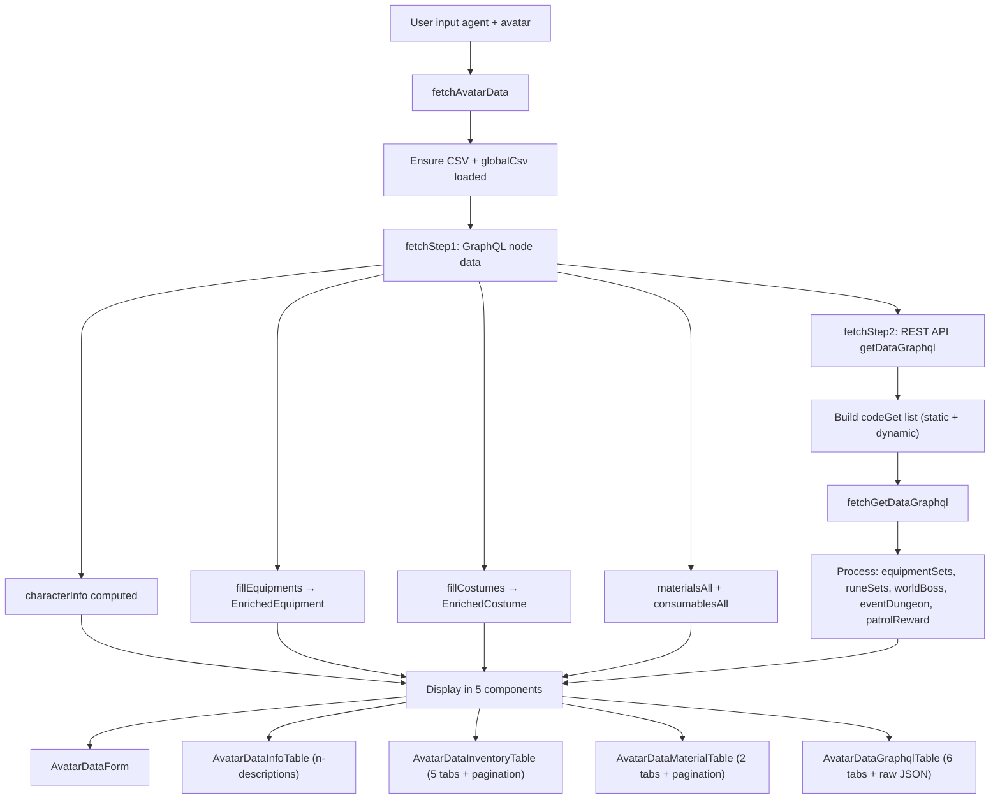

# Plan: Hoàn Thiện Avatar Data Display Feature

## Tổng quan
Tiếp tục phát triển tính năng Avatar Data Display — hoàn thiện REST API data (fetchStep2), thêm pagination cho tables, đầy đủ i18n, tận dụng tối đa các thư viện có sẵn.

> **Files hiện có đã tạo**: Bước 1-14 đã hoàn thành. Plan này xử lý các TODO còn lại.

---

## Phân Tích Hiện Trạng

### Đã Hoàn Thành ✅
- Types, constants, helpers, GraphQL queries, store (fetchStep1), 5 components, view, route, menu, i18n keys
- Login → Avatar Data flow (localStorage prefill)
- Double-unwrap fix

### Còn TODO 🔶
1. **fetchStep2 chưa implement** — `getDataGraphql` ref never populated, REST API call chưa gọi
2. **AvatarDataGraphqlTable** — 6 tabs đều là placeholder text
3. **Pagination** — Không có `n-pagination` trên bất kỳ table nào
4. **Material/Consumable processing** — Đang ở component level (AvatarDataMaterialTable), nên move lên store
5. **AvatarDataInfoTable** — Thiếu adventureCP, rank fields
6. **i18n vi.json** — graphql section chưa dịch đầy đủ

---

## Kế Hoạch Chi Tiết

### Bước 1: Thêm REST API Constants + codeGet Types
**File**: [`constants.ts`](src-ts/utilities/constants.ts)

```ts
// Avatar Data REST API — codeGet values for display (not craft/arena action)
export const AVATAR_DATA_CODE_GET_DISPLAY = [
  'lookupItemSetMuti_type_Adventure',
  'lookupItemSetMuti_type_Arena',
  'lookupItemSetMuti_type_Raid',
  'lookupRuneSetMuti_type_Adventure',
  'lookupRuneSetMuti_type_Arena',
  'lookupRuneSetMuti_type_Raid',
  'other_lookupPatrolReward'
]
```

> **Lưu ý**: WorldBoss và EventDungeon codeGet cần dynamic `idRaid`/`dungeonId` từ CSV, sẽ build trong store.

### Bước 2: Cập nhật Types cho REST API Response
**File**: [`types/avatarData.ts`](src-ts/types/avatarData.ts)

Thêm interfaces cho getDataGraphql response:
- `EquipmentSetEntry` — { itemId, count, type }
- `RuneSetEntry` — { runeId, count, type }
- `WorldBossInfo` — { total, avatar data }
- `EventDungeonInfo` — { dungeonId, round, ... }
- `PatrolRewardData` — { blockLastClaim, ... }
- `GetDataGraphqlProcessed` — processed data từ REST API

### Bước 3: Implement fetchStep2 trong Store
**File**: [`stores/avatarDataDisplay.ts`](src-ts/stores/avatarDataDisplay.ts)

```ts
async function fetchStep2(agent: string, avatar: string): Promise<void> {
  // 1. Build codeGet list:
  //    - Static: AVATAR_DATA_CODE_GET_DISPLAY
  //    - Dynamic: WorldBoss (getActiveWorldBossId từ csvData.WorldBossSheet + blockNow)
  //    - Dynamic: EventDungeon (getActiveEventDungeon từ csvData.EventScheduleSheet + blockNow)

  // 2. Call fetchGetDataGraphql(avatar, codeGets) từ avatarDataGraphQL.ts

  // 3. Process response: extract data from each codeGet key
  //    - equipmentSets, runeSets, worldBoss, eventDungeon, patrolReward

  // 4. Store processed data in ref
}
```

Cập nhật `fetchAvatarData()` gọi cả fetchStep1 + fetchStep2.

### Bước 4: Implement AvatarDataGraphqlTable với Data Thật
**File**: [`components/avatarData/AvatarDataGraphqlTable.vue`](src-ts/components/avatarData/AvatarDataGraphqlTable.vue)

Thay placeholder bằng data thực:
- **Equipment Set tabs** (Adventure/Arena/Raid): `n-data-table` hiển thị itemId, count
- **Rune Set tabs** (Adventure/Arena/Raid): `n-data-table` hiển thị runeId, count
- **World Boss tab**: `n-descriptions` hiển thị total HP, avatar contribution
- **Event Dungeon tab**: `n-descriptions` hiển thị dungeon info
- **Patrol Reward tab**: `n-descriptions` hiển thị blockLastClaim, interval, canClaim
- **Raw JSON tab**: Giữ nguyên `n-code` với JSON viewer

Mỗi tab dùng `n-empty` nếu data null (chưa có world boss active, etc.)

### Bước 5: Thêm Pagination cho Tất Cả Tables
**Files**: 
- [`AvatarDataInventoryTable.vue`](src-ts/components/avatarData/AvatarDataInventoryTable.vue)
- [`AvatarDataMaterialTable.vue`](src-ts/components/avatarData/AvatarDataMaterialTable.vue)

Pattern từ CsvDataView.vue:
```vue
<!-- Thêm pagination state -->
<script setup lang="ts">
const page = ref(1)
const pageSize = ref(20)
const pagedData = computed(() => {
  const start = (page.value - 1) * pageSize.value
  return allData.value.slice(start, start + pageSize.value)
})
</script>

<!-- Thêm n-pagination sau mỗi n-data-table -->
<n-pagination
  v-model:page="page"
  v-model:page-size="pageSize"
  :item-count="allData.length"
  :page-sizes="[20, 50, 100]"
  show-size-picker
  style="margin-top: 8px"
/>
```

**Lưu ý quan trọng**: Mỗi tab trong tabs cần pagination state riêng để không xung đột khi chuyển tab.

### Bước 6: Move Material/Consumable Processing lên Store
**File**: 
- [`stores/avatarDataDisplay.ts`](src-ts/stores/avatarDataDisplay.ts) — thêm refs
- [`AvatarDataMaterialTable.vue`](src-ts/components/avatarData/AvatarDataMaterialTable.vue) — dùng store data

```ts
// Thêm vào store
const materialsAll = ref<Array<{ id: number; count: number }>>([])
const consumablesAll = ref<Array<{ id: number; count: number; itemIdList: number[] }>>([])
```

Trong `fetchStep1()`, thêm:
```ts
materialsAll.value = processMaterials(inventory?.materials)
consumablesAll.value = dedupConsumables(inventory?.consumables)
```

Component chỉ cần `store.materialsAll` / `store.consumablesAll`.

### Bước 7: Bổ Sung AvatarDataInfoTable
**File**: [`AvatarDataInfoTable.vue`](src-ts/components/avatarData/AvatarDataInfoTable.vue)

Thêm 2 fields:
- **Adventure CP** — từ `getDataGraphql?.adventureCp` (REST API data)
- **Rank** — từ `characterInfo.cpData?.rank`

### Bước 8: Bổ Sung i18n
**Files**: [`en.json`](src-ts/i18n/locales/en.json), [`vi.json`](src-ts/i18n/locales/vi.json)

Thêm keys:
```json
{
  "avatarData": {
    "graphql": {
      "adventureSet": "Adventure Set",
      "arenaSet": "Arena Set",
      "raidSet": "Raid Set",
      "totalHp": "Total HP",
      "avatarContribution": "Avatar Contribution",
      "dungeonRound": "Dungeon Round",
      "canClaim": "Can Claim",
      "interval": "Interval",
      "diffBlock": "Block Difference",
      "noData": "No data available"
    },
    "inventory": {
      "pagination": {
        "total": "Total"
      }
    }
  }
}
```

Dịch vi.json đầy đủ cho tất cả keys mới.

### Bước 9: Cleanup Rác
- Bỏ comments `Ref:` tham khảo file cũ trong các files mới
- Verify `vue-tsc` 0 errors
- Verify pattern一致: `createLogger` trong store, `useI18n` trong components

---

## Flow Tổng Thể (Cập Nhật)



---

## Danh Sách TODO Checklist

- [ ] **Bước 1**: Thêm `AVATAR_DATA_CODE_GET_DISPLAY` vào `constants.ts`
- [ ] **Bước 2**: Cập nhật `types/avatarData.ts` — REST API response types
- [ ] **Bước 3**: Implement `fetchStep2()` trong `stores/avatarDataDisplay.ts`
- [ ] **Bước 4**: Implement `AvatarDataGraphqlTable.vue` — data thay placeholder
- [ ] **Bước 5**: Thêm `n-pagination` cho InventoryTable + MaterialTable
- [ ] **Bước 6**: Move material/consumable data lên store level
- [ ] **Bước 7**: Bổ sung InfoTable — adventureCP, rank
- [ ] **Bước 8**: Bổ sung i18n keys (en.json + vi.json)
- [ ] **Bước 9**: Cleanup rác + verify vue-tsc 0 errors
