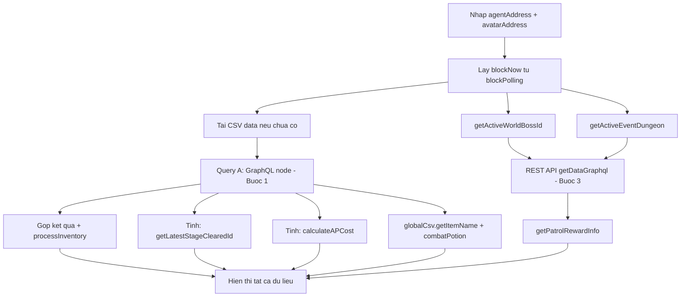

# Plan: Hiển thị dữ liệu Avatar từ 3 giai đoạn nhận dữ liệu

## Tổng quan

Tạo route `/avatar-data` trong project nineCMD (`src-ts/` — Vue 3 + TypeScript + Naive UI + Pinia) để hiển thị dữ liệu avatar sau khi nhập `agentAddress` và `avatarAddress`. Dữ liệu lấy theo 3 giai đoạn như Python tool, với tối ưu query từ cả 3 nguồn tham khảo.

> **Lưu ý quan trọng**: Tất cả files mới được tạo trong `src-ts/` (TypeScript), KHÔNG phải `src/` (JavaScript legacy).

---

## Thư viện & Patterns tận dụng tối đa trong `src-ts/`

### 1. Stores hiện có — Tái sử dụng tối đa

| Store | Cách dùng trong avatar data |
|-------|------------------------------|
| [`globalCsv`](src-ts/stores/globalCsv.ts:38) | `getItemName(id)` — lấy tên item theo locale hiện tại, `getSkillName(id)` — lấy tên skill theo locale. **KHÔNG cần manually lookup locale** |
| [`csvData`](src-ts/stores/csvData.ts:41) | `getSheet('ItemRequirementSheet')` — level requirement, `getSheet('CostumeStatSheet')` — costume stats, `getSheet('GameConfigSheet')` — game config, `getSheet('ConsumableItemSheet')` — consumable stats |
| [`blockPolling`](src-ts/stores/blockPolling.ts:58) | `currentBlockIndex` — block hiện tại, `selectedPlanet` — planet |
| [`appSettings`](src-ts/stores/appSettings.ts:50) | `selectedPlanet` — planet, `lang` — ngôn ngữ hiện tại |
| [`configURL`](src-ts/stores/configURL.ts:130) | `getHeadlessGql(planet)` — headless GraphQL URL, `getMimirUrl(planet)` — mimir URL |

### 2. Utilities tái sử dụng

| Utility | Cách dùng |
|---------|-----------|
| [`mimirGraphql.graphqlQuery<T>()`](src-ts/utilities/mimirGraphql.ts:38) | Generic GraphQL POST helper với error handling — tái sử dụng cho avatar data queries |
| [`nameService.getLocalizedName()`](src-ts/utilities/nameService.ts:131) | Fallback chain: localeColumn → English → Key |
| [`logger.createLogger()`](src-ts/utilities/logger.ts:99) | Logging thống nhất |
| [`csvParser`](src-ts/utilities/csvParser.ts) | Parse CSV nếu cần |

### 3. Vue/TypeScript patterns

| Pattern | Source | Áp dụng |
|---------|--------|---------|
| `<script setup lang="ts">` | Tất cả Vue files | Component syntax |
| `useI18n()` + `t()` | [`HomePage.vue`](src-ts/views/HomePage.vue:63), [`LoginPage.vue`](src-ts/views/LoginPage.vue:99) | i18n cho tất cả text UI |
| `n-data-table` + typed columns | [`ArenaLookupPage.vue`](src-ts/views/ArenaLookupPage.vue:67) | Table hiển thị data |
| `n-tabs` + `n-tab-pane` | Naive UI | Tổ chức sections |
| `n-form` + validation | [`LoginPage.vue`](src-ts/views/LoginPage.vue:4) | Form nhập địa chỉ |
| Pinia Composition API | Tất cả stores | Store pattern |
| Types trong `types/` | [`types/arenaLookup.ts`](src-ts/types/arenaLookup.ts) | Tách interfaces |
| `@vicons/material` icons | [`PlaceholderMenuLeft.vue`](src-ts/components/PlaceholderMenuLeft.vue:53) | Menu icons |

### 4. i18n keys cần thêm

Tất cả text UI phải qua `t()` với keys mới trong `en.json` / `vi.json`:

```json
{
  "avatarData": {
    "title": "Avatar Data",
    "form": {
      "agentAddress": "Agent Address",
      "avatarAddress": "Avatar Address",
      "agentPlaceholder": "Enter agent address (0x...)",
      "avatarPlaceholder": "Enter avatar address (0x...)",
      "fetch": "Fetch Data",
      "reset": "Reset",
      "autoPlanet": "Planet (auto)"
    },
    "info": {
      "title": "Character Info",
      "name": "Name",
      "level": "Level",
      "stage": "Stage Cleared",
      "worldId": "Unlocked Worlds",
      "ap": "Action Point",
      "apCost": "AP Cost",
      "gold": "Gold",
      "crystal": "Crystal",
      "stakeNCG": "Stake NCG",
      "adventureCP": "Adventure CP",
      "rank": "Rank"
    },
    "inventory": {
      "title": "Inventory",
      "equipments": "Equipments",
      "costumes": "Costumes",
      "runes": "Runes",
      "combinationSlots": "Combination Slots",
      "equipped": "Equipped"
    },
    "material": {
      "title": "Materials & Consumables",
      "materials": "Materials",
      "consumables": "Consumables"
    },
    "graphql": {
      "title": "getDataGraphql",
      "itemSet": "Equipment Set",
      "runeSet": "Rune Set",
      "worldBoss": "World Boss",
      "eventDungeon": "Event Dungeon",
      "patrolReward": "Patrol Reward",
      "claimedGifts": "Claimed Gifts",
      "adventureCp": "Adventure CP",
      "rawJson": "Raw JSON"
    },
    "loading": "Loading avatar data...",
    "error": "Error loading data",
    "noData": "Enter addresses and click Fetch to load data"
  }
}
```

---

## Kiến trúc files trong `src-ts/`

```
src-ts/
├── types/
│   └── avatarData.ts              # TypeScript interfaces
├── utilities/
│   ├── avatarDataHelpers.ts       # Helper functions (pure logic)
│   └── avatarDataGraphQL.ts       # GraphQL queries + fetch (dùng graphqlQuery<T>)
├── stores/
│   └── avatarDataDisplay.ts       # Store chính (Pinia Composition API)
├── components/
│   └── avatarData/
│       ├── AvatarDataForm.vue         # Form nhập agent + avatar address
│       ├── AvatarDataInfoTable.vue    # Table thông tin nhân vật
│       ├── AvatarDataInventoryTable.vue # Tabs: equipment/costume/rune/slot
│       ├── AvatarDataMaterialTable.vue  # Tabs: material/consumable
│       └── AvatarDataGraphqlTable.vue   # Tabs: itemSet/runeSet/wb/ed/patrol/gift
├── views/
│   └── AvatarDataView.vue             # View chính (layout + orchestration)
├── router/
│   └── index.ts                       # Thêm route
└── i18n/
    └── locales/
        ├── en.json                    # Thêm avatarData keys
        └── vi.json                    # Thêm avatarData keys
```

---

## Chi tiết từng file

### 1. `src-ts/types/avatarData.ts` — TypeScript Interfaces

Tách tất cả interfaces liên quan avatar data vào file riêng, follows pattern của [`types/arenaLookup.ts`](src-ts/types/arenaLookup.ts).

```ts
/**
 * Avatar Data Types – Interfaces cho avatar data display feature
 *
 * Ref:
 * - src/stores/fetchDataUser9C.js: GraphQL response shapes
 * - .REF/python-tool/avatar/avatar_data.py: data processing logic
 * - src-ts/types/arenaLookup.ts: pattern for type file
 */

/** Agent balance data */
export interface AgentBalance {
  gold: string
  crystal: string
}

/** Stake state */
export interface StakeState {
  deposit: string
}

/** Stage map pairs */
export interface StageMap {
  pairs: Array<{ key: string; value: string }>
  count: number
}

/** Rune entry */
export interface RuneEntry {
  runeId: string
  level: number
}

/** Equipment stat */
export interface EquipmentStat {
  statType: string
  baseValue: number
  totalValue: number
  additionalValue: number
}

/** Equipment skill */
export interface EquipmentSkill {
  id: number
  elementalType: string
  power: number
  chance: number
  statPowerRatio: number
  referencedStatType: string
}

/** Equipment stats map — from GraphQL statsMap field */
export interface StatsMap {
  hP: number
  aTK: number
  dEF: number
  cRI: number
  hIT: number
  sPD: number
}

/** Equipment item from GraphQL (all equipments) */
export interface EquipmentItem {
  grade: number
  id: number
  itemType: string
  itemSubType: string
  elementalType: string
  requiredBlockIndex: number
  setId: number
  stat: EquipmentStat
  equipped: boolean
  itemId: number
  level: number
  skills: EquipmentSkill[]
  buffSkills: EquipmentSkill[]
  statsMap: StatsMap
}

/** Equipment item with enriched data (from funcFillMoreInfo) */
export interface EnrichedEquipment extends EquipmentItem {
  indexKey: number
  title: string
  name: string
  cp: number
  skills: Array<EquipmentSkill & { name: string; dataStat: unknown[] }>
  statArray: StatSkillResult
  levelReq: number
}

/** Costume item from GraphQL */
export interface CostumeItem {
  grade: number
  id: number
  itemType: string
  itemSubType: string
  elementalType: string
  requiredBlockIndex: number
  itemId: number
  equipped: boolean
}

/** Costume item with enriched data */
export interface EnrichedCostume extends CostumeItem {
  indexKey: number
  title: string
  name: string
  statsMap: Record<string, number>
  cp: number
  statArray: StatSkillResult
  levelReq: number
}

/** Material item from GraphQL */
export interface MaterialItem {
  id: number
}

/** Consumable item from GraphQL */
export interface ConsumableItem {
  id: number
}

/** Deduped consumable */
export interface DedupedConsumable {
  id: number
  count: number
  itemIdList: number[]
  name: string
  levelReq: number
}

/** Inventory from GraphQL */
export interface InventoryData {
  equipped: Array<{ itemSubType: string; id: number }>
  all: EquipmentItem[]
  costumes: CostumeItem[]
  materials: MaterialItem[]
  consumables: ConsumableItem[]
}

/** Combination slot */
export interface CombinationSlot {
  address: string
  petId: number
  index: number
  isUnlocked: boolean
  startBlockIndex: number
  unlockBlockIndex: number
}

/** Item map pairs */
export interface ItemMap {
  count: number
  pairs: Array<{ key: string; value: string }>
}

/** Avatar data from GraphQL (stateQuery.avatar) */
export interface AvatarGraphQL {
  address: string
  name: string
  level: number
  actionPoint: number
  dailyRewardReceivedIndex: number
  stageMap: StageMap
  runes: RuneEntry[]
  inventory: InventoryData
  itemMap: ItemMap
  combinationSlots: CombinationSlot[]
}

/** Character info (processed from raw GraphQL) */
export interface CharacterInfo {
  name: string
  level: number
  stageClearedId: number
  actionPoint: number
  apCost: number
  gold: string
  crystal: string
  stakeNCG: string
  dailyRewardReceivedIndex: number
  unlockedWorldIds: number[]
  cpData: CpRankingData | null
}

/** CP ranking data */
export interface CpRankingData {
  rank: number
  cp: number
  armorId: number
  portraitId: number
}

/** Stat and skill result — port from src/utilities/gearCombatPotion.js */
export interface StatSkillResult {
  listStat: string[]
  mainStat: Record<string, number>
  optionStat: Record<string, number>
  isHasSkill: boolean
}

/** Patrol reward info */
export interface PatrolRewardInfo {
  blockLastClaim: number
  interval: number
  diffBlock: number
  isCanClaim: boolean
}

/** getDataGraphql REST response */
export interface GetDataGraphqlResponse {
  [key: string]: unknown
  adventureCp?: number
}
```

### 2. `src-ts/utilities/constants.ts` — Thêm constants

Thêm vào cuối file hiện tại:

```ts
// ============================================================
// Avatar Data Constants
// ============================================================

/** AP cost by stake tiers — ordered low to high */
export const COST_AP_BY_STAKE = [
  { ncgStake: 5000, costAP: 5 },
  { ncgStake: 500000, costAP: 4 }
]

/** Minimum AP cost (when stake >= all tiers) */
export const COST_AP_BY_STAKE_MIN = 3
```

### 3. `src-ts/utilities/avatarDataHelpers.ts` — Helper Functions

Pure functions, KHÔNG side effects, KHÔNG fetch logic. Port từ Python/JS.

```ts
/**
 * Avatar Data Helpers – Pure functions cho avatar data processing
 *
 * Port từ:
 * - .REF/python-tool/avatar/avatar_data.py
 * - src/utilities/gearCombatPotion.js
 *
 * Reuses:
 * - constants.ts: COST_AP_BY_STAKE, COST_AP_BY_STAKE_MIN
 * - types/avatarData.ts: StatsMap, StatSkillResult
 */

import { COST_AP_BY_STAKE, COST_AP_BY_STAKE_MIN } from '@/utilities/constants'
import type { StatsMap, StatSkillResult } from '../types/avatarData'

export function calculateAPCost(stakeNCG: string | number): number { ... }
export function getLatestStageClearedId(stageMap: StageMap): number { ... }
export function combatPotion(statsMap: StatsMap, hasSkill?: boolean): number { ... }
export function statAndSkillOption(params: { ... }): StatSkillResult { ... }
export function getActiveWorldBossId(blockNow: number, worldBossData: Array<...>): number | null { ... }
export function getActiveEventDungeon(blockNow: number, eventScheduleData: Array<...>): { ... } | null { ... }
export function getPatrolRewardInfo(blockLastClaim: number, level: number, patrolRewardData: ..., blockNow: number): PatrolRewardInfo { ... }
export function processMaterials(materials: MaterialItem[] | undefined): Array<{ id: number; count: number }> { ... }
export function dedupConsumables(consumables: ConsumableItem[] | undefined): DedupedConsumable[] { ... }
```

### 4. `src-ts/utilities/avatarDataGraphQL.ts` — GraphQL Queries

Tái sử dụng [`graphqlQuery<T>()`](src-ts/utilities/mimirGraphql.ts:38) từ mimirGraphql.ts cho POST requests.

```ts
/**
 * Avatar Data GraphQL – Query strings + fetch functions
 *
 * Reuses:
 * - mimirGraphql.ts: graphqlQuery<T>() for POST with error handling
 * - configURL.ts: getHeadlessGql(planet) for dynamic endpoint
 * - appSettings.ts: selectedPlanet
 */

import { graphqlQuery } from './mimirGraphql'
import { useConfigURLStore } from '../stores/configURL'
import { useAppSettingsStore } from '../stores/appSettings'
import type { PlanetName } from '@/utilities/constants'

export function buildQueryA(agentAddress: string, avatarAddress: string): string { ... }

export async function fetchQueryA(agentAddress: string, avatarAddress: string): Promise<...> {
  const configURL = useConfigURLStore()
  const appSettings = useAppSettingsStore()
  const planet = appSettings.selectedPlanet as PlanetName
  const headlessGql = configURL.getHeadlessGql(planet)
  // Dùng graphqlQuery<T>() từ mimirGraphql.ts
  return graphqlQuery(headlessGql, buildQueryA(agentAddress, avatarAddress))
}

export async function fetchGetDataGraphql(avatarAddress: string, codeGets: string[]): Promise<...> { ... }
```

### 5. `src-ts/stores/avatarDataDisplay.ts` — Store chính

Follow pattern của [`arenaLookup.ts`](src-ts/stores/arenaLookup.ts:39) — Composition API + computed URLs + watchers.

```ts
/**
 * avatarDataDisplay Store – Pinia store for avatar data display
 *
 * Pattern follows arenaLookup.ts:
 * - Computed URLs from configURL store
 * - Block from blockPolling store
 * - Planet from appSettings store
 * - Logger from createLogger()
 */

import { defineStore } from 'pinia'
import { ref, computed } from 'vue'
import { useBlockPollingStore } from './blockPolling'
import { useConfigURLStore } from './configURL'
import { useAppSettingsStore } from './appSettings'
import { useGlobalCsvStore } from './globalCsv'
import { useCsvDataStore } from './csvData'
import { createLogger } from '../utilities/logger'
import { calculateAPCost, getLatestStageClearedId, combatPotion, statAndSkillOption } from '../utilities/avatarDataHelpers'
import { fetchQueryA } from '../utilities/avatarDataGraphQL'
import type { CharacterInfo, EnrichedEquipment, EnrichedCostume, ... } from '../types/avatarData'

export const useAvatarDataDisplayStore = defineStore('avatarDataDisplay', () => {
  const logger = createLogger({ module: 'avatarDataDisplay' })

  // Stores
  const appSettings = useAppSettingsStore()
  const blockPolling = useBlockPollingStore()
  const configURL = useConfigURLStore()
  const globalCsv = useGlobalCsvStore()
  const csvData = useCsvDataStore()

  // Computed URLs (follow arenaLookup pattern)
  const selectedPlanet = computed<PlanetName>(() => appSettings.selectedPlanet)
  const blockNow = computed<number>(() => blockPolling.currentBlockIndex)

  // State
  const agentAddress = ref('')
  const avatarAddress = ref('')
  const isLoading = ref(false)
  const error = ref<string | null>(null)
  const characterInfo = ref<CharacterInfo | null>(null)
  const equipmentsAll = ref<EnrichedEquipment[]>([])
  const costumesAll = ref<EnrichedCostume[]>([])
  const runesAll = ref<RuneEntry[]>([])
  const combinationSlots = ref<CombinationSlot[]>([])
  const equippedSlots = ref<Array<{ itemSubType: string; id: number }>>([])
  const unlockedWorldIds = ref<number[]>([])
  const getDataGraphql = ref<GetDataGraphqlResponse | null>(null)

  // Helper: enrich equipments using globalCsv.getItemName()
  function fillEquipments(data: EquipmentItem[]): EnrichedEquipment[] {
    return data.map((item, i) => ({
      ...item,
      indexKey: i,
      title: globalCsv.getItemName(`ITEM_NAME_${item.id}`),
      name: globalCsv.getItemName(`ITEM_NAME_${item.id}`),
      cp: combatPotion(item.statsMap, item.skills.length > 0),
      skills: item.skills.map(s => ({
        ...s,
        name: globalCsv.getSkillName(`SKILL_NAME_${s.id}`),
        dataStat: csvData.getSheetRow('SkillSheet', s.id) ?? []
      })),
      statArray: statAndSkillOption({ stat: item.stat, skills: item.skills, statsMap: item.statsMap }),
      levelReq: (csvData.getSheetRow('ItemRequirementSheet', item.id) as { level?: number })?.level ?? 888888
    }))
  }

  // ... similar for fillCostumes, fillConsumables

  async function fetchAvatarData(agent: string, avatar: string): Promise<void> { ... }
  async function fetchStep1(agent: string, avatar: string): Promise<void> { ... }

  return { ... }
})
```

### 6. Vue Components — Naive UI + i18n

#### `AvatarDataForm.vue`
```vue
<template>
  <n-card :title="t('avatarData.title')" size="small">
    <n-form label-placement="left">
      <n-form-item :label="t('avatarData.form.agentAddress')">
        <n-input v-model:value="agentAddr" :placeholder="t('avatarData.form.agentPlaceholder')" clearable />
      </n-form-item>
      <n-form-item :label="t('avatarData.form.avatarAddress')">
        <n-input v-model:value="avatarAddr" :placeholder="t('avatarData.form.avatarPlaceholder')" clearable />
      </n-form-item>
      <n-space>
        <n-button type="primary" :loading="store.isLoading" @click="onFetch">
          {{ t('avatarData.form.fetch') }}
        </n-button>
        <n-button @click="onReset">{{ t('avatarData.form.reset') }}</n-button>
        <n-tag :bordered="false" type="info" size="small">
          {{ t('avatarData.form.autoPlanet') }}: {{ store.selectedPlanet }}
        </n-tag>
      </n-space>
    </n-form>
  </n-card>
</template>
```

#### `AvatarDataInfoTable.vue`
```vue
<template>
  <n-card :title="t('avatarData.info.title')" size="small">
    <n-descriptions bordered :column="2" size="small">
      <n-descriptions-item :label="t('avatarData.info.name')">{{ info.name }}</n-descriptions-item>
      <n-descriptions-item :label="t('avatarData.info.level')">{{ info.level }}</n-descriptions-item>
      <!-- ... more items ... -->
    </n-descriptions>
  </n-card>
</template>
```

#### `AvatarDataInventoryTable.vue`
```vue
<template>
  <n-card :title="t('avatarData.inventory.title')" size="small">
    <n-tabs type="line" animated>
      <n-tab-pane :name="'equipments'" :tab="t('avatarData.inventory.equipments')">
        <n-data-table :columns="equipColumns" :data="store.equipmentsAll" size="small" striped />
      </n-tab-pane>
      <n-tab-pane :name="'costumes'" :tab="t('avatarData.inventory.costumes')">
        <n-data-table :columns="costumeColumns" :data="store.costumesAll" size="small" striped />
      </n-tab-pane>
      <n-tab-pane :name="'runes'" :tab="t('avatarData.inventory.runes')">
        <n-data-table :columns="runeColumns" :data="store.runesAll" size="small" striped />
      </n-tab-pane>
      <n-tab-pane :name="'slots'" :tab="t('avatarData.inventory.combinationSlots')">
        <n-data-table :columns="slotColumns" :data="store.combinationSlots" size="small" striped />
      </n-tab-pane>
    </n-tabs>
  </n-card>
</template>
```

#### `AvatarDataMaterialTable.vue`
```vue
<template>
  <n-card :title="t('avatarData.material.title')" size="small">
    <n-tabs type="line" animated>
      <n-tab-pane :name="'materials'" :tab="t('avatarData.material.materials')">
        <n-data-table :columns="materialColumns" :data="materials" size="small" striped />
      </n-tab-pane>
      <n-tab-pane :name="'consumables'" :tab="t('avatarData.material.consumables')">
        <n-data-table :columns="consumableColumns" :data="consumables" size="small" striped />
      </n-tab-pane>
    </n-tabs>
  </n-card>
</template>
```

#### `AvatarDataGraphqlTable.vue`
```vue
<template>
  <n-card :title="t('avatarData.graphql.title')" size="small">
    <n-tabs type="line" animated>
      <n-tab-pane :name="'itemSet'" :tab="t('avatarData.graphql.itemSet')">...</n-tab-pane>
      <n-tab-pane :name="'runeSet'" :tab="t('avatarData.graphql.runeSet')">...</n-tab-pane>
      <n-tab-pane :name="'worldBoss'" :tab="t('avatarData.graphql.worldBoss')">...</n-tab-pane>
      <n-tab-pane :name="'eventDungeon'" :tab="t('avatarData.graphql.eventDungeon')">...</n-tab-pane>
      <n-tab-pane :name="'patrolReward'" :tab="t('avatarData.graphql.patrolReward')">...</n-tab-pane>
      <n-tab-pane :name="'claimedGifts'" :tab="t('avatarData.graphql.claimedGifts')">...</n-tab-pane>
      <n-tab-pane :name="'rawJson'" :tab="t('avatarData.graphql.rawJson')">
        <n-code :code="JSON.stringify(store.getDataGraphql, null, 2)" language="json" />
      </n-tab-pane>
    </n-tabs>
  </n-card>
</template>
```

### 7. `src-ts/views/AvatarDataView.vue`

Follow pattern của [`CsvDataView.vue`](src-ts/views/CsvDataView.vue) — layout + orchestration.

```vue
<template>
  <n-space vertical style="padding: 16px; max-width: 1200px; margin: 0 auto">
    <!-- Form -->
    <AvatarDataForm />

    <!-- Loading -->
    <n-spin v-if="store.isLoading" size="large" style="display: block; text-align: center; padding: 40px">
      <n-text depth="2">{{ t('avatarData.loading') }}</n-text>
    </n-spin>

    <!-- Error -->
    <n-alert v-else-if="store.error" type="error" :title="t('avatarData.error')">
      {{ store.error }}
    </n-alert>

    <!-- No data -->
    <n-empty v-else-if="!store.isReady" :description="t('avatarData.noData')" />

    <!-- Results -->
    <template v-else>
      <AvatarDataInfoTable />
      <AvatarDataInventoryTable />
      <AvatarDataMaterialTable />
      <AvatarDataGraphqlTable />
    </template>
  </n-space>
</template>
```

### 8. Router — [`index.ts`](src-ts/router/index.ts)

```ts
// Thêm vào children array
{
  path: 'avatar-data',
  name: 'avatar-data',
  meta: { transition: 'fade' },
  component: () => import('@/views/AvatarDataView.vue')
}
```

### 9. Menu — [`PlaceholderMenuLeft.vue`](src-ts/components/PlaceholderMenuLeft.vue)

```ts
// Thêm import icon (follow existing pattern)
import TableChartRound from '@vicons/material/es/TableChartRound.js'

// Thêm vào menuOptions
{
  label: () => h(RouterLink, { to: { name: 'avatar-data' } }, { default: () => 'Avatar Data' }),
  key: 'avatar-data',
  icon: renderIcon(TableChartRound)
}

// Thêm vào routeToMenuKey
'avatar-data': 'avatar-data'
```

### 10. i18n — Thêm keys vào locales

Thêm `"avatarData"` section vào cả [`en.json`](src-ts/i18n/locales/en.json) và [`vi.json`](src-ts/i18n/locales/vi.json).

---

## Flow tổng thể



---

## Kế hoạch thực hiện

- [ ] **Bước 1**: Tạo `src-ts/types/avatarData.ts` — TypeScript interfaces
- [ ] **Bước 2**: Thêm `COST_AP_BY_STAKE`, `COST_AP_BY_STAKE_MIN` vào `src-ts/utilities/constants.ts`
- [ ] **Bước 3**: Tạo `src-ts/utilities/avatarDataHelpers.ts` — pure helper functions
- [ ] **Bước 4**: Tạo `src-ts/utilities/avatarDataGraphQL.ts` — GraphQL queries (dùng `graphqlQuery<T>()`)
- [ ] **Bước 5**: Tạo `src-ts/stores/avatarDataDisplay.ts` — store (dùng globalCsv, csvData, configURL, blockPolling)
- [ ] **Bước 6**: Thêm i18n keys vào `src-ts/i18n/locales/en.json` và `vi.json`
- [ ] **Bước 7**: Tạo `src-ts/components/avatarData/AvatarDataForm.vue`
- [ ] **Bước 8**: Tạo `src-ts/components/avatarData/AvatarDataInfoTable.vue`
- [ ] **Bước 9**: Tạo `src-ts/components/avatarData/AvatarDataInventoryTable.vue`
- [ ] **Bước 10**: Tạo `src-ts/components/avatarData/AvatarDataMaterialTable.vue`
- [ ] **Bước 11**: Tạo `src-ts/components/avatarData/AvatarDataGraphqlTable.vue`
- [ ] **Bước 12**: Tạo `src-ts/views/AvatarDataView.vue`
- [ ] **Bước 13**: Thêm route `/avatar-data` vào `src-ts/router/index.ts`
- [ ] **Bước 14**: Thêm menu item vào `src-ts/components/PlaceholderMenuLeft.vue`
