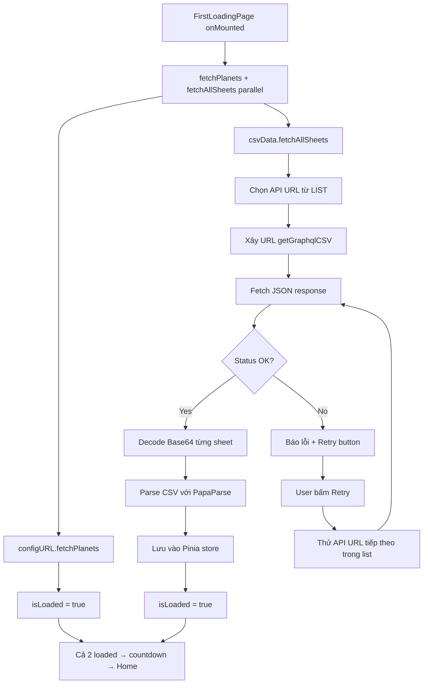
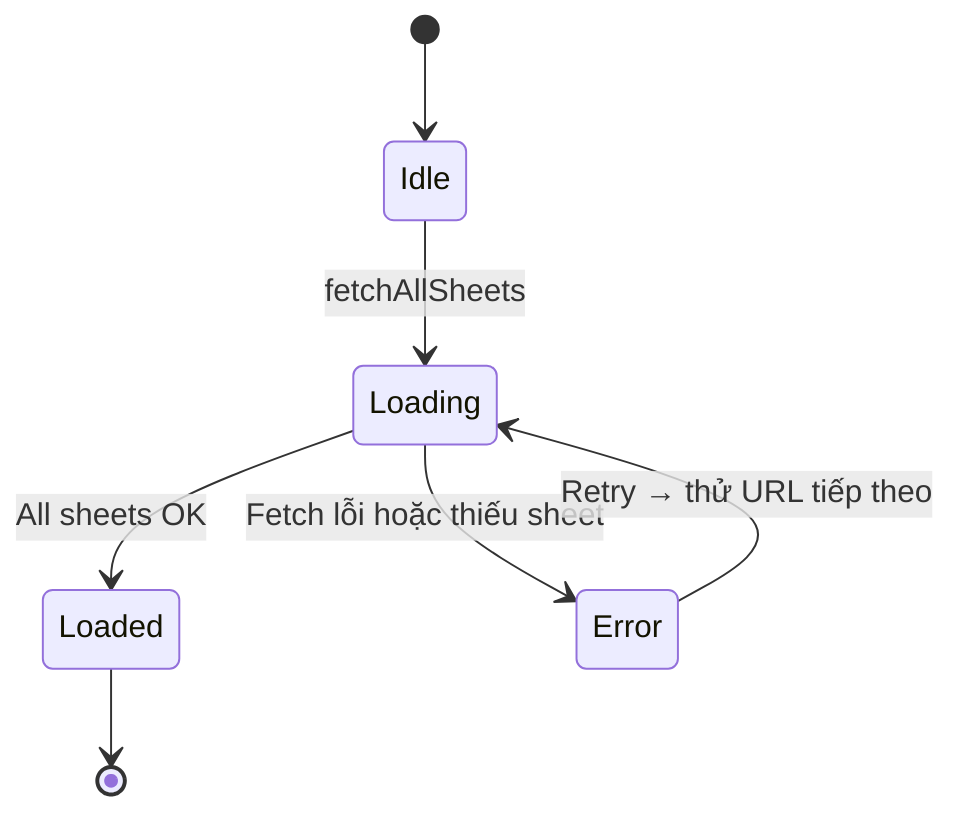
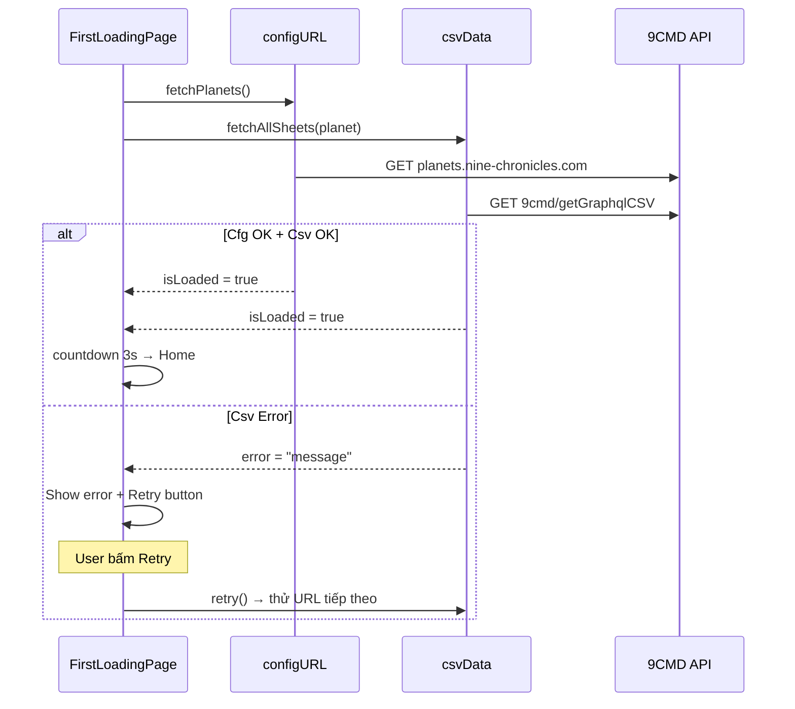

# Kế Hoạch: Nhận & Xử Lý Dữ Liệu CSV từ 9CMD API

## Tổng Quan

Nhận dữ liệu CSV game (Nine Chronicles) từ 9CMD API, giải mã base64, parse thành object có thể tìm lọc dễ dàng, lưu vào Pinia store. Tích hợp loading cùng [`FirstLoadingPage.vue`](src-ts/views/FirstLoadingPage.vue).

---

## Phân Tích Hiện Tại

### Nguồn Dữ Liệu
- **API Endpoint**: `{API_NINECMD}/getGraphqlCSV`
- **Params**: `network=odin|heimdall`, `csv=SheetName` (lặp lại), `encodeAsBase64=true`
- **Response**: `{ status: "success", data: { "SheetName": "base64CsvString", ... } }`
- **3 API URLs** trong `LIST_API_NINECMD`: random hoặc chọn thủ công

### Danh Sách Sheet Cần Fetch (21 sheets)

| # | Sheet Name | Key Column | Ghi Chú |
|---|-----------|------------|---------|
| 1 | GameConfigSheet | key | Config game key-value |
| 2 | ItemRequirementSheet | item_id | Level yêu cầu equipment |
| 3 | CostumeStatSheet | costume_id | Stat costume (unique=true) |
| 4 | RuneListSheet | id | Danh sách rune |
| 5 | RuneSheet | c | Option rune (9cmd api) |
| 6 | CostumeItemSheet | id | Danh sách costume |
| 7 | WorldUnlockSheet | world_id_to_unlock | Mở khóa world |
| 8 | WorldSheet | id | Danh sách world |
| 9 | PatrolRewardSheet | id | Phần thưởng patrol |
| 10 | EquipmentItemRecipeSheet | id | Công thức craft equipment |
| 11 | SummonSheet | groupID | Danh sách summon |
| 12 | ClaimableGiftsSheet | id | Quà có thể nhận |
| 13 | EventScheduleSheet | id | Lịch sự kiện |
| 14 | WorldBossListSheet | id | Danh sách world boss |
| 15 | EquipmentItemSubRecipeSheetV2 | id | Sub recipe craft |
| 16 | CrystalHammerPointSheet | id | Crystal hammer point |
| 17 | StageSheet | id | Danh sách stage |
| 18 | CharacterLevelSheet | id | Level character |
| 19 | CrystalMaterialCostSheet | id | Cost crystal material |
| 20 | ConsumableItemSheet | id | Danh sách consumable |
| 21 | ConsumableItemRecipeSheet | id | Công thức craft consumable |

> **Bỏ qua ArenaSheet** - không cần nữa

### Thư Viện Hiện Có
- **PapaParse 5.5.3** + `@types/papaparse` - đã có trong dependencies
- **@vueuse/core** - `useFetch`, `useStorage`
- **Pinia 3.0.4** - state management

---

## Kiến Trúc Giải Pháp



---

## Mô Hình Lỗi & Retry

Giống hệt pattern của [`configURL`](src-ts/stores/configURL.ts):



- **Error state**: Hiển thị `n-result` + nút Retry + nút chọn URL khác
- **Retry**: Thử API URL tiếp theo trong `LIST_API_NINECMD`
- **Không có fallback data** - nếu lỗi thì phải retry cho đến khi thành công
- **loadingStatus**: Cập nhật i18n key theo từng bước

---

## Các Bước Thực Hiện Chi Tiết

### Bước 1: Types cho CSV Data

**File mới**: `src-ts/types/csvData.ts`

```typescript
export type CsvSheetName =
  | 'GameConfigSheet' | 'ItemRequirementSheet' | 'CostumeStatSheet'
  | 'RuneListSheet' | 'RuneSheet' | 'CostumeItemSheet'
  | 'WorldUnlockSheet' | 'WorldSheet' | 'PatrolRewardSheet'
  | 'EquipmentItemRecipeSheet' | 'SummonSheet' | 'ClaimableGiftsSheet'
  | 'EventScheduleSheet' | 'WorldBossListSheet'
  | 'EquipmentItemSubRecipeSheetV2' | 'CrystalHammerPointSheet'
  | 'StageSheet' | 'CharacterLevelSheet' | 'CrystalMaterialCostSheet'
  | 'ConsumableItemSheet' | 'ConsumableItemRecipeSheet'

export type CsvRow = Record<string, string | number>
export type CsvSheetData = Record<string | number, CsvRow>

export interface CsvSheetMeta {
  keyColumn: string
  unique?: boolean
  description?: string
}

export interface CsvStoreState {
  sheets: Partial<Record<CsvSheetName, CsvSheetData>>
  isLoading: boolean
  error: string | null
  isLoaded: boolean
  lastFetchTime: number | null
  loadingStatus: string
}
```

### Bước 2: Constants mới

**File**: `src-ts/utilities/constants.ts` (edit)

Thêm vào cuối file:
- `LIST_API_NINECMD` - 3 API URLs
- `CSV_SHEET_CONFIG` - map sheet name → CsvSheetMeta

### Bước 3: Utility Parse CSV

**File mới**: `src-ts/utilities/csvParser.ts`

Sử dụng **PapaParse** thay custom parser:

```typescript
// Decode base64 → csv string
function decodeBase64Csv(base64String: string): string

// Parse CSV string → CsvSheetData (keyed by keyColumn)
function parseCsvSheet(
  csvString: string,
  keyColumn: string,
  options?: { unique?: boolean }
): CsvSheetData
```

**Lợi ích PapaParse**:
- Xử lý đúng quoted fields, escape characters
- Xử lý multi-line fields
- Type detection tự động
- Tốc độ nhanh hơn, được test rộng rãi

### Bước 4: Utility Fetch CSV

**File mới**: `src-ts/utilities/csvFetcher.ts`

```typescript
// Xây URL cho getGraphqlCSV endpoint
function buildCsvFetchUrl(
  apiBase: string,
  sheetNames: string[],
  network: string
): string

// Fetch CSV data từ 1 API URL
async function fetchCsvFromApi(
  apiUrl: string,
  sheetNames: string[],
  network: string
): Promise<Record<string, string>>  // sheetName → base64Csv
```

### Bước 5: Pinia Store

**File mới**: `src-ts/stores/csvData.ts`

Pattern giống [`configURL`](src-ts/stores/configURL.ts):

```typescript
interface CsvDataStore {
  // State (giống configURL)
  sheets: Partial<Record<CsvSheetName, CsvSheetData>>
  isLoading: boolean
  error: string | null
  isLoaded: boolean
  lastFetchTime: number | null
  loadingStatus: string
  currentApiIndex: number  // index trong LIST_API_NINECMD

  // Getters
  getSheet(name: CsvSheetName): CsvSheetData | null
  getSheetRow(name: CsvSheetName, key: string | number): CsvRow | null
  getSheetRows(name: CsvSheetName): CsvRow[]
  searchInSheet(name: CsvSheetName, query: string, fields?: string[]): CsvRow[]
  filterSheet(name: CsvSheetName, predicate: (row: CsvRow) => boolean): CsvRow[]
  anySheetNull: boolean  // có sheet nào chưa load không

  // Actions
  fetchAllSheets(planet: PlanetName): Promise<boolean>
  retry(): Promise<boolean>
  clearData(): void
}
```

**Logic fetchAllSheets**:
1. Set `isLoading = true`, `error = null`
2. Chọn API URL từ `LIST_API_NINECMD[currentApiIndex]`
3. Build URL với danh sách 21 sheets
4. Fetch JSON response
5. Check `status === "success"`
6. Decode base64 → parse CSV từng sheet
7. Nếu thiếu sheet → `error = "Thiếu sheet X"`, return false
8. Nếu OK → `isLoaded = true`, return true
9. On error → hiển thị retry button

**Logic retry**:
1. Tăng `currentApiIndex` (wrap around)
2. Gọi lại `fetchAllSheets()`

### Bước 6: Tích Hợp FirstLoadingPage.vue

**File**: `src-ts/views/FirstLoadingPage.vue` (edit)

Thay đổi:
1. Import `useCsvDataStore`
2. Thêm csvData store state vào template (error, loading, retry)
3. `onMounted`: gọi song song `configURL.fetchPlanets()` + `csvData.fetchAllSheets(planet)`
4. Condition chuyển home: `configURL.isLoaded && csvData.isLoaded`
5. Error state: hiển thị lỗi từ cả 2 store
6. Retry button: gọi cả `configURL.retry()` + `csvData.retry()`



---

## Cấu Trúc File Mới

```
src-ts/
├ types/
│  └ csvData.ts                    # NEW: CsvRow, CsvSheetData, CsvSheetName
├ utilities/
│  ├── constants.ts                # EDIT: +LIST_API_NINECMD, +CSV_SHEET_CONFIG
│  ├── csvParser.ts                # NEW: parseCsvSheet(), decodeBase64Csv()
│  ├── csvFetcher.ts               # NEW: buildCsvFetchUrl(), fetchCsvFromApi()
│  └ logger.ts                     # EXISTING
├ stores/
│  ├── csvData.ts                  # NEW: Pinia store (pattern giống configURL)
│  ├── configURL.ts                # EXISTING
│  ├── appSettings.ts              # EXISTING
│  └ blockPolling.ts               # EXISTING
├ views/
│  └ FirstLoadingPage.vue          # EDIT: +csvData integration
└ __tests__/
   ├── csvParser.test.ts           # NEW
   ├── csvFetcher.test.ts          # NEW
   └ csvData.test.ts               # NEW
```

---

## Thứ Tự Code

1. `src-ts/types/csvData.ts` - Types trước
2. `src-ts/utilities/constants.ts` - Thêm constants mới
3. `src-ts/utilities/csvParser.ts` - Parser logic
4. `src-ts/utilities/csvFetcher.ts` - Fetch logic
5. `src-ts/stores/csvData.ts` - Pinia store
6. `src-ts/views/FirstLoadingPage.vue` - Tích hợp loading
7. `src-ts/__tests__/csvParser.test.ts` - Tests
8. `src-ts/__tests__/csvFetcher.test.ts` - Tests
9. `src-ts/__tests__/csvData.test.ts` - Tests

---

## Lưu Ý Quan Trọng

- **Không ArenaSheet** - đã bỏ
- **Không Fallback Data** - lỗi thì retry hoặc báo dừng
- **PapaParse** thay custom parser để xử lý CSV tốt hơn
- **CostumeStatSheet** cần `unique=true` vì key không unique (dùng `${key}_${index}`)
- **RuneSheet** dùng key `c` thay `id` (theo 9cmd api convention)
- Luôn decode base64 trước khi parse CSV
- Network parameter phải match planet name: `odin`, `heimdall`
- **retry mechanism**: thử lần lượt các URL trong LIST_API_NINECMD
