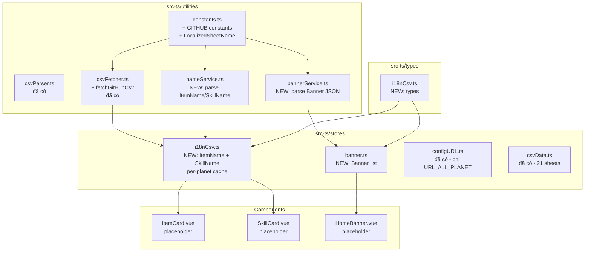

# Kế Hoạch Refactor: i18n CSV (Tên vật phẩm + Skill) + Banner

## 1. Mục tiêu

Chuyển logic JS cũ sang TypeScript cho 3 phần liên quan đến i18n + URL `/planetarium/`:

1. **ItemNameSheet CSV** – `item_name.csv` từ GitHub `planetarium/NineChronicles`
2. **SkillNameSheet CSV** – `skill_name.csv` từ GitHub `planetarium/NineChronicles`
3. **Banner** – `Assets/Json/Event.json` từ GitHub `planetarium/NineChronicles.LiveAssets`

Các phần khác (DCC, Guild, Arena Icon, Portrait, Equipment) → **placeholder** trong store, không implement chi tiết.

## 2. Phạm vi KHÔNG làm (placeholder)

Các hàm sau chỉ tạo interface + log "not implemented", KHÔNG fetch/parse:

- `getListDCCFromCacheOrFetch()` – liên quan DCC portal
- `getListGuildFromCacheOrFetch()` – liên quan Guild API
- `getPortraitId()` – portrait logic
- `getEquipmentsAndRuneFrom9cscan()` – equipment từ 9cscan
- `getImageBase64FromCacheOrFetch()` (logic cũ) – cache ảnh local
- `arrayToIndexedObject()` – dùng nội bộ trong csvParser (đã có rồi)

## 3. Phân tích mã nguồn cũ (src/stores/configURL.js)

### 3.1. Pattern CSV Name Sheets

```js
// ItemNameSheet
const nameItemNameSheet = computed(() => `ItemNameSheet_${selectedPlanetDelay.value}`)
const urlItemNameSheet = computed(() =>
  `${URL_GITHUB_NineChronicles}/nekoyume/Assets/StreamingAssets/Localization/item_name.csv#${selectedPlanetDelay.value}`
)

// SkillNameSheet
const nameSkillNameSheet = computed(() => `SkillNameSheet_${selectedPlanetDelay.value}`)
const urlSkillNameSheet = computed(() =>
  `${URL_GITHUB_NineChronicles}/nekoyume/Assets/StreamingAssets/Localization/skill_name.csv#${selectedPlanetDelay.value}`
)
```

**Đặc điểm**:
- URL có hash `#${selectedPlanet}` ở cuối (dùng để cache busting)
- Key column: `Key` (viết hoa) → case-insensitive matching
- Source: GitHub raw (`raw.githubusercontent.com/planetarium/NineChronicles/${branch}/nekoyume/Assets/StreamingAssets/Localization/`)
- Không phụ thuộc planet API endpoint (giống nhau cho mọi planet)
- Cache qua `sessionStorageSheet` với key = `nameSheet.value`

### 3.2. Pattern Banner

```js
// Banner
const getBanner = (url) => {
  return useFetch(url, { refetch: true }, {
    afterFetch(ctx) {
      ctx.data = ctx.data.Banners !== null ? ctx.data.Banners : []
      const currentDate = new Date()
      ctx.data = ctx.data.filter((item) => {
        // Replace image URL với base64 cache
        item.BannerImageName = getImageBase64FromCacheOrFetch(
          `https://raw.githubusercontent.com/planetarium/NineChronicles.LiveAssets/main/Assets/Images/Banner/${item.BannerImageName}.png`
        )
        // Filter by BeginDateTime/EndDateTime
        if (!item.BeginDateTime && !item.EndDateTime) return true
        if (!item.BeginDateTime && item.EndDateTime) {
          return new Date(item.EndDateTime) > currentDate
        }
        return new Date(item.BeginDateTime) <= currentDate && new Date(item.EndDateTime) >= currentDate
      })
      return ctx
    },
    onFetchError(ctx) {
      if (ctx.data === null) ctx.data = []
      return ctx
    }
  }).get().json()
}

// URL
const LINK_BANNER = 'https://raw.githubusercontent.com/planetarium/NineChronicles.LiveAssets/main/Assets/Json/Event.json'
```

**Đặc điểm**:
- Response là JSON object `{ Banners: [...] }`
- Mỗi banner có `BeginDateTime`, `EndDateTime`, `BannerImageName`
- Image URL cần fetch + convert sang base64 cache (chỗ này gọi `getImageBase64FromCacheOrFetch` cũ)
- Lỗi → trả về `[]` (mảng rỗng, không throw)

## 4. Kiến trúc đề xuất

### 4.1. Mermaid diagram



### 4.2. Cấu trúc file mới

```
src-ts/
├ types/
│  └ i18nCsv.ts                          # NEW: types cho ItemName, SkillName, Banner
├ utilities/
│  ├ constants.ts                        # +GITHUB_RAW_BASE, +LOCALIZED_SHEETS
│  ├ csvFetcher.ts                       # +fetchGitHubCsv() helper
│  ├ nameService.ts                      # NEW: parse + cache logic cho ItemName/SkillName
│  └ bannerService.ts                    # NEW: parse + filter Banner
├ stores/
│  ├ i18nCsv.ts                          # NEW: ItemName + SkillName store (per-planet cache)
│  ├ banner.ts                           # NEW: Banner store
│  ├ configURL.ts                        # KHÔNG đổi (đã làm đúng phạm vi)
│  └ csvData.ts                          # KHÔNG đổi
├ components/
│  ├ i18n/                                # NEW folder
│  │  ├ ItemNameText.vue                 # NEW: wrapper hiển thị tên vật phẩm
│  │  ├ SkillNameText.vue                # NEW: wrapper hiển thị tên skill
│  │  └ BannerList.vue                   # NEW: hiển thị banner carousel (placeholder)
│  └ ...existing
├ __tests__/
│  ├ i18nCsv.test.ts                     # NEW
│  └ banner.test.ts                      # NEW
└ views/
   └ FirstLoadingPage.vue                # +init i18nCsv + banner
```

## 5. Chi tiết từng module

### 5.1. `src-ts/types/i18nCsv.ts` (NEW)

```ts
/** Tên các localized sheet (chỉ 2 sheet: ItemName, SkillName) */
export type LocalizedSheetName = 'ItemNameSheet' | 'SkillNameSheet'

/** Một dòng trong item_name.csv / skill_name.csv */
export interface LocalizedNameRow {
  /** Key ID (string hoặc number) */
  Key: string | number
  /** Tên Tiếng Anh */
  English: string
  /** Tên Tiếng Việt */
  Vietnamese: string
  /** Tên Tiếng Hàn */
  Korean: string
  /** Tên Tiếng Nhật */
  Japanese: string
  /** ... các locale khác nếu có */
  [locale: string]: string | number
}

/** Dữ liệu 1 localized sheet – key = Key column */
export type LocalizedSheetData = Record<string | number, LocalizedNameRow>

/** Cache theo planet */
export type LocalizedSheetsByPlanet = Record<PlanetName, {
  ItemNameSheet: LocalizedSheetData
  SkillNameSheet: LocalizedSheetData
}>

/** Banner data từ Event.json */
export interface BannerItem {
  BannerImageName: string
  BeginDateTime: string | null
  EndDateTime: string | null
  /** URL gốc từ GitHub (sau khi resolve) */
  BannerImageUrl: string
  /** Base64 cached image (optional) */
  BannerImageBase64?: string
  /** Description / Title – nếu có */
  Description?: string
  [key: string]: unknown
}
```

### 5.2. `src-ts/utilities/constants.ts` (UPDATE)

```ts
// Thêm vào file hiện có:

/** GitHub branch cho source code NineChronicles */
export const V_GITHUB_NINECHRONICLES = 'development'

/** Base URL raw GitHub cho NineChronicles source */
export const URL_GITHUB_NineChronicles =
  `https://raw.githubusercontent.com/planetarium/NineChronicles/${V_GITHUB_NINECHRONICLES}`

/** Base URL raw GitHub cho LiveAssets (banner, image...) */
export const URL_GITHUB_LIVEASSETS = 'https://raw.githubusercontent.com/planetarium/NineChronicles.LiveAssets/main'

/** URL Event.json – danh sách banner */
export const LINK_BANNER = `${URL_GITHUB_LIVEASSETS}/Assets/Json/Event.json`

/** Localized CSV paths (relative to NineChronicles repo) */
export const LOCALIZED_CSV_PATHS: Record<LocalizedSheetName, string> = {
  ItemNameSheet: '/nekoyume/Assets/StreamingAssets/Localization/item_name.csv',
  SkillNameSheet: '/nekoyume/Assets/StreamingAssets/Localization/skill_name.csv'
}

/** Locale columns in localized CSV */
export const LOCALIZED_CSV_LOCALES = ['English', 'Vietnamese', 'Korean', 'Japanese'] as const
export type LocalizedLocale = typeof LOCALIZED_CSV_LOCALES[number]

/** Map app locale → CSV column name */
export const LOCALE_TO_CSV_COLUMN: Record<string, string> = {
  en: 'English',
  vi: 'Vietnamese',
  ko: 'Korean',
  ja: 'Japanese'
}
```

### 5.3. `src-ts/utilities/csvFetcher.ts` (UPDATE – thêm helper)

```ts
// Thêm function mới:

/**
 * Fetch raw CSV từ GitHub raw URL.
 * Dùng cho ItemNameSheet, SkillNameSheet.
 * Hỗ trợ cache busting qua hash #planet ở cuối URL.
 */
export async function fetchGitHubCsv(url: string): Promise<string> {
  const response = await fetch(url, {
    method: 'GET',
    headers: { Accept: 'text/csv' }
  })
  if (!response.ok) {
    throw new Error(`GitHub CSV HTTP ${response.status}: ${response.statusText}`)
  }
  return response.text()
}
```

### 5.4. `src-ts/utilities/nameService.ts` (NEW)

```ts
import type { LocalizedSheetName, LocalizedSheetData, PlanetName } from '../types/i18nCsv'
import { fetchGitHubCsv } from './csvFetcher'
import { parseCsvSheet } from './csvParser'
import { LOCALIZED_CSV_PATHS, URL_GITHUB_NineChronicles } from './constants'

/**
 * Build URL cho localized CSV, có cache busting hash theo planet.
 * Pattern: {base}{path}#{planet}
 */
export function buildLocalizedCsvUrl(
  sheetName: LocalizedSheetName,
  planet: PlanetName
): string {
  const path = LOCALIZED_CSV_PATHS[sheetName]
  return `${URL_GITHUB_NineChronicles}${path}#${planet}`
}

/**
 * Fetch + parse 1 localized CSV sheet
 * @param sheetName 'ItemNameSheet' | 'SkillNameSheet'
 * @param planet Planet name
 * @returns LocalizedSheetData (keyed by Key column)
 */
export async function fetchLocalizedSheet(
  sheetName: LocalizedSheetName,
  planet: PlanetName
): Promise<LocalizedSheetData> {
  const url = buildLocalizedCsvUrl(sheetName, planet)
  const csvText = await fetchGitHubCsv(url)
  // Key column = 'Key' (case-insensitive matching đã có trong parseCsvSheet)
  return parseCsvSheet(csvText, 'Key') as LocalizedSheetData
}

/**
 * Fetch cả 2 localized sheets song song (ItemName + SkillName)
 * @returns { ItemNameSheet, SkillNameSheet }
 */
export async function fetchAllLocalizedSheets(
  planet: PlanetName
): Promise<{ ItemNameSheet: LocalizedSheetData; SkillNameSheet: LocalizedSheetData }> {
  const [itemName, skillName] = await Promise.all([
    fetchLocalizedSheet('ItemNameSheet', planet),
    fetchLocalizedSheet('SkillNameSheet', planet)
  ])
  return { ItemNameSheet: itemName, SkillNameSheet: skillName }
}
```

### 5.5. `src-ts/utilities/bannerService.ts` (NEW)

```ts
import type { BannerItem } from '../types/i18nCsv'
import { LINK_BANNER, URL_GITHUB_LIVEASSETS } from './constants'

interface EventJsonResponse {
  Banners: Array<{
    BannerImageName: string
    BeginDateTime: string | null
    EndDateTime: string | null
    Description?: string
    [key: string]: unknown
  }> | null
}

/** Build full URL cho banner image */
function buildBannerImageUrl(imageName: string): string {
  return `${URL_GITHUB_LIVEASSETS}/Assets/Images/Banner/${imageName}.png`
}

/** Filter banners theo current date */
function filterByDate(banners: BannerItem[]): BannerItem[] {
  const now = new Date()
  return banners.filter((b) => {
    if (!b.BeginDateTime && !b.EndDateTime) return true
    if (!b.BeginDateTime && b.EndDateTime) return new Date(b.EndDateTime) > now
    if (!b.BeginDateTime === false && b.EndDateTime) {
      // @ts-ignore - đã check ở trên
      return new Date(b.BeginDateTime) <= now && new Date(b.EndDateTime) >= now
    }
    // Cả 2 có giá trị
    return new Date(b.BeginDateTime!) <= now && new Date(b.EndDateTime!) >= now
  })
}

/**
 * Fetch + parse + filter banner list từ GitHub Event.json
 */
export async function fetchBanners(): Promise<BannerItem[]> {
  const response = await fetch(LINK_BANNER, {
    method: 'GET',
    headers: { Accept: 'application/json' }
  })
  if (!response.ok) {
    throw new Error(`Banner HTTP ${response.status}: ${response.statusText}`)
  }
  const json: EventJsonResponse = await response.json()
  const rawBanners = json.Banners ?? []

  // Build BannerItem với image URL
  const items: BannerItem[] = rawBanners.map((b) => ({
    BannerImageName: b.BannerImageName,
    BeginDateTime: b.BeginDateTime,
    EndDateTime: b.EndDateTime,
    Description: b.Description,
    BannerImageUrl: buildBannerImageUrl(b.BannerImageName),
    ...b
  }))

  return filterByDate(items)
}
```

### 5.6. `src-ts/stores/i18nCsv.ts` (NEW)

```ts
/**
 * i18nCsv Store – Pinia store quản lý dữ liệu tên vật phẩm + skill đa ngôn ngữ
 *
 * Mục đích: Khi user chuyển ngôn ngữ (vi/en/ko/ja), hiển thị tên vật phẩm + skill
 * theo ngôn ngữ tương ứng, dựa trên 2 CSV từ GitHub planetarium/NineChronicles.
 *
 * Pattern tương tự csvData store:
 * - isLoading, error, isLoaded, loadingStatus
 * - Per-planet cache (cacheByPlanet)
 * - switchPlanet() → cache hit = instant
 * - Watch appSettings.selectedPlanet → auto switchPlanet
 * - Watch appSettings.lang → re-render tên theo locale mới (không cần fetch lại)
 */
export const useI18nCsvStore = defineStore('i18nCsv', () => {
  const logger = createLogger({ module: 'i18nCsv' })
  const appSettings = useAppSettingsStore()

  // State
  const currentPlanet = ref<PlanetName | null>(null)
  const itemNameSheet = ref<LocalizedSheetData>({})
  const skillNameSheet = ref<LocalizedSheetData>({})
  const isLoading = ref(false)
  const error = ref<string | null>(null)
  const isLoaded = ref(false)
  const loadingStatus = ref<string>('')

  // Per-planet cache
  const cacheByPlanet = ref<Record<PlanetName, {
    ItemNameSheet: LocalizedSheetData
    SkillNameSheet: LocalizedSheetData
  }>>({} as any)

  // Computed
  const localeColumn = computed(() => LOCALE_TO_CSV_COLUMN[appSettings.lang] ?? 'English')

  // Getters
  function getItemName(key: string | number): string {
    const row = itemNameSheet.value[key]
    if (!row) return String(key)
    return String(row[localeColumn.value] ?? row.English ?? key)
  }

  function getSkillName(key: string | number): string {
    const row = skillNameSheet.value[key]
    if (!row) return String(key)
    return String(row[localeColumn.value] ?? row.English ?? key)
  }

  function isPlanetCached(planet: PlanetName): boolean { ... }
  function getCachedPlanets(): PlanetName[] { ... }
  function clearCacheForPlanet(planet: PlanetName): void { ... }
  function clearCache(): void { ... }

  // Actions
  async function fetchLocalizedSheets(planet: PlanetName): Promise<boolean> { ... }
  async function switchPlanet(planet: PlanetName): Promise<boolean> { ... }
  function clearData(): void { ... }

  // Watchers
  watch(() => appSettings.selectedPlanet, async (newPlanet) => {
    if (newPlanet && isLoaded.value) await switchPlanet(newPlanet)
  })

  return {
    // state
    currentPlanet, itemNameSheet, skillNameSheet,
    isLoading, error, isLoaded, loadingStatus, cacheByPlanet,
    // computed
    localeColumn,
    // getters
    getItemName, getSkillName,
    isPlanetCached, getCachedPlanets, clearCacheForPlanet, clearCache,
    // actions
    fetchLocalizedSheets, switchPlanet, clearData
  }
})
```

### 5.7. `src-ts/stores/banner.ts` (NEW)

```ts
/**
 * banner Store – Pinia store quản lý danh sách banner từ Event.json
 *
 * Pattern đơn giản: fetch 1 lần, filter theo date, lưu vào store.
 * Không per-planet (banner là global, không phụ thuộc planet).
 */
export const useBannerStore = defineStore('banner', () => {
  const logger = createLogger({ module: 'banner' })

  const banners = ref<BannerItem[]>([])
  const isLoading = ref(false)
  const error = ref<string | null>(null)
  const isLoaded = ref(false)
  const loadingStatus = ref<string>('')

  async function fetchBanners(): Promise<boolean> { ... }
  function clearData(): void { ... }

  return { banners, isLoading, error, isLoaded, loadingStatus, fetchBanners, clearData }
})
```

### 5.8. Components (NEW – placeholder để sử dụng)

```vue
<!-- src-ts/components/i18n/ItemNameText.vue -->
<template>
  <span>{{ name }}</span>
</template>
<script setup lang="ts">
import { computed } from 'vue'
import { useI18nCsvStore } from '../../stores/i18nCsv'
const props = defineProps<{ id: string | number }>()
const i18nCsv = useI18nCsvStore()
const name = computed(() => i18nCsv.getItemName(props.id))
</script>

<!-- src-ts/components/i18n/SkillNameText.vue – tương tự với getSkillName -->

<!-- src-ts/components/i18n/BannerList.vue -->
<!-- Carousel hiển thị banner, dùng banner store -->
```

## 6. Tích hợp vào FirstLoadingPage

Trong [`FirstLoadingPage.vue`](src-ts/views/FirstLoadingPage.vue) thêm:

```ts
// Trong script setup, thêm:
const i18nCsv = useI18nCsvStore()
const banner = useBannerStore()

// Trong onMounted hoặc watch:
onMounted(async () => {
  if (!i18nCsv.isLoaded) {
    await i18nCsv.fetchLocalizedSheets(appSettings.selectedPlanet)
  }
  if (!banner.isLoaded) {
    await banner.fetchBanners()
  }
})
```

i18n keys mới cần thêm vào locales:
- `i18nCsv.loading`: "Đang tải dữ liệu tên vật phẩm..."
- `i18nCsv.error`: "Lỗi tải dữ liệu tên vật phẩm"
- `banner.loading`: "Đang tải banner..."
- `banner.error`: "Lỗi tải banner"

## 7. Tests cần viết

### 7.1. [`src-ts/__tests__/i18nCsv.test.ts`](src-ts/__tests__/i18nCsv.test.ts) (NEW)

- `nameService` (5 tests):
  - buildLocalizedCsvUrl – đúng format với planet hash
  - fetchLocalizedSheet – success
  - fetchLocalizedSheet – HTTP error
  - fetchAllLocalizedSheets – parallel fetch
  - parse CSV với locale columns
- `i18nCsv store` (10 tests):
  - Initial state
  - fetchLocalizedSheets – success
  - fetchLocalizedSheets – cache hit
  - switchPlanet – cache hit instant
  - switchPlanet – cache miss + fetch
  - getItemName – theo locale hiện tại
  - getSkillName – fallback English khi locale không có
  - Watch appSettings.selectedPlanet → switchPlanet
  - Watch appSettings.lang → re-render (không cần fetch)
  - clearCache / clearData

### 7.2. [`src-ts/__tests__/banner.test.ts`](src-ts/__tests__/banner.test.ts) (NEW)

- `bannerService` (5 tests):
  - fetchBanners – success
  - fetchBanners – HTTP error
  - filterByDate – giữ banner không có date
  - filterByDate – giữ banner còn hạn
  - filterByDate – bỏ banner hết hạn
- `banner store` (5 tests):
  - Initial state
  - fetchBanners success
  - fetchBanners error
  - clearData

## 8. Lệch phạm vi (Out of Scope) – placeholder

Các hàm dưới đây CHỈ tạo stub với `logger.warn('Not implemented')`, KHÔNG fetch/parse:

```ts
// src-ts/utilities/placeholder.ts (NEW)
export function getListDCCFromCacheOrFetch(): number {
  logger.warn('[placeholder] getListDCCFromCacheOrFetch – not implemented')
  return 0
}

export function getListGuildFromCacheOrFetch(avatarAddress: string): string {
  logger.warn('[placeholder] getListGuildFromCacheOrFetch – not implemented')
  return ''
}

export function getPortraitId(): number {
  logger.warn('[placeholder] getPortraitId – not implemented')
  return 10200000
}

export async function getEquipmentsAndRuneFrom9cscan(): Promise<[]> {
  logger.warn('[placeholder] getEquipmentsAndRuneFrom9cscan – not implemented')
  return []
}
```

Có thể import các hàm này ở đâu cần (ví dụ component footer) mà không bị lỗi build.

## 9. Verification

Sau khi implement xong, chạy:

```bash
npm run check:ts   # vue-tsc – phải 0 errors
npm run test       # vitest – tất cả tests pass
npm run dev:ts     # manual test chạy app
```

Test cases manual:
1. Mở app, đợi load xong → check console không có lỗi fetch CSV
2. Click nút "Vietnamese" → check banner + (khi có UI) tên item hiển thị Tiếng Việt
3. Switch planet odin → heimdall → check i18nCsv switchPlanet hoạt động
4. Reload page → check cache hoạt động

## 10. Tóm tắt file cần tạo/sửa

| File | Action | Mô tả |
|------|--------|-------|
| `src-ts/types/i18nCsv.ts` | CREATE | Types cho ItemName, SkillName, Banner |
| `src-ts/utilities/constants.ts` | UPDATE | + GitHub URLs, LOCALIZED_CSV_PATHS, locale mapping |
| `src-ts/utilities/csvFetcher.ts` | UPDATE | + `fetchGitHubCsv()` helper |
| `src-ts/utilities/nameService.ts` | CREATE | Parse logic cho ItemName/SkillName |
| `src-ts/utilities/bannerService.ts` | CREATE | Parse + filter logic cho Banner |
| `src-ts/utilities/placeholder.ts` | CREATE | Stub cho DCC/Guild/Portrait/Equipment |
| `src-ts/stores/i18nCsv.ts` | CREATE | Pinia store cho ItemName + SkillName |
| `src-ts/stores/banner.ts` | CREATE | Pinia store cho Banner |
| `src-ts/components/i18n/ItemNameText.vue` | CREATE | Component hiển thị tên item |
| `src-ts/components/i18n/SkillNameText.vue` | CREATE | Component hiển thị tên skill |
| `src-ts/components/i18n/BannerList.vue` | CREATE | Component hiển thị banner |
| `src-ts/views/FirstLoadingPage.vue` | UPDATE | + init i18nCsv + banner |
| `src-ts/views/HomePage.vue` | UPDATE | + demo BannerList (optional) |
| `src-ts/i18n/locales/en.json` | UPDATE | + `i18nCsv.*`, `banner.*` keys |
| `src-ts/i18n/locales/vi.json` | UPDATE | + `i18nCsv.*`, `banner.*` keys |
| `src-ts/__tests__/i18nCsv.test.ts` | CREATE | Tests cho nameService + i18nCsv store |
| `src-ts/__tests__/banner.test.ts` | CREATE | Tests cho bannerService + banner store |

## 11. Lưu ý quan trọng

- **Pattern giống csvData**: Per-planet cache trong `Record<PlanetName, ...>`, watch `appSettings.selectedPlanet` để auto switchPlanet
- **CSV key column**: 'Key' (viết hoa) → `parseCsvSheet` đã support case-insensitive matching
- **URL cache busting**: hash `#${planet}` ở cuối URL → browser sẽ không cache chéo planet
- **Image base64 cache**: KHÔNG implement (placeholder) – banner service chỉ trả URL, component tự render
- **Banner filter date**: Dùng `new Date()` so sánh với `BeginDateTime`/`EndDateTime` (giống code cũ)
- **Tests phải mock fetch**: Dùng `vi.spyOn(globalThis, 'fetch')` như các test hiện có
- **vue-tsc 0 errors**: Verify sau khi code xong

## 12. Kế hoạch thực thi (gợi ý cho Code mode)

1. Tạo types → verify vue-tsc pass
2. Update constants + csvFetcher → verify
3. Tạo nameService + bannerService → viết tests cho services
4. Tạo placeholder utilities
5. Tạo stores (i18nCsv, banner) → viết tests cho stores
6. ~~Tạo components (ItemNameText, SkillNameText, BannerList)~~ → **BỎ QUA**
7. Tích hợp vào FirstLoadingPage
8. Update i18n locales
9. Chạy full test + check:ts
10. Manual test trên browser

---

## 13. ⚠️ ĐIỀU CHỈNH SAU KHI USER REVIEW

User yêu cầu: **Chỉ tạo stores + services + tests. Components thì hiện trong router csv data luôn, hiển thị đơn giản.**

### 13.1. Components KHÔNG tạo (bỏ)

- ~~`components/i18n/ItemNameText.vue`~~ – bỏ
- ~~`components/i18n/SkillNameText.vue`~~ – bỏ
- ~~`components/i18n/BannerList.vue`~~ – bỏ
- ~~Cập nhật `FirstLoadingPage.vue` để gọi init i18nCsv + banner~~ – **không cần**, để CsvDataView tự gọi

### 13.2. Cập nhật CsvDataView.vue (đơn giản, tích hợp trực tiếp)

Thay vì tạo components riêng, hiển thị dữ liệu i18nCsv + banner trong [`CsvDataView.vue`](src-ts/views/CsvDataView.vue:1) bằng các `n-card` đơn giản:

**Layout trong CsvDataView** (thêm vào dưới dropdown chọn sheet hiện tại):

```vue
<template>
  <!-- ... existing sheet selector + table ... -->

  <!-- ====== BANNER SECTION (mới) ====== -->
  <n-card title="Banner (from Event.json)" size="small" style="margin-top: 16px">
    <n-spin v-if="banner.isLoading">Loading banners...</n-spin>
    <n-alert v-else-if="banner.error" type="error">
      {{ banner.error }}
    </n-alert>
    <n-empty v-else-if="banner.banners.length === 0" description="No active banners" />
    <n-grid v-else :cols="3" :x-gap="12" :y-gap="12">
      <n-grid-item v-for="b in banner.banners" :key="b.BannerImageName">
        <n-image :src="b.BannerImageUrl" object-fit="cover" />
        <n-text depth="3" style="font-size: 11px">
          {{ b.BannerImageName }}
        </n-text>
      </n-grid-item>
    </n-grid>
  </n-card>

  <!-- ====== i18n CSV SECTION (mới) ====== -->
  <n-card title="i18n Name Sheets (ItemName + SkillName)" size="small" style="margin-top: 16px">
    <n-spin v-if="i18nCsv.isLoading">Loading localized names...</n-spin>
    <n-alert v-else-if="i18nCsv.error" type="error">
      {{ i18nCsv.error }}
    </n-alert>
    <n-empty v-else-if="!i18nCsv.isLoaded" description="Localized CSV not loaded" />

    <n-space vertical v-else>
      <!-- Locale indicator -->
      <n-text depth="3">
        Current locale column: <n-tag size="small">{{ i18nCsv.localeColumn }}</n-tag>
      </n-text>

      <!-- ItemNameSheet sample -->
      <div>
        <n-text strong>ItemNameSheet ({{ i18nCsv.itemNameSheet ? Object.keys(i18nCsv.itemNameSheet).length : 0 }} entries)</n-text>
        <n-data-table
          :columns="itemNameColumns"
          :data="itemNameSampleRows"
          size="small"
          :max-height="240"
        />
      </div>

      <!-- SkillNameSheet sample -->
      <div>
        <n-text strong>SkillNameSheet ({{ i18nCsv.skillNameSheet ? Object.keys(i18nCsv.skillNameSheet).length : 0 }} entries)</n-text>
        <n-data-table
          :columns="skillNameColumns"
          :data="skillNameSampleRows"
          size="small"
          :max-height="240"
        />
      </div>
    </n-space>
  </n-card>
</template>

<script setup lang="ts">
// ... existing imports ...
import { useI18nCsvStore } from '../stores/i18nCsv'
import { useBannerStore } from '../stores/banner'
import { useAppSettingsStore } from '../stores/appSettings'

const i18nCsv = useI18nCsvStore()
const banner = useBannerStore()
const appSettings = useAppSettingsStore()

// Auto-load khi mount
onMounted(async () => {
  if (!banner.isLoaded && !banner.isLoading) {
    await banner.fetchBanners()
  }
  if (!i18nCsv.isLoaded && !i18nCsv.isLoading) {
    await i18nCsv.fetchLocalizedSheets(appSettings.selectedPlanet)
  }
})

// Watch planet → switch
watch(() => appSettings.selectedPlanet, async (newPlanet) => {
  if (newPlanet && i18nCsv.isLoaded) {
    await i18nCsv.switchPlanet(newPlanet)
  }
})

// Sample rows (first 20) cho table
const itemNameSampleRows = computed(() => {
  const sheet = i18nCsv.itemNameSheet
  if (!sheet) return []
  return Object.values(sheet).slice(0, 20)
})

const itemNameColumns = computed<DataTableColumns>(() => {
  if (itemNameSampleRows.value.length === 0) return []
  const first = itemNameSampleRows.value[0]
  return Object.keys(first).map((key) => ({ title: key, key, minWidth: 100 }))
})

// Tương tự cho SkillNameSheet...
</script>
```

### 13.3. Danh sách file cập nhật (đã bỏ components)

| # | File | Action |
|---|------|--------|
| 1 | [`types/i18nCsv.ts`](src-ts/types/i18nCsv.ts) | CREATE |
| 2 | [`utilities/constants.ts`](src-ts/utilities/constants.ts) | UPDATE |
| 3 | [`utilities/csvFetcher.ts`](src-ts/utilities/csvFetcher.ts) | UPDATE |
| 4 | [`utilities/nameService.ts`](src-ts/utilities/nameService.ts) | CREATE |
| 5 | [`utilities/bannerService.ts`](src-ts/utilities/bannerService.ts) | CREATE |
| 6 | [`utilities/placeholder.ts`](src-ts/utilities/placeholder.ts) | CREATE |
| 7 | [`stores/i18nCsv.ts`](src-ts/stores/i18nCsv.ts) | CREATE |
| 8 | [`stores/banner.ts`](src-ts/stores/banner.ts) | CREATE |
| 9 | [`views/CsvDataView.vue`](src-ts/views/CsvDataView.vue) | UPDATE – thêm 2 section (Banner + i18n) |
| 10-11 | `i18n/locales/{en,vi}.json` | UPDATE – thêm keys |
| 12-13 | `__tests__/{i18nCsv,banner}.test.ts` | CREATE |

**Tổng cộng: 13 file** (giảm 3 file components so với kế hoạch ban đầu).

---

## 14. 🔄 ĐIỀU CHỈNH SAU REVIEW LẦN 2

User yêu cầu bổ sung 4 yêu cầu mới:

1. **Banner clickable ở main router** - hiện tại chỉ hiển thị trong CsvDataView, cần hiển thị ở HomePage với click handler
2. **Thêm 1 CSV mới**: `https://github.com/planetarium/NineChronicles.LiveAssets/blob/main/Assets/Csv/RemoteCsv.csv` với `Key` làm key chính
3. **Cả 3 loại CSV (ItemName, SkillName, RemoteCsv) + Banner** đều là **global** (không phụ thuộc planet), load **1 lần lúc preloading**
4. **Lỗi thì bỏ qua, không bắt buộc retry** - vì 3 loại này là "kiểu thứ 3 cần loading"

### 14.1. Phân tích thay đổi

**Code đã làm (per-planet) cần refactor**:

- `stores/i18nCsv.ts` hiện đang per-planet (có `cacheByPlanet: Record<PlanetName, ...>`, watch `appSettings.selectedPlanet` → switchPlanet)
- Cần chuyển thành global: load 1 lần, không watch planet, không có per-planet cache

**Code mới cần thêm**:

- `RemoteCsv` - CSV thứ 3, key = 'Key', URL từ `NineChronicles.LiveAssets` repo
- Có thể gộp vào cùng store với i18nCsv (vì cùng pattern global, cùng cơ chế load 1 lần) HOẶC tạo store riêng
- **Quyết định**: Gộp vào `i18nCsv` store (đổi tên thành `globalCsv` cho rõ ràng) - vì cùng pattern, ít file hơn

**Banner clickable ở HomePage**:

- Hiện tại Banner component chỉ hiển thị grid readonly
- Cần: click → mở URL ảnh hoặc link khác (cần check code cũ để biết click behavior)

**Preloading trong FirstLoadingPage**:

- Hiện tại đã có logic load planet + CSV. Cần thêm bước "3": load i18nCsv + Banner + RemoteCsv
- Lỗi ở bước này → KHÔNG retry, KHÔNG block, tiếp tục redirect về home

### 14.2. Kế hoạch thực hiện chi tiết

#### A. Refactor `stores/i18nCsv.ts` thành global

**Hiện tại** (per-planet):
- `itemNameSheet`, `skillNameSheet`: `LocalizedSheetData`
- `cacheByPlanet: Record<PlanetName, LocalizedSheetsPair>`
- `currentPlanet: PlanetName | null`
- `fetchLocalizedSheets(planet)` - cache hit check
- `switchPlanet(planet)` - watch `appSettings.selectedPlanet`
- Watch planet → auto switch

**Sau khi refactor** (global):
- Bỏ `cacheByPlanet`, `currentPlanet`, `switchPlanet`
- Bỏ watch `appSettings.selectedPlanet`
- Giữ `itemNameSheet`, `skillNameSheet` (giờ là global, không đổi theo planet)
- Thêm `remoteCsv: CsvRow[]` (vì RemoteCsv dùng `CsvRow` chuẩn, không phải LocalizedNameRow)
- `fetchAll()` - load 1 lần, không có param planet, lỗi → bỏ qua
- `isLoaded`, `isLoading`, `error` giữ nguyên

#### B. Thêm RemoteCsv

- Type trong `types/i18nCsv.ts`: `RemoteCsvRow = CsvRow` (dùng type chuẩn từ `types/csvData.ts`)
- Constant trong `constants.ts`:
  ```ts
  export const REMOTE_CSV_URL = `${URL_GITHUB_LIVEASSETS}/Assets/Csv/RemoteCsv.csv`
  export const REMOTE_CSV_KEY_COLUMN = 'Key'
  ```
- Helper trong `nameService.ts` (hoặc tách sang `globalCsvService.ts`):
  ```ts
  export async function fetchRemoteCsv(): Promise<CsvSheetData> {
    const csv = await fetchGitHubCsv(REMOTE_CSV_URL)
    return parseCsvSheet(csv, REMOTE_CSV_KEY_COLUMN)
  }
  ```

#### C. Refactor `stores/banner.ts` thành global

- Banner đã global rồi (không có planet), chỉ cần verify
- Thêm comment "Global - không per-planet"

#### D. Thêm Banner clickable ở HomePage

**Click behavior** (từ `src/views/HomeMain.vue`):
- Mỗi banner có field `Url` riêng (optional)
- Click → `<a :href="liveAsset.Url" target="_blank" rel="noopener noreferrer">`
- Có `n-carousel` với `autoplay=true`, `interval=2000ms`
- Key dùng `Priority` (cần check xem Event.json có field này không)

**Cập nhật types**:
- Thêm `Url?: string` vào `BannerItem`
- Thêm `Priority?: number` vào `BannerItem` (cho carousel key)

**HomePage.vue thêm**:
```vue
<n-carousel :autoplay="true" :interval="2000" draggable>
  <a
    v-for="b in bannerStore.banners"
    :key="b.Priority ?? b.BannerImageName"
    :href="b.Url"
    target="_blank"
    rel="noopener noreferrer"
  >
    
  </a>
</n-carousel>
```

#### E. Tích hợp load vào FirstLoadingPage

- Thêm bước 3 vào `allLoaded` logic:
  ```ts
  const allLoaded = computed(() =>
    configURL.isLoaded &&
    csvData.isLoaded &&
    i18nCsvStore.isLoaded ||  // load xong hoặc đã bỏ qua
    bannerStore.isLoaded
  )
  ```
- Thêm `loadGlobalData()` chạy song song:
  ```ts
  async function loadGlobalData() {
    // Promise.all - lỗi 1 cái không ảnh hưởng cái khác
    await Promise.allSettled([
      i18nCsvStore.loadAll(),
      bannerStore.loadBanners()
    ])
  }
  ```

### 14.3. File cần sửa / tạo mới

| File | Action | Mô tả |
|------|--------|-------|
| `src-ts/stores/globalCsv.ts` | **RENAME + REFACTOR** | Đổi tên từ `i18nCsv.ts`, bỏ per-planet, thêm remoteCsv |
| `src-ts/stores/banner.ts` | UPDATE | Comment + verify global |
| `src-ts/utilities/nameService.ts` | UPDATE | Thêm `fetchRemoteCsv()` |
| `src-ts/utilities/constants.ts` | UPDATE | + `REMOTE_CSV_URL`, `REMOTE_CSV_KEY_COLUMN` |
| `src-ts/types/i18nCsv.ts` | UPDATE | + `RemoteCsvRow` type + thêm `Url` field cho Banner |
| `src-ts/views/FirstLoadingPage.vue` | UPDATE | + load global data bước 3 |
| `src-ts/views/HomePage.vue` | UPDATE | + Banner carousel clickable (giống HomeMain.vue) |
| `src-ts/views/CsvDataView.vue` | UPDATE | Bỏ watch planet cho i18nCsv (đã global) |
| `src-ts/__tests__/globalCsv.test.ts` | **RENAME + UPDATE** | Test global, bỏ test per-planet |
| `src-ts/__tests__/banner.test.ts` | UPDATE | Verify global (đã OK) |

**Lưu ý**: Khi đổi tên `i18nCsv.ts` → `globalCsv.ts`, cần update tất cả import:
- `CsvDataView.vue` đang import `useI18nCsvStore` → đổi thành `useGlobalCsvStore`
- `__tests__/i18nCsv.test.ts` → đổi thành `__tests__/globalCsv.test.ts`

### 14.4. Lưu ý quan trọng

- **Đổi tên file**: Có thể đổi `i18nCsv.ts` → `globalCsv.ts` để rõ ràng hơn, nhưng để giảm breaking change → giữ tên cũ
- **Watcher xung đột**: Cần BỎ watch `appSettings.selectedPlanet` trong i18nCsv store (vì giờ global)
- **i18nCsv localeColumn**: Giữ nguyên (computed từ `appSettings.lang`), watch locale → re-render tên (KHÔNG cần fetch lại)
- **Tests cũ** (`switchPlanet`, `cacheByPlanet`): Cần viết lại cho phù hợp global pattern
- **Backward compat**: Nếu code nào khác đang dùng `i18nCsv.cacheByPlanet` hoặc `switchPlanet` cần update
- **Banner click handler**: Check code JS cũ trong `src/views/HomeMain.vue` hoặc `src/components/FooterBlock.vue` để biết click behavior mặc định

### 14.5. Kế hoạch thực thi (cho Code mode)

1. Update types/i18nCsv.ts - thêm RemoteCsvRow type + Url/Priority cho Banner
2. Update utilities/constants.ts - thêm REMOTE_CSV_URL, REMOTE_CSV_KEY_COLUMN
3. Update utilities/nameService.ts - thêm fetchRemoteCsv()
4. RENAME stores/i18nCsv.ts → stores/globalCsv.ts + REFACTOR (xóa per-planet, thêm remoteCsv, Promise.allSettled)
5. Xóa file stores/i18nCsv.ts cũ
6. Update stores/banner.ts - verify global + add comment
7. Update views/CsvDataView.vue - import từ globalCsv, bỏ watch planet
8. Update views/FirstLoadingPage.vue - thêm bước 3 load global data
9. Update views/HomePage.vue - thêm Banner carousel clickable (giống HomeMain.vue)
10. RENAME __tests__/i18nCsv.test.ts → __tests__/globalCsv.test.ts + UPDATE test global pattern
11. Xóa file __tests__/i18nCsv.test.ts cũ
12. UPDATE __tests__/banner.test.ts - test global (nếu cần)
13. Chạy npm run check:ts + npm run test
