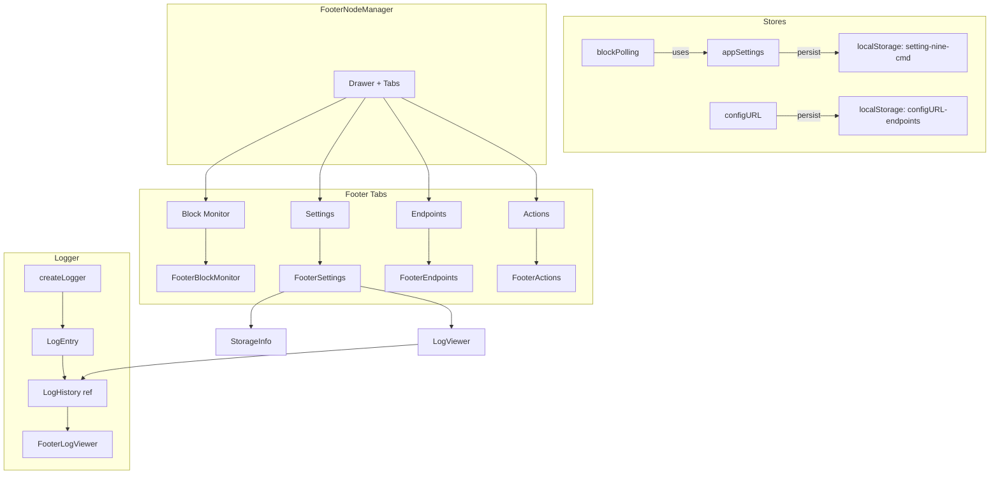

# Plan: Logger System + Settings Tab + Code Refactor

## Tổng Quan

Dự án NineCMD TypeScript cần 4 thay đổi chính:
1. **Hệ thống Logger** – Thay `console.log/warn/error` bằng logger có cấu trúc
2. **Audit localStorage** – Quét tất cả settings đang lưu, xác định cần thêm gì
3. **Tab Settings mới trong Footer** – Hiển thị toàn bộ settings đã lưu
4. **Refactor code** – Tách nhỏ components, tận dụng VueUse, dọn dẹp imports

---

## Phần 1: Hệ Thống Logger

### Vấn Đề Hiện Tại
- Dùng `console.log/warn/error` trực tiếp trong stores và components
- Không có prefix thống nhất: `[configURL]`, `[blockPolling]`, `[appSettings]`
- Không thể bật/tắt log theo module
- Khó debug khi production

### Giải Pháp: Tạo `src-ts/utilities/logger.ts`

```
Logger Architecture
├── logger.ts                     # Core logger utility
├── stores/appSettings.ts         # Dùng logger.info/warn/error
├── stores/configURL.ts           # Dùng logger.info/warn/error
├── stores/blockPolling.ts        # Dùng logger.info/warn/error
└── components/...                # Dùng logger.debug khi cần
```

#### Logger Interface
```typescript
type LogLevel = 'debug' | 'info' | 'warn' | 'error'

interface LoggerConfig {
  module: string        // Tên module: 'configURL', 'blockPolling', etc.
  level?: LogLevel      // Minimum level to output (default: 'debug' in dev)
  enabled?: boolean     // Master switch
}

interface Logger {
  debug: (...args: unknown[]) => void
  info: (...args: unknown[]) => void
  warn: (...args: unknown[]) => void
  error: (...args: unknown[]) => void
}
```

#### Chi Tiết Triển Khai

1. **Tạo file `src-ts/utilities/logger.ts`**:
   - Factory function `createLogger(config: LoggerConfig): Logger`
   - Output format: `[HH:MM:SS] [module] LEVEL: message`
   - Dev mode: all levels; Prod mode: warn + error only
   - Lưu log history vào `ref<LogEntry[]>` (max 200 entries) để hiển thị trong Settings tab
   - `getLogHistory()` để component khác đọc log history

2. **Tạo file `src-ts/types/logger.ts`**:
   - `LogLevel`, `LogEntry`, `LoggerConfig`, `Logger` interfaces

3. **Cập nhật stores**:
   - `appSettings.ts`: `const logger = createLogger({ module: 'appSettings' })`
   - `configURL.ts`: `const logger = createLogger({ module: 'configURL' })`
   - `blockPolling.ts`: `const logger = createLogger({ module: 'blockPolling' })`
   - Thay thế tất cả `console.log/warn/error` bằng `logger.info/warn/error`

4. **i18n keys**: Thêm `logger.*` keys cho UI hiển thị

5. **Tests**: Tạo `__tests__/logger.test.ts` (test log levels, history, format)

---

## Phần 2: Audit & Mở Rộng localStorage

### Current localStorage Keys

| Key | Store | Fields | Status |
|-----|-------|--------|--------|
| `setting-nine-cmd` | appSettings | `isDarkMode`, `lang`, `lastPlanet`, `pollIntervalMs` | ✅ OK |
| `configURL-endpoints` | configURL | `selections`, `modes` | ✅ OK |

### Vấn Đề Phát Hiện
- **PlaceholderMenuLeft.vue** dùng `useStorage('setting-nine-cmd')` TRỰC TIẾP thay vì qua Pinia store → **xung đột tiềm ẩn** với appSettings store
- `isPolling` (blockPolling) KHÔNG được persist → mỗi lần reload, polling state mất

### Settings Cần Thêm/Persist

| Setting | Hiện Tại | Cần Thêm | Lý Do |
|---------|----------|----------|-------|
| `isDarkMode` | ✅ Persist | – | OK |
| `lang` | ✅ Persist | – | OK |
| `lastPlanet` | ✅ Persist | – | OK |
| `pollIntervalMs` | ✅ Persist | – | OK |
| `endpointModes` | ✅ Persist | – | OK |
| `endpointSelections` | ✅ Persist | – | OK |
| `isPolling` | ❌ Không persist | ✅ Thêm | Giữ trạng thái poll sau reload |
| `loggerLevel` | ❌ Không có | ✅ Thêm | Cấu hình log level từ UI |

### Hành Động

1. **Fix PlaceholderMenuLeft.vue**:
   - Bỏ `useStorage('setting-nine-cmd')` trực tiếp
   - Thay bằng import `useAppSettingsStore` từ Pinia
   - Đảm bảo 1 source of truth cho localStorage

2. **Thêm `isPolling` vào appSettings persistence**:
   - Thêm field `isPolling?: boolean` vào `PersistedSettings`
   - Load khi store init, persist khi toggle

3. **Thêm `loggerLevel` vào appSettings**:
   - Thêm field `logLevel?: LogLevel` vào `PersistedSettings`
   - Cho phép user chọn log level từ Settings tab

---

## Phần 3: Tab Settings Mới trong Footer

### Vấn Đề Hiện Tại
- Tab "Setting" hiện tại chỉ hiển thị Dark Mode + Language + Planet info
- Không hiển thị endpoint selections
- Không có tab nào hiển thị TOÀN BỘ settings đã lưu
- Không có cách xem/debug log history

### Giải Pháp: Tab "Settings" mới trong FooterNodeManager

Đổi tên tab "Setting" hiện tại thành tab "Settings" và mở rộng nội dung.

#### Cấu Trúc Tab Settings

```
Tab: Settings (⚙️)
├── Section: General Settings
│   ├── Dark Mode toggle
│   ├── Language selector
│   └── Current Planet display
├── Section: Block Polling
│   ├── Poll Interval selector
│   └── Auto-poll on startup toggle (isPolling persist)
├── Section: Endpoints Summary
│   ├── Current planet endpoints list (read-only summary)
│   └── Link to Endpoints tab for editing
├── Section: Storage Info
│   ├── Total localStorage keys count
│   ├── setting-nine-cmd size
│   ├── configURL-endpoints size
│   └── Nút "Clear All Settings" (reset)
├── Section: Logger Settings
│   ├── Log Level selector (debug/info/warn/error)
│   └── Recent Logs viewer ( collapsible, max 50 entries )
└── Section: About
    ├── App version
    └── Build info
```

#### Chi Tiết Triển Khai

1. **Tạo component `src-ts/components/footer/FooterSettings.vue`**:
   - Tách nội dung tab Settings ra thành component riêng
   - Dùng NCollapse để nhóm các sections
   - Component nhận props: `appSettings`, `blockPolling`, `configURL`

2. **Tạo component `src-ts/components/footer/FooterStorageInfo.vue`**:
   - Hiển thị thông tin về localStorage: keys, sizes
   - Nút "Clear All" với confirmation dialog

3. **Tạo component `src-ts/components/footer/FooterLogViewer.vue`**:
   - Hiển thị log history từ logger
   - Filter theo level
   - Auto-scroll, max 50 entries hiển thị

4. **Cập nhật FooterNodeManager.vue**:
   - Import FooterSettings component
   - Tab "Setting" → import `<FooterSettings />`

5. **i18n keys**: Thêm `settingsPage.*` keys cho toàn bộ UI mới

---

## Phần 4: Code Reorganization & VueUse

### Vấn Đề Hiện Tại
- `FooterNodeManager.vue` quá lớn (350 lines) – chứa 4 tabs + logic
- PlaceholderMenuLeft.vue dùng `useStorage` trực tiếp thay Pinia
- Chưa tận dụng nhiều VueUse utilities
- localStorage mock bị lặp lại trong nhiều test files

### Hành Động

#### 4.1 Tách Components
```
src-ts/components/footer/
├── FooterInfoBlock.vue           # Giữ nguyên
├── FooterNodeManager.vue         # Giữ drawer + tabs, tách content
├── FooterBlockMonitor.vue        # MỚI: Tab 1 content
├── FooterSettings.vue            # MỚI: Tab 2 content (mở rộng)
├── FooterEndpoints.vue           # MỚI: Tab 3 content
├── FooterActions.vue             # MỚI: Tab 4 content
├── FooterStorageInfo.vue         # MỚI: Storage info section
└── FooterLogViewer.vue           # MỚI: Log viewer section
```

#### 4.2 Tận Dụng VueUse
- `useStorage` → Thay thế manual localStorage trong stores (cho simple values)
- `useLocalStorage` → Cho logger level config
- `useIntervalFn` → Thay `setInterval` trong blockPolling (cleaner cleanup)
- `useDebounceFn` → Cho log viewer scroll
- `useEventListener` → Cho drawer keyboard shortcuts

#### 4.3 Test Utilities
- Tạo `src-ts/__tests__/helpers/setup.ts`:
  - Export `createLocalStorageMock()` helper
  - Bỏ duplicate mock code trong 4 test files

#### 4.4 i18n Updates
- Thêm keys mới cho Settings tab, Logger, Storage info
- Cập nhật `en.json` và `vi.json`

---

## Sơ Đồ Flow Tổng Quan



---

## Thứ Tự Thực Hiện

| # | Task | Priority | Dependencies |
|---|------|----------|-------------|
| 1 | Tạo `logger.ts` + `types/logger.ts` | Cao | Không |
| 2 | Tạo test `logger.test.ts` | Cao | Task 1 |
| 3 | Cập nhật stores dùng logger | Cao | Task 1 |
| 4 | Fix PlaceholderMenuLeft.vue (bỏ useStorage direct) | Cao | Không |
| 5 | Thêm isPolling + logLevel vào appSettings persistence | Trung bình | Task 1 |
| 6 | Tách FooterBlockMonitor, FooterEndpoints, FooterActions | Trung bình | Không |
| 7 | Tạo FooterSettings (mở rộng) | Trung bình | Task 5, 6 |
| 8 | Tạo FooterStorageInfo | Thấp | Task 5 |
| 9 | Tạo FooterLogViewer | Thấp | Task 1 |
| 10 | Cập nhật FooterNodeManager imports | Trung bình | Task 6, 7 |
| 11 | Cập nhật i18n (en.json + vi.json) | Trung bình | Task 7, 9 |
| 12 | Tạo test utilities helper | Thấp | Không |
| 13 | Update existing tests | Thấp | Task 12 |
| 14 | Verify build + test | Cao | Tất cả |

---

## Files Mới Tạo

| File | Mô Tả |
|------|-------|
| `src-ts/utilities/logger.ts` | Core logger utility |
| `src-ts/types/logger.ts` | Logger types |
| `src-ts/__tests__/logger.test.ts` | Logger tests |
| `src-ts/components/footer/FooterBlockMonitor.vue` | Tab 1 content |
| `src-ts/components/footer/FooterSettings.vue` | Tab 2 content (mở rộng) |
| `src-ts/components/footer/FooterEndpoints.vue` | Tab 3 content |
| `src-ts/components/footer/FooterActions.vue` | Tab 4 content |
| `src-ts/components/footer/FooterStorageInfo.vue` | Storage info section |
| `src-ts/components/footer/FooterLogViewer.vue` | Log viewer section |
| `src-ts/__tests__/helpers/setup.ts` | Test utilities |

## Files Sửa Đổi

| File | Thay Đổi |
|------|----------|
| `src-ts/stores/appSettings.ts` | Dùng logger + thêm isPolling, logLevel |
| `src-ts/stores/configURL.ts` | Dùng logger thay console |
| `src-ts/stores/blockPolling.ts` | Dùng logger + useIntervalFn |
| `src-ts/components/footer/FooterNodeManager.vue` | Tách content, import components mới |
| `src-ts/components/PlaceholderMenuLeft.vue` | Bỏ useStorage, dùng Pinia store |
| `src-ts/i18n/locales/en.json` | Thêm settingsPage.*, logger.* keys |
| `src-ts/i18n/locales/vi.json` | Thêm settingsPage.*, logger.* keys |
| `src-ts/types/naive-ui.d.ts` | Thêm NCollapse, NCollapseItem nếu chưa có |

---

## Lưu Ý Khi Implement

1. **Logger phải tree-shakeable**: Chỉ import logger trong các file cần
2. **Không break existing tests**: 124 tests hiện tại phải tiếp tục pass
3. **localStorage migration**: Khi thêm field mới, phải handle backward compatibility (field mới = undefined → dùng default)
4. **VueUse import**: Dùng named imports `import { useIntervalFn } from '@vueuse/core'` (đã có dependency)
5. **FooterNodeManager.vue**: Giữ nguyên drawer logic, chỉ tách tab content ra components mới
6. **Naive UI components**: Cần check `naive-ui.d.ts` trước khi dùng component mới
