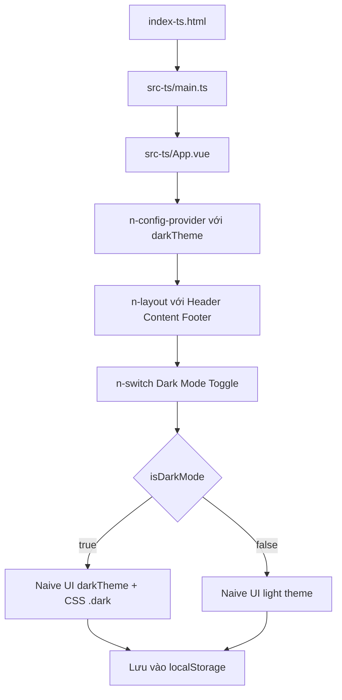

# Kế Hoạch: Giao diện TypeScript Đơn Giản với Dark Mode

## Tổng Quan

Tạo giao diện TypeScript đơn giản hoạt động song song với phiên bản JavaScript gốc.
- **JS gốc**: `index.html` → `src/main.ts` → `src/App.vue` (đầy đủ tính năng)
- **TS mới**: `index-ts.html` → `src-ts/main.ts` → `src-ts/App.vue` (đơn giản, dark mode)

---

## Cấu Trúc Thư Mục Mục Tiêu

```
nineCMD/
├── index.html              # JS gốc (giữ nguyên)
├── index-ts.html           # TS entry point (TẠO MỚI)
├── vite.config.js          # Vite config gốc (giữ nguyên)
├── vite-ts.config.js       # Vite config cho TS (TẠO MỚI)
├── src/                    # JS version (giữ nguyên)
└── src-ts/                 # TS version
    ├── main.ts             # Entry point (SỬA)
    ├── App.vue             # Giao diện đơn giản (ĐƠN GIẢN HÓA)
    ├── assets/
    │   ├── base.css        # CSS cơ bản (giữ nguyên)
    │   └── main.css        # CSS import (giữ nguyên)
    └── types/
        └── ui.d.ts         # Type definitions (SỬA)
```

---

## Chi Tiết Từng Bước

### Bước 1: Tạo `index-ts.html`

Tạo file HTML mới tại root, trỏ đến `src-ts/main.ts`:

```html
<!doctype html>
<html lang="en">
<head>
  <meta charset="UTF-8" />
  <meta name="viewport" content="width=device-width, initial-scale=1.0" />
  <title>NineCMD - TypeScript</title>
</head>
<body>
  <div id="app"></div>
  <script type="module" src="/src-ts/main.ts"></script>
</body>
</html>
```

### Bước 2: Tạo `vite-ts.config.js`

Vite config riêng cho src-ts/, quan trọng: alias `@/` trỏ đến `src-ts/` thay vì `src/`:

```javascript
import { fileURLToPath, URL } from 'node:url'
import { defineConfig } from 'vite'
import vue from '@vitejs/plugin-vue'
import vueJsx from '@vitejs/plugin-vue-jsx'

export default defineConfig({
  plugins: [vue(), vueJsx()],
  root: '.',  // root vẫn là root để index-ts.html hoạt động
  build: {
    rollupOptions: {
      input: 'index-ts.html'
    }
  },
  resolve: {
    alias: {
      '@': fileURLToPath(new URL('./src-ts', import.meta.url))
    }
  },
  server: {
    port: 1415  // Port khác src/ (1414)
  },
  preview: {
    port: 2829  // Port khác src/ (2828)
  }
})
```

### Bước 3: Đơn giản hóa `src-ts/App.vue`

Giữ nguyên cấu trúc Naive UI nhưng đơn giản hóa:
- **Header**: Logo "NineCMD" + Dark Mode toggle (n-switch với icon sun/moon)
- **Content**: Vùng nội dung cơ bản hiển thị trạng thái dark mode
- **Footer**: Copyright
- **KHÔNG CÓ**: Router, Planet/Node selects, Sidebar menu (để Phase 2)

### Bước 4: Sửa `src-ts/main.ts`

Entry point tối thiểu:
- Import Vue 3 + Pinia
- Import Naive UI styles (necessary for tree-shaking)
- Import CSS assets
- Mount app
- KHÔNG có router, KHÔNG có i18n (đơn giản nhất)

### Bước 5: Sửa `src-ts/types/ui.d.ts`

Fix type definitions:
- Import `GlobalTheme` từ `naive-ui` thay vì tự define sai
- Loại bỏ `any` types
- Đảm bảo `SettingNineCMD` interface chính xác

### Bước 6: Thêm npm scripts

```json
{
  "scripts": {
    "dev": "vite --host",
    "dev:ts": "vite --config vite-ts.config.js --host",
    "build": "vite build",
    "build:ts": "vite build --config vite-ts.config.js"
  }
}
```

---

## Giao Diển Đơn Giản Mục Tiêu

```
┌──────────────────────────────────────────────┐
│  NineCMD TypeScript          [🌙] Dark Mode  │  ← Header
├──────────────────────────────────────────────┤
│                                              │
│         Chào mừng đến NineCMD TypeScript!    │  ← Content
│                                              │
│         Dark Mode: Đang BẬT                 │
│         (hoặc ĐANG TẮT)                     │
│                                              │
├──────────────────────────────────────────────┤
│          NineCMD © 2024                      │  ← Footer
└──────────────────────────────────────────────┘
```

Dark Mode hoạt động qua:
1. **Naive UI darkTheme** - Thay đổi theme của tất cả Naive UI components
2. **CSS class `.dark`** - Thay đổi background/text cho custom elements
3. **localStorage** - Lưu trữ preference giữa các session

---

## Mermaid Flowchart



---

## npm Scripts

| Command | Mô tả |
|---------|-------|
| `npm run dev` | Chạy JS version (port 1414) |
| `npm run dev:ts` | Chạy TS version (port 1415) |
| `npm run build` | Build JS version |
| `npm run build:ts` | Build TS version |

---

## Lưu Ý Quan Trọng

1. **`@/` alias** trong TS version trỏ đến `src-ts/`, không phải `src/`
2. **Không cần i18n** cho phiên bản đơn giản này
3. **Không cần router** - chỉ hiển thị 1 trang
4. **Naive UI direct imports** - KHÔNG dùng `app.use(naive)` (tránh Plugin type errors)
5. **Dark mode persistence** - Dùng `useStorage` từ `@vueuse/core`
6. **Port khác nhau** - JS: 1414/2828, TS: 1415/2829 để chạy song song
