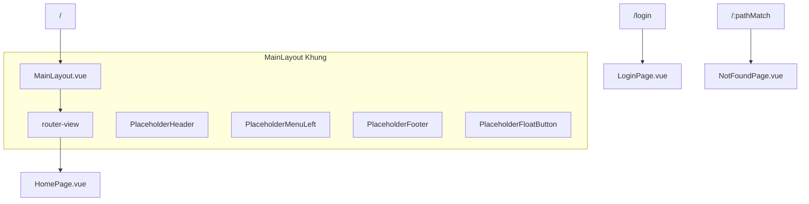
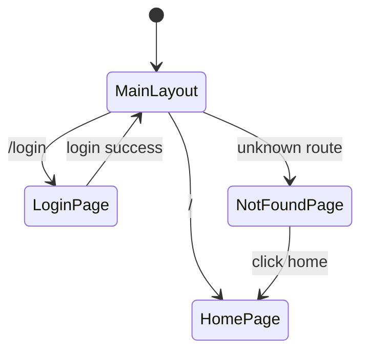

# Kế Hoạch: Tích Hợp Vue Router vào TypeScript Version

## Mục Tiêu
Tích hợp Vue Router vào `src-ts/` với 3 route chính: Main Layout, Login, và 404. Giao diện Main Layout sẽ có khung giống JS version nhưng chỉ là placeholder, chưa có logic.

## Phân Tích Hiện Trạng

### JS Version (src/) - Layout hiện tại
```
┌─────────────────────────────────────┐
│           HeaderNineCMD             │  ← 10vh
├──────────┬──────────────────────────┤
│ MenuLeft │                          │
│ (sider)  │    <router-view>         │  ← 80vh
│          │    (n-scrollbar)         │
├──────────┴──────────────────────────┤
│           FooterBlock               │  ← 10vh
└─────────────────────────────────────┘
+ FloatButtonSetting (nút nổi góc phải)
```

### TS Version (src-ts/) - Hiện tại
- Chỉ có App.vue đơn giản: Header + Content card + Footer
- Chưa có router

## Cấu Trúc File Mới

```
src-ts/
├── main.ts                          ← CẬP NHẬT: thêm router
├── App.vue                          ← CẬP NHẬT: dùng <router-view>
├── router/
│   └── index.ts                     ← MỚI: cấu hình router
├── layouts/
│   └── MainLayout.vue               ← MỚI: khung giao diện chính placeholder
├── views/
│   ├── HomePage.vue                 ← MỚI: trang chủ placeholder
│   ├── LoginPage.vue                ← MỚI: trang login placeholder
│   └── NotFoundPage.vue             ← MỚI: trang 404 placeholder
├── components/                      ← MỚI: placeholder components
│   ├── PlaceholderHeader.vue        ← MỚI: header placeholder
│   ├── PlaceholderMenuLeft.vue      ← MỚI: menu left placeholder
│   ├── PlaceholderFooter.vue        ← MỚI: footer placeholder
│   └── PlaceholderFloatButton.vue   ← MỚI: float button placeholder
├── i18n/                            ← KHÔNG ĐỔI
├── types/                           ← KHÔNG ĐỔI
├── utilities/                       ← KHÔNG ĐỔI
├── assets/                          ← KHÔNG ĐỔI
└── __tests__/                       ← KHÔNG ĐỔI
```

## Chi Tiết Các Route

### Route Group 1: Main Layout (authenticated area)
- **Path**: `/`
- **Component**: `MainLayout.vue` (wrapper với header/sidebar/content/footer)
- **Children**:
  - `/` → `HomePage.vue` (trang chủ placeholder)
- **Layout**: Giống JS version - HeaderNineCMD, MenuLeft sidebar, content area, FooterBlock

### Route Group 2: Login (standalone page)
- **Path**: `/login`
- **Component**: `LoginPage.vue` (trang standalone, không có main layout)
- **Layout**: Đơn giản, chỉ có form login placeholder

### Route Group 3: 404 (catch-all)
- **Path**: `/:pathMatch(.*)*`
- **Component**: `NotFoundPage.vue`
- **Layout**: Đơn giản, hiển thị thông báo 404

## Chi Tiết File

### 1. `src-ts/router/index.ts`
```typescript
import { createRouter, createWebHistory } from 'vue-router'
import type { RouteRecordRaw } from 'vue-router'
import MainLayout from '@/layouts/MainLayout.vue'

const routes: RouteRecordRaw[] = [
  {
    path: '/',
    component: MainLayout,
    children: [
      {
        path: '',
        name: 'home',
        component: () => import('@/views/HomePage.vue')
      }
    ]
  },
  {
    path: '/login',
    name: 'login',
    component: () => import('@/views/LoginPage.vue')
  },
  {
    path: '/:pathMatch(.*)*',
    name: 'not-found',
    component: () => import('@/views/NotFoundPage.vue')
  }
]

const router = createRouter({
  history: createWebHistory(import.meta.env.BASE_URL),
  routes
})

export default router
```

### 2. `src-ts/layouts/MainLayout.vue`
Khung giao diện chính placeholder, replica cấu trúc JS version:
- **Header** (10vh): PlaceholderComponent hiển thị text "Header Placeholder"
- **Sider** (MenuLeft): PlaceholderComponent hiển thị menu items placeholder
- **Content**: `<router-view>` với transition
- **Footer** (10vh): PlaceholderComponent hiển thị text "Footer Placeholder"
- **FloatButton**: PlaceholderComponent nút nổi

### 3. `src-ts/views/HomePage.vue`
Trang chủ placeholder với `<n-card>` hiển thị "Home Page - Placeholder"

### 4. `src-ts/views/LoginPage.vue`
Trang login standalone placeholder với `<n-card>` hiển thị "Login Page - Placeholder"

### 5. `src-ts/views/NotFoundPage.vue`
Trang 404 placeholder với `<n-result>` status="404"

### 6. Cập nhật `src-ts/main.ts`
Thêm `import router from './router'` và `app.use(router)`

### 7. Cập nhật `src-ts/App.vue`
Thay nội dung hiện tại bằng `<router-view>` trong layout wrapper. Giữ nguyên:
- Naive UI ConfigProvider (theme, locale, breakpoints)
- LoadingBarProvider, ModalProvider, MessageProvider
- GlobalStyle

## Sơ Đồ Cấu Trúc Router



## Sơ Đồ Luồng Điều Hướng



## Thứ Tự Thực Hiện

1. Tạo `src-ts/components/` với 4 placeholder components
2. Tạo `src-ts/layouts/MainLayout.vue`
3. Tạo `src-ts/views/` với 3 view pages
4. Tạo `src-ts/router/index.ts`
5. Cập nhật `src-ts/main.ts` - thêm router
6. Cập nhật `src-ts/App.vue` - dùng router-view
7. Chạy `npm run build:ts` - xác nhận 0 TypeScript errors
8. Chạy `npm run dev:ts` - kiểm tra giao diện
9. Cập nhật Memory Bank

## Lưu Ý
- Tất cả components chỉ là **placeholder** - không có logic, chỉ có giao diện cơ bản
- Sử dụng Naive UI components (n-layout, n-layout-header, n-layout-sider, n-layout-footer, n-card, n-result, v.v.)
- Type-safe với TypeScript strict mode
- Tự chứa trong `src-ts/` - không import từ `src/`
- Giữ nguyên dark mode + i18n hiện tại
