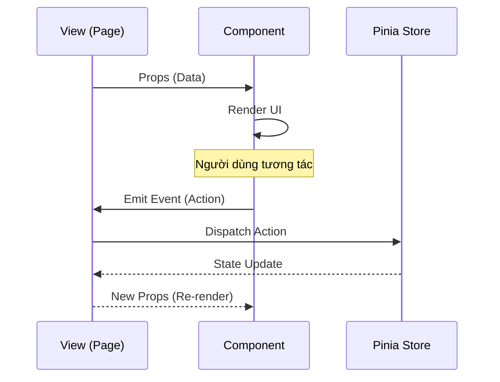

# UI Components

Thư mục này chứa các Vue components được sử dụng trong ứng dụng. Dự án sử dụng `Naive UI` làm thư viện component chính.

## Cấu trúc thư mục

- `block/`: Các component liên quan đến hiển thị và cấu hình Block (Stats, History, Config Form).
- `layout/`: Các component khung của ứng dụng (Header, Footer, Navigation).

## Luồng tương tác Component (Sequence Diagram)

## Nguyên tắc phát triển

- **Auto Import:** Sử dụng `unplugin-vue-components`, không cần import thủ công các component trong code.
- **Atomic Design:** Chia nhỏ component thành các phần nhỏ nhất có thể tái sử dụng.
- **Logic Separation:** Giữ logic hiển thị trong component, chuyển logic nghiệp vụ vào Store hoặc Core.
- **i18n:** Tuyệt đối không hardcode text, luôn sử dụng `t()` từ `vue-i18n`.
