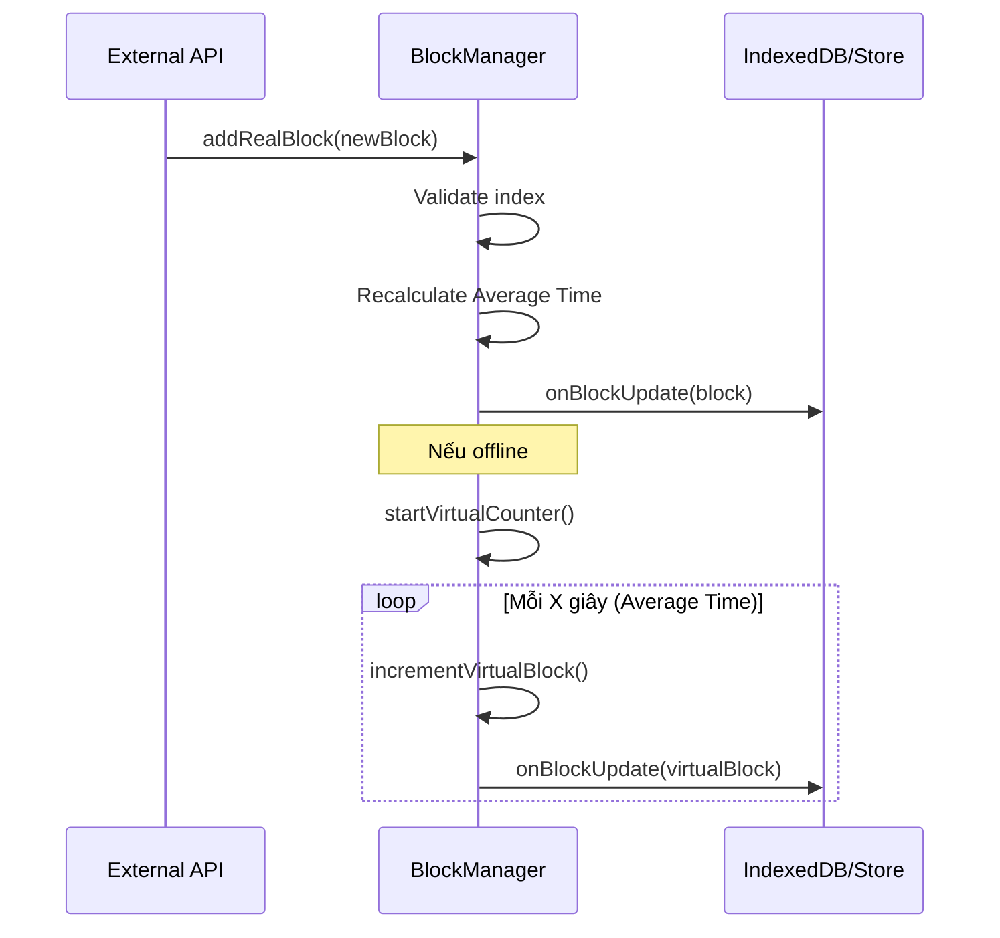

# Core Business Logic

Thư mục này chứa các logic nghiệp vụ cốt lõi (Business Logic) của hệ thống, được thiết kế độc lập với giao diện người dùng (UI-agnostic) để có thể tái sử dụng hoặc kiểm thử dễ dàng.

## Các thành phần chính

### 1. BlockManager (`BlockManager.ts`)

Quản lý việc theo dõi và xử lý các block từ mạng lưới Nine Chronicles.

**Chức năng:**

- Theo dõi chỉ số block hiện tại.
- Tính toán thời gian tạo block trung bình (`averageBlockTimeMs`).
- Tự động tạo block ảo (Virtual Blocks) khi mất kết nối để duy trì tính liên tục.
- Đồng bộ hóa dữ liệu giữa các luồng (Main Thread và Service Worker).

## Luồng xử lý Block (Sequence Diagram)

## Quy tắc phát triển

- Tuyệt đối không đưa các API liên quan đến DOM hoặc Vue-specific vào thư mục này.
- Mọi logic tính toán nặng phải được tối ưu hóa để có thể chạy trong Web Worker nếu cần.
- **Unit Test:** Luôn có unit test đi kèm trong thư mục `src/__tests__`. Các test cho core logic bao gồm:
  - `BlockManager.test.ts`: Kiểm tra tính toán thời gian trung bình, xử lý block ảo, và giới hạn cache.
