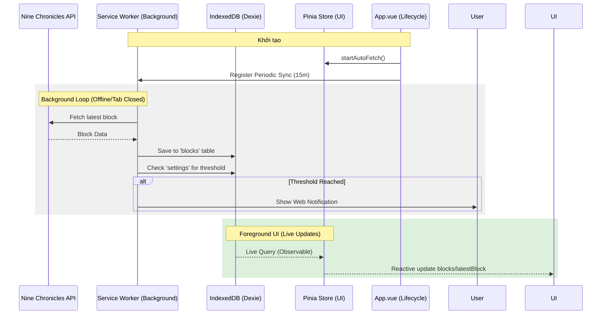

# Block Management & Persistence

Thư mục này quản lý trạng thái của các Block và đảm bảo dữ liệu được lưu trữ bền vững, đồng bộ giữa giao diện và tiến trình chạy ngầm (Service Worker).

## Luồng hoạt động (Sequence Diagram)

## Các thành phần chính

- `useBlockStore.ts`: Quản lý state và cung cấp các hành động (fetch, set marker).
- `src/db/index.ts`: Cấu hình Dexie DB.
- `src/sw.ts`: Logic chạy ngầm của Service Worker.

## Kiểm thử (Testing)

Mọi logic trong Store và Database đều được kiểm thử tại:

- `src/__tests__/BlockStore.test.ts`: Kiểm tra khởi tạo store và các action chính.
- `src/__tests__/Database.test.ts`: Kiểm tra việc lưu trữ, truy vấn và tính bền vững của dữ liệu trong IndexedDB.
